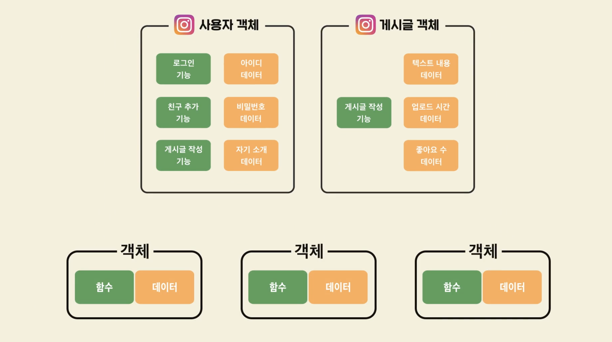

# 객체 지향 프로그래밍

## 비객체 지향의 경우 Top-down 방식 문제가 발생

- 코드 전체가 완성되지 않으면 동작을 제대로 확인해 볼 수 없다.
- 하나의 기능 수정시 모든 코드를 점검해야 한다.

## 해결방안 : Bottom-up 방식의 객체 지향 프로그래밍

- 함수와 관련 데이터를 합쳐 오브젝트를 만들고, 그것을 기준으로 개발한다.
- 데이터를 확인하거나 수정하면 객체만 고치면 된다!

## 비교

| 비객체지향      | 객체지향                                                     |
| --------------- | ------------------------------------------------------------ |
| 로그인하기 기능 | 사용자 객체 : 로그인기능, 친구추가기능, 게시글 작성 기능  +  아이디 데이터, 비밀번호 데이터, 자기소개 데이터 |
| 좋아요 기능     | 게시글 객체 : 게시글 작성 기능 + 텍스트 내용 데이터, 업로드 시간 데이터, 좋아요 수 데이터 |

## 객체 지향의 장점

- 데이터와 기능 변화가 생길 때 관련객체만 확인하면 되므로 편리하다.
- 의미 있는 단위로 나누므로 코드를 이해하거나, 다른 프로그램에서 재사용하기 쉽ㄴ다.
- 일부 기능만 사용이 가능하여 테스트에 유리하다.

## 객체 지향의 단점

- 설계에 많은 노력이 든다.
- 실행속도가 느려지거나 저장공간을 많이 차지하기도 한다.

## 객체 지향 언어를 쓰기 좋은 곳

- 많은 데이터를 다루는 프로그램
- 규모가 큰 프로젝트

## 객체 지향 언어가 적합하지 않은 곳

- 매우 빠른 속도가 필요한 분야
- 저장장치, 성능이 제한적인 기기(스마트 워치, 스마트 TV, 스마트 냉장고)

---

[ 정리 ]

## 장점

- 유지 보수에 용이하다.
- 가독성이 높다.
- 재사용하기 좋다.
- 테스트가 쉽다.

## 단점

- 설계가 어렵다.
- 작은 규모의 프로그램에서는 객체 지향적으로 작성하는 것이 더 오래 걸릴 수 있다.
- 극도로 빠르거나, 주어진 자원을 극도로 활용해야 하는 경우에는 좋지 않다.
- 임베디드와 같은 특정 분야에는 부적합하다.

---

## 객체 지향 언어

- Python
- Java
- Kotlin
- Swift
- C++
- Objective-C
- C#
- Rubi

## 비객체지향 언어

- C
- Pascal

