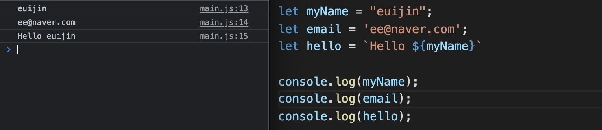
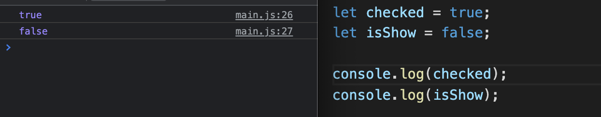
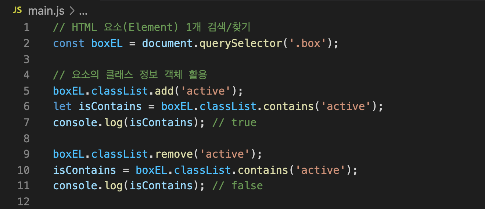
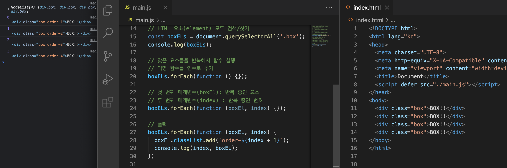

# JavaScript

## 표기법

컴퓨터가 하나의 단어를 인식하는 방법

1. dash-case(kebab case)

- html, css

```
the-quick-brown-fox-jumps
```

2. snake_case

- html, css

```
the_quick_brown_fox_jumps
```

3. camelCase

- javascript

```
theQuickBrowmFoxJumps
```

4. PascalCase

- javescript

```
TheQuickBrownFoxJumps
```

** Zero-based Numbering

- 숫자는 0부터 센다

- 숫자 0 은 일요일을 의미, 1은 월요일을 의미


## 주석

```javascript
// 한 줄 메모

/**
 * 여러 줄 메모
 * 1
 * 2
*/ 
```


## 데이터 종류(자료형)

1. 문자데이터 string



2. 숫자데이터 number


3. 논리데이터 Boolean



4. Undefined : 값이 할당되지 않은 상태


5. Null : 값이 '의도적으로' 비어있음을 의미


6. Object 객체 데이터 : 여러 데이터를 Key:Value 형태로 저장 , user 라는 변수에 담는다.


7. Array 배열 데이터


## 변수

- 데이터를 저장하고 참조(사용)하는 데이터의 이름

1. let

   - 재사용 가능
   - 재할당 가능

   

2. const

   - 재할당 불가

   


## 예약어

특별한 의미를 가져 변수나 함수명으로 사용할 수 없는 이름, SyntaxError 발생

- this
- if
- break
- ...


## 함수

특정 동작을 수행할 수 있는 일부 코드의 집합(부분)


- `return` 을 통해 데이터를 내보내고, 그 값을 새 변수에 할당하여 사용


- 매개변수와 인수
  - 매개변수는 함수 내부에서 사용하는 변수


- 기명함수와 익명함수
  - 기명함수는 '함수를 선언한다'
  - 익명함수는 '함수를 표현한다' - 변수에 할당


- const 통해 정의한 변수는 추가 재할당이 불가
- 객체 데이터 내부에는 다양한 데이터가 정의되어 있다.
- `속성` 부분에 함수가 할당되어 있으면 그것을 `메소드`라 한다.
  - getName은 함수의 표현, 함수라는 데이터를 할당
  - this 는 this 가 소속되어있는 객체 데이터


## 조건문


## DOM API

- Document Object Model
- Application Programming Interface

> 자바스크립트에서 HTML 를 제어하는 명령들


- 정보구조에 유지하기 위해 `defer` 속성 부여하고 head 태그 내에 넣는다.

  - ```html
    <script defer src="./main.js"></script>
    ```


- 상황(이벤트) 발생시 익명함수(핸들러)를 실행


- `boxEL` 이라는 요소에서 `class`  라는 전역속성의 정보를 가진 객체 `classList` 를 사용
- `add` , `remove` 라는 메소드 사용



- 클릭시 active 클래스가 추가된다.


- 배열 `boxELs` 을 반복하는 메서드 `.forEach` 




- 텍스트 변경


## 메소드 체이닝(Method Chaining)

- 메소드를 연결하여 작성


