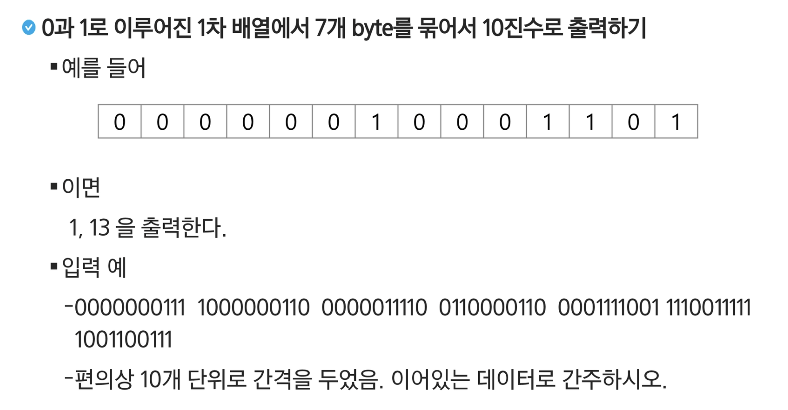
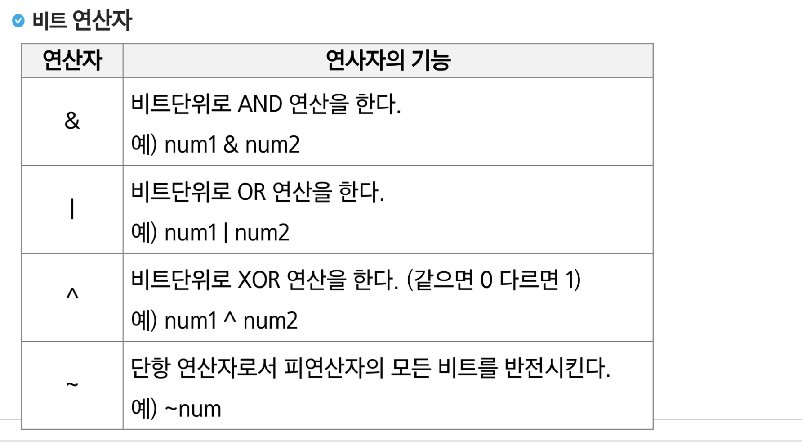
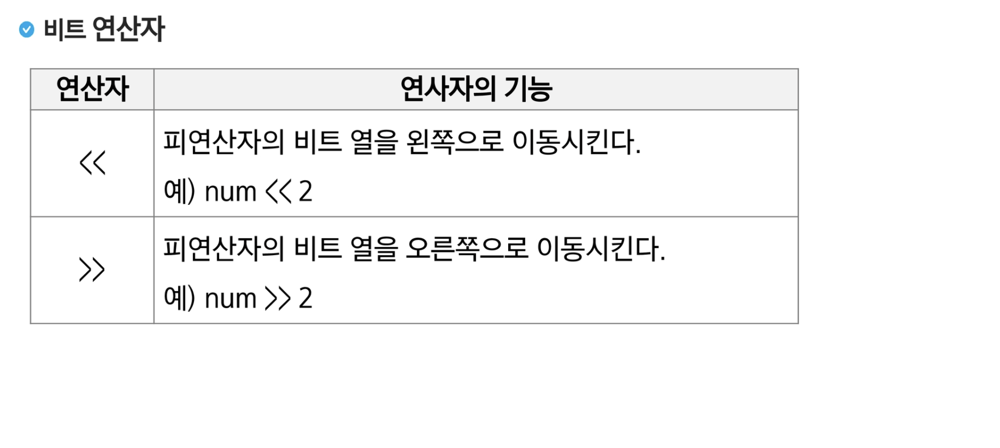
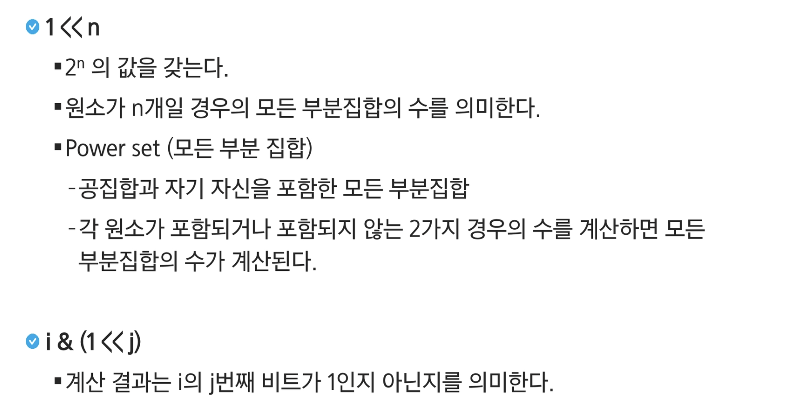
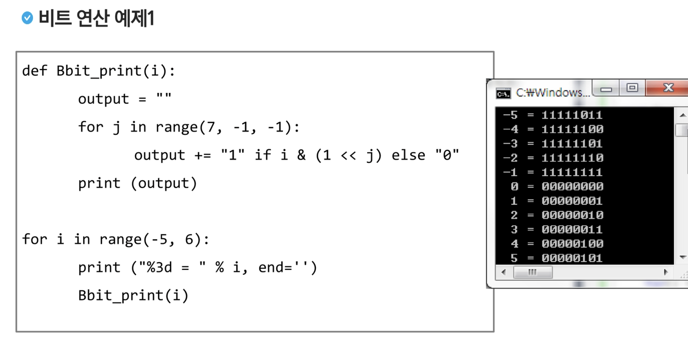
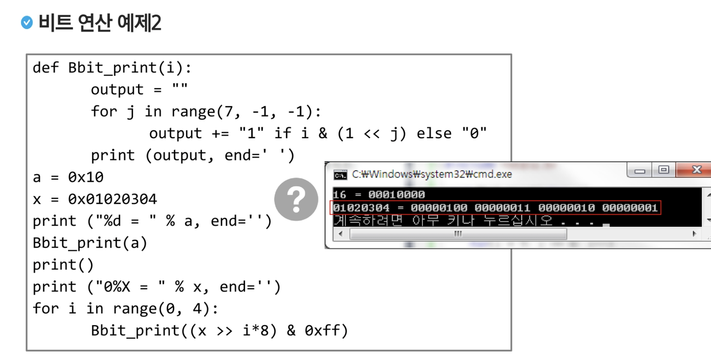

## 문제

2진수를 10진수로 변환하는 방법은 간단합니다. 2진수의 각 자리가 1이면 비트 연산자를 사용하여 해당 자리에 1을 위치시키면 됩니다.

배열 binary에는 2진수가 순서대로 저장되어 있습니다. 최하위 비트부터 처리를 해야 하므로 배열의 크기를 구한 뒤 배열의 크기 - 1부터 0까지 반복합니다. 반복문 안에서는 2진수의 자릿수가 1이면 그만큼 1을 왼쪽으로 시프트한 뒤 원래값과 더하여 저장합니다. 계산이 끝났다면 다음 자리를 처리할 수 있도록 position의 값을 증가시킵니다.

이런 과정을 통해 최종적으로 더해진 값이 2진수를 10진수로 변환한 값입니다.

---

## 개념

