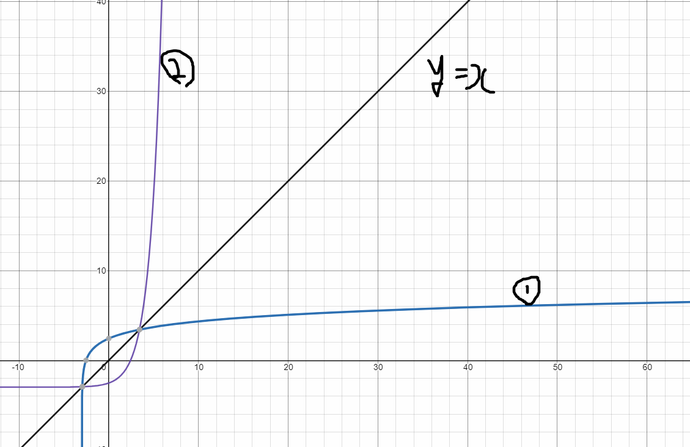

# 수와 표현

> 함께 학습하고 고민하고 설명하며 작은 부분 하나라도 '내 것'으로 만들어보세요. 😁

## 2 번

##### solution

2^20

## 3-2 & 3-4 번

**3-2번**

<

½은 근호이므로 결국 2^n과 3^n을 비교하는 문제이다.

따라서 오른쪽이 더 크다.

**3-4번**

<

## 4번

##### solution

$$
x = log_ayz\\
=log_2yz/log_2a\\
=(log_2y +log_2z)/log_2a
$$

## 5-2번

##### solution

$$
f(x)=3log(x+3)+1\\
f(x)=y라고 하면\\
y=3log(x+3)+1\\
y-1=3log(x+3)\\
(y-1)/3=log(x+3)\\
x+3 = 10^{(y-1)/3}\\
x = 10^{(y-1)/3}-3\\
역함수는 y=x대칭이므로\\
f(x)=3log(x+3)+1의 역함수는 y=10^{(x-1)/3}-3\\
$$

**정리 예시**

