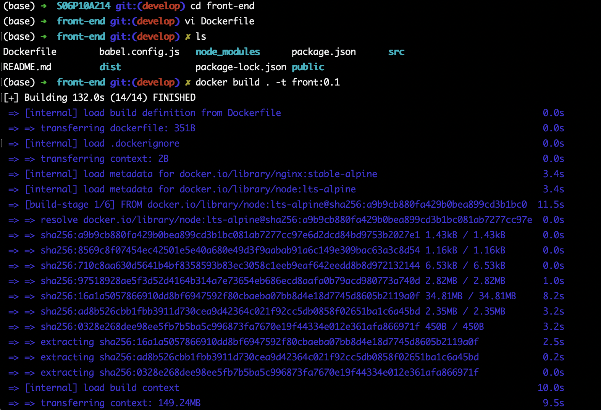
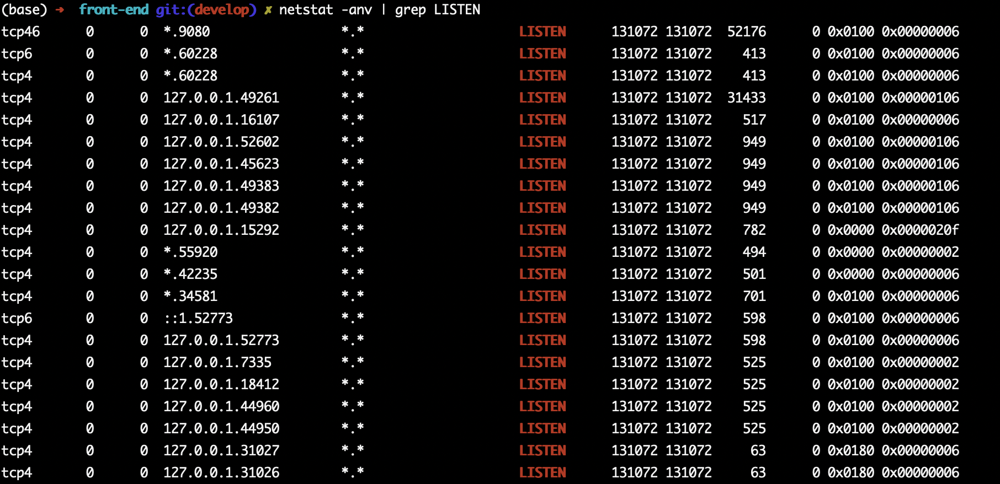
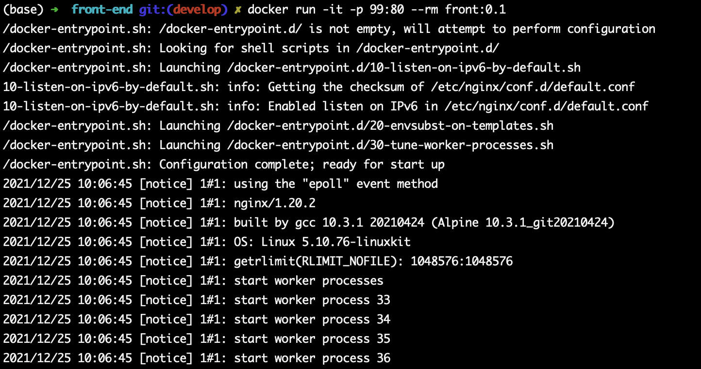

# Dockerize_front

- 프로젝트 코드 다운로드

```
git clone https:// ... 
```

```bash
cd <project name>
```


- 로컬에서 프론트엔드 실행 및 웹브라우저(http://localhost:8080) 접속 후 확인

```bash
cd frontend
npm run serve
```


- <project_home>/frontend/Dockerfile 작성 후 프론트엔드용 도커 이미지 빌드
- https://kr.vuejs.org/v2/cookbook/dockerize-vuejs-app.html
- NGINX 예제 사용

```bash
docker build . -t front:0.1
```

- `-t` 도커 이미지 TAG명으로 보통 버전 관리 용도로 사용





- 이미지에 태그 추가

```bash
docker tag front:0.1 front:latest
```

- 이미지에 TAG 삭제

```bash
docker rmi front
```

- 도커로 프론트엔드 실행
  - `-rm` : 컨테이너 정지시 컨테이너 자동 삭제
  - `Ctrl + C` 키 입력으로 컨테이너 종료

```
docker run -it -p 80:80 --rm front:0.1
```


- 포트 확인




- 임의 포트 잡아서 실행(도커로 프론트엔드 실행)

```bash
docker run -it -p 99:80 --rm front:0.1
```




- 옵션 변경

```bash
docker run -p 99:80  front:0.1 
```

- 옵션 변경2 

```bash
docker run -d -p 99:80  front:0.1
```


- 도커 컨테이너 및 이미지 최종 확인

