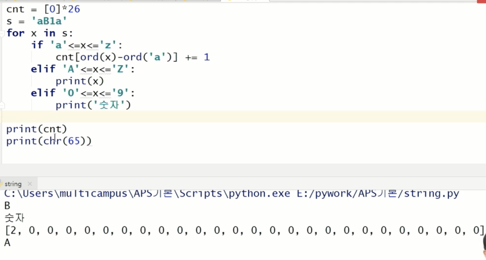

# String

## 문자열 뒤집기

#### 자기 문자열 뒤집는 방법

- swap을 위한 임시 변수가 필요하며, 반복 수행은 문자열 길이의 반 만큼 수행한다.

```python
s = list(input())  # algo => ['a', 'l', 'g', 'o']
n = len(s)	# 글자수

for i in range(n//2):
  s[i], s[n-1-i] = s[n-1-i], s[i]
  
print(s) # ['o', 'g', 'l', 'a']
```

- 파이써닉! Reverse함수 또는 slice notation 을 이용하여 구현

```python
s = 'Reverse'
s = s[::-1]
print(s) #=> 'esreveR'
```


#### 새로운 빈 문자열을 만들어 뒤에서부터 읽는 방법


## ASCII CODE 활용하기

- 'a' 부터 'z'까지 소문자만 있는 경우
- 카운트 배열로 문자열의 알파벳을 세기

```python
cnt = [0] * 26 # alphabet counter
s = 'aB1a'
for x in s:
  if 'a' <= x <= 'z':
  	cnt[ord(x)-ord('a')] += 1
   elif 'A' <=  x <= 'Z':
    print(x)
   elif '0' <= x <= '9':
    print('숫자')
    
print(cnt)
print(chr(65))

# [2, 1, 0, 0, 0, 0, 0, .......]
```




## 문자열 비교

- == 연산자, is 연산자 제공

```python
>>> b == '123'	# 내용물 비교
True

>>> b is '123'  # 같은 객체인지 확인하는 is 연산자
False
```


## 문자열 숫자를 정수로 변환하기

- int(), float(), str(), repr()

