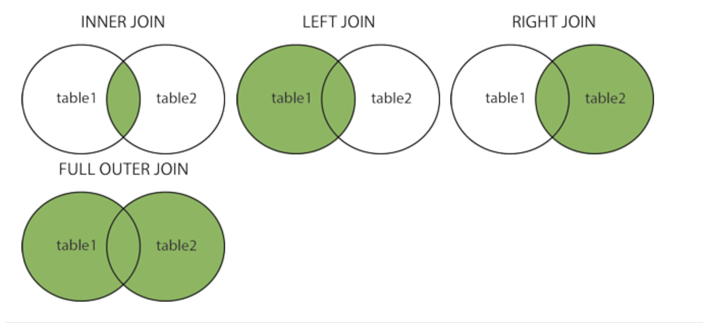
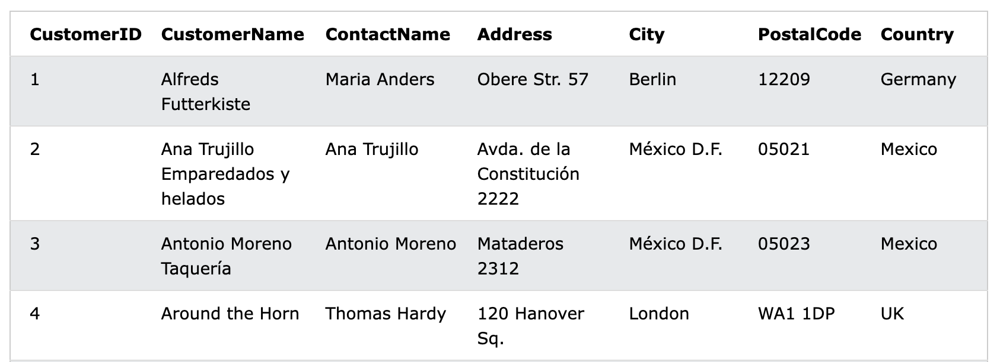
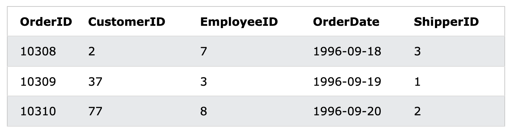
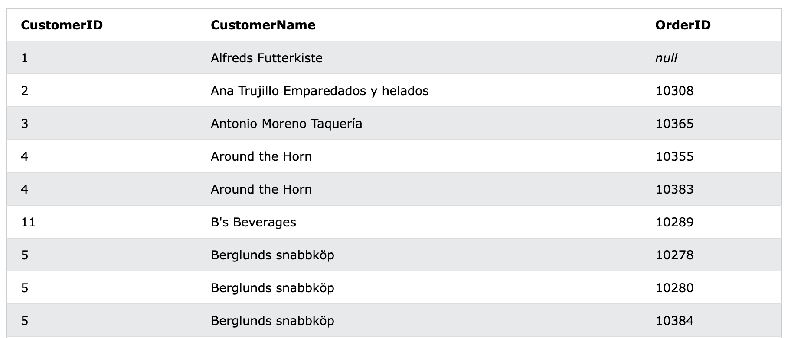
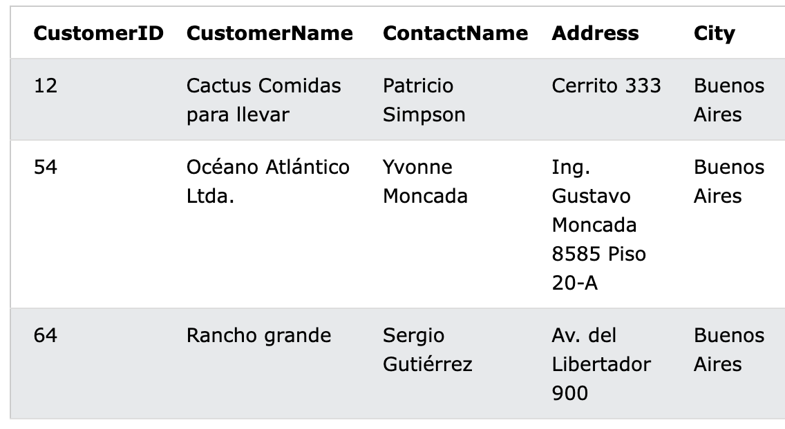
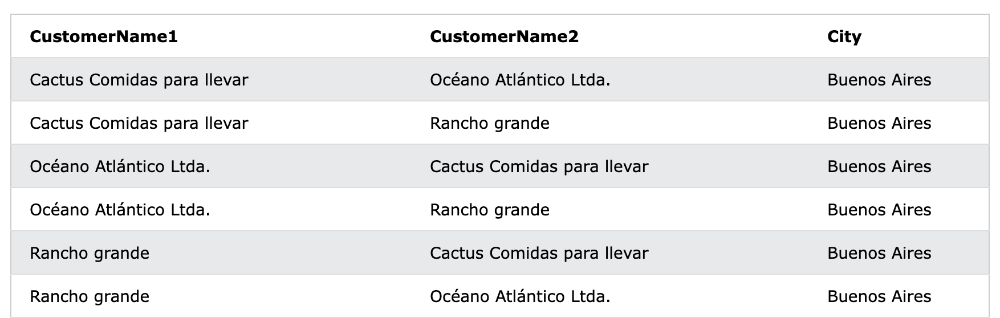

[TOC]


# Some of The Most Important SQL Commands

- `SELECT` - extracts data from a database
- `UPDATE` - updates data in a database
- `DELETE` - deletes data from a database
- `INSERT INTO` - inserts new data into a database


- `CREATE DATABASE` - creates a new database
- `ALTER DATABASE` - modifies a database


- `CREATE TABLE` - creates a new table
- `ALTER TABLE` - modifies a table
- `DROP TABLE` - deletes a table


- `CREATE INDEX` - creates an index (search key)
- `DROP INDEX` - deletes an index


---


# ⭐️ Select & Select Distinct

```sql
SELECT COUNT(DISTINCT Country) FROM Customers;
```


# Where & And,Or and Not

```sql
SELECT * FROM Customers
WHERE NOT Country='Germany';
```


# Order By

default = ASC

```sql
SELECT * FROM Customers
ORDER BY Country, CustomerName;
```

```sql
SELECT * FROM Customers
ORDER BY Country ASC, CustomerName DESC;
```


# ⭐️ Insert Into

insert new records

1. column names and values	
2. values only => column name 필요 x, order 중요

```sql
INSERT INTO Customers (CustomerName, ContactName, Address, City, PostalCode, Country)
VALUES ('Cardinal', 'Tom B. Erichsen', 'Skagen 21', 'Stavanger', '4006', 'Norway');
```

```sql
INSERT INTO table_name
VALUES ('Cardinal', 'Tom B. Erichsen', 'Skagen 21', 'Stavanger', '4006', 'Norway');
```

3. insert only in specified columns => 나머지는 `null` 로 들어간다.

```sql
INSERT INTO Customers (CustomerName, City, Country)
VALUES ('Cardinal', 'Stavanter', 'Norway');
```


# Null Values

Null은 `with no value`, 즉 값이 없는 상태로 0의 값 또는 space 를 포함한 공간과는 다른 개념이다. 레코드를 생성할 때 블랭크 상태로 남겨져 있는 값이다.

"column is empty"

비교연산자로는 테스트할 수 없고, `IS NULL` , `IS NOT NULL` 연산자를 쓴다.

## IS NULL, IS NOT NULL

해당 필드가 비어있는 레코드의 특정 필드를 출력

```sql
SELECT CustomerName, ContactName, Address
FROM Customers
WHERE Address IS NULL; 
/* WHERE Address IS NOT NULL; */
```


# ⭐️ Update

테이블의 특정 조건 레코드의 기존 데이터를 변경한다.

**⚠️  `WHERE`  절을 적지 않으면 테이블의 모든 데이터가 바뀌니 주의하자!! **

- CustomerID 가 1인 레코드의 ContactName과 City 컬럼을 업데이트

```sql
UPDATE Customers
SET ContactName = 'Alfred Schmidt', City= 'Frankfurt'
WHERE CustomerID = 1;
```

- 조건에 의해 여러 레코드가 한 번에 업데이트 될 수도 있다.


# ⭐️ Delete

테이블의 특정 조건 레코드를 삭제한다.

**⚠️  `WHERE`  절을 적지 않으면 테이블의 모든 record가 삭제되니 주의하자!! **

```sql
DELETE FROM Customers(table_name) WHERE CustomerName='Alfreds Futterkiste'(condition);
```

## Delete All Records

- 테이블의 구조는 남기고 데이터만 모두 삭제할 수 있다. - WHERE X

```sql
DELETE FROM Customers(Table_name);
```


# SELECT TOP(LIMIT-MySQL)

리턴할 레코드의 갯수를 정한다.

- SQL Server

```sql
SELECT TOP NUMBER column_name(s)
FROM table_name
WHERE condition;
```

- MySQL

```sql
SELECT column_name(s)
FROM table_name
WHERE condition
LIMIT number;
```

- 셋은 동일 (SQL, MySQL, Oracle)

```sql
SELECT TOP 3 * FROM Customers;
```

```sql
SELECT * FROM Customers LIMIT 3;
```

```sql
SELECT * FROM Customers
FETCH FIRST 3 ROWS ONLY;
```

- SQL TOP PERCENT - 상위 50%의 레코드를 반환

```sql
SELECT TOP 50 PERCENT * FROM Customers;
```

## 조건절 추가

- SQL

```sql
SELECT TOP 3 * FROM Customers
WHERE Country='Germany';
```

- MySQL

```sql
SELECT * FROM Customers
WHERE Country='Germany'
LIMIT 3;
```


# Functions

## MIN(), MAX()

해당 `column` 에서 최솟값 및 최댓값을 반환

```sql
SELECT MIN(column_name) AS (새로운 컬럼명)
FROM table_name
WHERE contidion;
```

- 예시 - 가장 싼 물건의 가격을 찾기

```sql
SELECT MIN(Price) AS SmallestPrice
FROM Products;
```


## COUNT(), AVG(), SUM()

- 특정 기준을 만족하는  row의 갯수를 반환
- COUNT(ID - 아이디) 로 하면 데이터 갯수를 셀 수 있음

```sql
SELECT COUNT(column_name)
FROM table_name
WHERE condition;
```

- 숫자로 된 column의 평균값을 반환

```sql
SELECT AVG(column_name)
FROM table_name
WHERE condition;
```

- 특정 필드의 합계를 반환

```sql
SELECT SUM(column_name)
FORM table_name
WHERE condition;
```

# Like

# Wildcards

# In

# Between

# Aliases

# Joins

- `(INNER) JOIN`: Returns records that have matching values in both tables
- `LEFT (OUTER) JOIN`: Returns all records from the left table, and the matched records from the right table
- `RIGHT (OUTER) JOIN`: Returns all records from the right table, and the matched records from the left table
- `FULL (OUTER) JOIN`: Returns all records when there is a match in either left or right table



# 💚 Inner Join

두 테이블에서 겹치는 부분(교집합)을 기준으로 묶어서, 양 테이블에서 원하는 정보를 출력할 수 있다.

**두 테이블에 정보가 모두 있어야 하고, 한 곳에만 있을 경우 나오지 않는다.**

예를 들어 Order 테이블에 CustomerID column 이 있고, Customers table에 CustomerID 컬럼이 있으면 그 컬럼을 기준으로 조인하고 각 테이블에서 정보를 출력한다.

**테이블 1, 2 순서는 무관하긴 한데, Order 테이블을 기준으로 잡아야 문법을 보는 입장에서 편리하게 사용할 수 있을 것으로 보인다.**

왜냐하면 Order table 안의 ID 들이 다른 테이블을 참조하고 있기 때문이다. 

❗️**즉, Order 테이블 안의 CustomerID, EmployeeID, ShipperID는 모두 `FOREIGN KEY` 로 Customer, Employee, Shipper 테이블의 `PRIMARY KEY`  를 참조하고 있다.**

**자식테이블을 FROM 에 위치시키고, INNER JOIN 뒤에는 부모테이블을 쓰자!**


💚 **FROM (테이블1) INNER JOIN(테이블2) ON (테이블1겹치는부분=테이블2겹치는부분)**

```sql
SELECT Orders.OrderID, Customers.CustomerName, ...
FROM Orders
INNER JOIN Customers
ON Orders.CustomerID=Customers.CustomerID;
```

### 3개 테이블 

selects all orders with customer and shipper information

- Customer, Shipper 테이블은 `PRIMARY KEY` 를 가지고 이있는 부모 테이블




- 자식테이블인 Orders 테이블로부터 출발하여 조인하자!



```sql
SELECT Orders.OrderID, Customers.CustomerName, Shippers.ShipperName
FROM ((Orders INNER JOIN Customers ON Orders.CustomerID = Customers.CustomerID) INNER JOIN Shippers ON Orders.ShipperID = Shippers.ShipperID);
```


# Left Join

FROM 에 해당하는 테이블1의 모든 레코드 + 테이블2와 매칭되는 레코드

```sql
SELECT column_name(s)
FROM table1
LEFT JOIN table2
ON table1.column_name = table2.column_name;
```

- 예시

```sql
SELECT Customers.CustomerID, Customers.CustomerName, Orders.OrderID
FROM Customers
LEFT JOIN Orders
ON Customers.CustomerID=Orders.CustomerID
ORDER BY Customers.CustomerName;
```

위의 예시에서 기준은 Customers 테이블이다. Customers 테이블은 부모테이블, Orders 테이블은 자식 테이블이 된다. 이 둘은 `CustomerID` 로 묶여있다.

Customers에 해당하는 모든 레코드 + 주문이력이 있는 고객 레코드가 출력된다.

**즉, 주문하지 않은 고객도 포함된다는 것이다.**

아래 예시를 보면 1번 고객의 경우 주문을 하지 않았는데도 들어가 있다. 

4번과 5번 고객의 경우 주문을 여러번 해서 여러 번 등장한다.




# Right Join

table2의 모든 레코드 + table1과 매칭되는 레코드를 반환

```sql
SELECT column_name(s)
FROM table1
RIGHT JOIN table2
ON table1.column_name = table2.column_name;
```


# Full (Outer) Join

table1의 모든 레코드 + table2의 모든 레코드를 반환

일치하는 부분 없어도 `null` 로 채워 반환한다.

```sql
SELECT column_name(s)
FROM table1
FULL OUTER JOIN table2
ON table1.column_name = table2.column_name
WHERE condition;
```


# ❓Self Join

```sql
SELECT column_name(s)
FROM table1 T1, table1 T2
WHERE condition;
```

한 테이블 내에서 엮어서 도출..? 같은 도시에서 온 고객들을 묶는데...

같은 City의 고객은 Customers 테이블에서 확인하면 3명이 나온다.



이 데이터를 바탕으로 같은 도시에 사는 서로 다른 두 명(id가 다른 두 명)을 뽑아내는 것으로 보인다.

각각의 CustomerName을 하나의 테이블로 잡고 A, B, C 는 임의 설정.

```sql
SELECT A.CustomerName AS CustomerName1, B.CustomerName AS CustomerName2, A.City
FROM CustomerA, CustomerB
WHERE A.CustomerID <> B.CustomerID
AND A.City = B.City
ORDER BY A.City;
```



그러면 이렇게, 같은 도시에 사는 두 명의 커스토머 테이블이 조인되어 나온다.


# Union

# Group By

# Having

# Exists

# Any, All

# Select Into

# Insert Into Select

# Case

# Null Functions

# Stored Procedures

# Comments

# Operators

