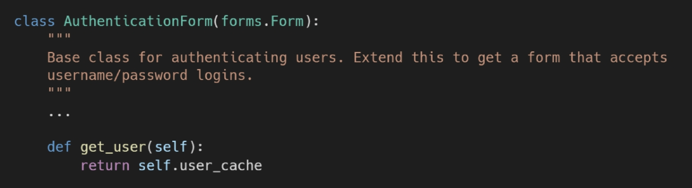

## Authentication System-1

- The Django Authentication System
- 쿠키와 세션
- **로그인**
- **로그아웃**
- 로그인 사용자에 대한 접근 제한


## The Django Authentication System

- Django 인증 시스템은 `django.contrib.auth`에 `Django contrib module`로 제공
- 필수구성은 `settings.py`에 이미 포함되어 있으며 INSTALLED_APPS 설정에 나열된 두 항목으로 구성
  1. django.contrib.auth : 인증 프레임워크와 핵심 기본모델 포함
  2. django.contrib.contenttypes : 사용자가 생성한 모델과 권한을 연결

- Django 인증 시스템은 인증(Authentication)과 권한(Authorization) 부여를 함께 제공한다.


## Authentication & Authorization

- ##### Authentication(인증)
  
  - 신원 확인
  - 사용자가 자신이 누구인지 확인하는 것
- ##### Authorization(권한, 허가)
  
  - 권한 부여
  - 인증된 사용자가 수행할 수 있는 작업을 결정
  
  

---


### accounts 이름으로 앱 생성

- django 내부적으로 auth를 accounts라는 이름으로 사용하기 때문에 accounts 이름 권장


---


## 쿠키와 세션

### HTTP

- Hyper Text Tranfer Protocol
  - HTML 문서와 같은 리소스(자원, 데이터) 들을 가져올 수 있도록 해주는 프로토콜(규칙, 규약)
  - 웹에서 이루어지는 모든 데이터 교환의 기초

### HTTP 특징

- 비연결지향(connectionless)
  - 서버는 요청에 대한 응답을 보낸 후 연결을 끊는다!
- 무상태(stateless)
  - 연결을 끊는 순간 클라이언트와 서버간 통신이 끝나고 상태정보 유지되지 않는다.

```
클라이언트와 서버의 지속적인 관계를 유지하기 위해 쿠키와 세션이 존재!
```

### 쿠키?

- 서버가 사용자의 웹브라우저에 전송하는 작은 데이터 조각
- 사용자가 웹사이트 방문시, 해당 웹사이트 서버를 통해 **사용자의 컴퓨터에 설치**
  - 브라우저(클라이언트)는 쿠키를 로컬에 KEY-VALUE 데이터 형식으로 저장
  - 쿠키를 저장해두었다, **동일한 서버에 재요청시 저장된 쿠키를 함께 전송!**
- 쿠키는 두 요청이 동일 브라우저에서 들어왔는지 아닌지를 판단할 때 사용
  - 상태가 없는 HTTP 프로토콜에서 상태정보를 기억시켜줌으로써 로그인 상태를 유지

```
웹페이지에 접속하면 요청한 웹페이지를 받으며 쿠키를 저장하고, 클라이언트가 같은 서버에 재요청시 요청과 함께 쿠키도 전송
```


### 쿠키 사용목적

1. 세션 관리(Sesson Management)
   - 로그인, 아이디 자동완성, 공지 하루동안 안보기, 팝업 체크, 장바구니 등 정보관리
2. 개인화(Personalization)
   - 사용자 선호, 테마 등 설정
3. 트래킹(Tracking)
   - 사용자 행동을 기록 및 분석

### 세션(Session)

- 사이트와 특정 브라우저 사이의 "상태"를 유지시키는 것.
- 클라이언트가 서버에 접속하면 서버가 특정 `session id`를 발급하고, 클라이언트는 발급받은 `session id`를 쿠키에 저장한다.
  - 클라이언트가 다시 서버에 접속하면 요청과 함께 쿠키를 서버에 전달
  - 쿠키는 요청 때마다 서버에 함께 전송되므로 서버에서 `session id`를 확인해 알맞은 로직을 처리
- `ID`는 세션을 구별하기 위해 필요하며, 쿠키에는 `ID`만 저장한다.

### 쿠키 lifetime(수명)

1. ###### Session cookies
   
   - 현재 세션이 종료되면 삭제됨
   - 브라우저가 "현재 세션(current sesison)"이 종료되는 시기를 정의
2. ###### Persistent cookies(Permanent cookies)
   
   - Expires 속성에 지정된 날짜 혹은 Max-Age 속성에 지정된 기간이 지나면 삭제

### Session in Django

- Django의 세션은 `미들웨어`를 통해 구현됨
- Django는 `database-backed sessions` 저장방식을 기본값으로 사용
- Django는  특정 `session id`를 포함하는 쿠키를 사용함여 각각의 브라우저와 사이트가 연결된 세션을 알아냄
  - 세션 정보의 Django_DB의 **django_session** 테이블에 저장됨
- 모든 것을 세션으로 사용하려하면 사용자가 많을 때 서버에 부하가 걸릴 수 있음

```bash
# 쿠키 vs 세션

쿠키
- 저장을 브라우저에 한다
- 단일방향

세션
- 세션 id를 쿠키로 저장
- 브라우저와 db에 모두 저장
- 양방향
```


### Authentication System in MIDDLEWARE

미들웨어란? http 요청과 응답 처리 중간에서 작동하는 시스템

django는 http 요청이 들어오면 미들웨어를 거쳐 해당 URL에 등록되어 있는 view로 연결해주고, http 응답 역시 미들웨어를 거쳐 내보낸다.

주로 데이터 관리, 애플리케이션 서비스, 메시징, 인증 및 API 관리를 담당

```python
# settings.py

MIDDLEWARE = [
  'django.contrib.sessions.middleware.SessionMiddleware',
  'django.contrib.auth.middleware.AuthenticationMiddleware',
]
```

- ###### SessionMiddleware
  
  - 요청 전반에 걸쳐 세션을 관리
- ###### AuthenticationMiddleware
  
  - 세션을 사용하여 사용자를 요청과 연결


---


```bash
# 유저의 종류
- 로그인 유저
- 익명 유저 Anonymous
```


## 로그인

- 로그인은 곧 Session 을 Create하는 로직, 인증 built-in forms 제공


### AuthenticationForm

- 사용자 로그인을 위한 form
- request를 첫 번째 인자로 취한다.


### login 함수

Django 의 session framework를 사용하여 세션에 user ID 를 저장한다. (==로그인)

```python
login(request, user, backend=None)
```

- 사용

```python
# accounts/views.py
# login view 함수와의 혼동을 방지하기 위해 함수이름을 변경
from django.contrib.auth import login as auth_login
from django.contrib.auth.forms import AuthenticationForm

def login(request):
  if request.method == 'POST':
    form = AuthenticationForm(request, request.POST)
    if form.is_valid():
      # login 함수 실행
      auth_login(request, form.get_user())
      return redirect('articles:index')
  else:
    form = AuthenticationForm()
  context = {
    'form' : form,
  }
  return render(request, 'accounts/login.html', context)
```


### class AuthenticationForm(forms.Form):



- Article은 Article을 받아오지만 AuthenticationForm은 사용자 정보를 토대로 세션 아이디를 가져오는 것이므로 모델폼이 아닌 일반 폼이다.
- 사용자가 입력한 `username`,`password` 를 저장되어있는 데이터와 비교
  - 맞으면 => `session id` 를 `create`(세션아이디 발급)
  
  

### get_user()

- AuthnticationForm의 인스턴스 메서드
- user_cache는 인스턴스 생성시 None으로 할당되며, 유효성 검사를 통과했을 경우 로그인 한 사용자 객체로 할당된다.


## 로그인 정보 출력

`context processors` : 템플릿 렌더싱시 자동으로 호출가능한 컨텍스트 데이터의 목록

```python
# Built-in template context processors
django.contrib.auth.context_processors.auth
```


`users` : 템플릿 RequestContext 를 렌더링할 때 현재 로그인한 사용자를 나타내는 `auth.User`인스턴스는 템플릿 변수 {{ user }} 에 저장된다.

```python
# base.html
# 로그인 전 : AnonymousUser 인스턴스 출력 / 로그인 후 : auth.User 

{{ user }}
```


### auth_login


### 회원가입과의 차이점?


- 회원가입시에는 ID, PASSWORD 받는정보와 DB 저장하는 정보가 같으면 `modelForm `사용
- 로그인의 경우 입력은 ID, PASSWORD 지만 저장하는 것은 `session id` 이므로 `modelForm`이 아닌 `Form` 을 사용
  - 인자로 `request` 와 `request.POST` 를 받는다
    - `request` 는 ... 사용자 정보 외의 다른 정보까지 포함한 변수
    - `request.POST` 는 사용자 정보만 (username, password)


- form.save() 가 아닌 `auth_login `사용 (login에서 명칭 변경)


### 로그인 분기처리

- 로그인한 사람이면 못들어오게 막는다.
- next parameter 가 있는 경우와 없는 경우로 나눈다.


---


## 로그아웃

- Session을 Delete하는 로직
- 서버 DB와 웹에서 모든 정보 삭제

### `logout`함수 | logout(requests)

- HttpRequest 객체를 인자로 받고 반환 값 없음
- 사용자가 로그인하지 않은 경우 오류를 발생시키지 않음
- 현재 요청에 대한 session data를 DB에서 삭제, 클라이언트 쿠키에서도 sessionid 삭제
- 다른 사람이 동일 웹브라우저를 사용하여 로그인하고, 이전 사용자의 세션데이터 접근하는 것을 방지!

```python
# accounts/views.py
from djanco.contrib.auth import logout as auth_logout

def logout(request):
  auth_logout(request)
  return redirect('articles:index')
```


---


## 로그인 사용자에 대한 접근 제한

로그인 사용자에 대한 액세스 제한 2가지 방법

1. ##### `.is_authenticated` attribute - 속성

2. ##### The `login_required` decorator - 데코레이터


### 1. is_authenticated 속성

- User model의 속성(attributes) 중 하나
- 모든 User 인스턴스에 대해 항상 True인 읽기 전용 속성
- AnonymousUser 인스턴스에 대해서는 항상 False
- 사용자가 인증되었는지 여부를 확인! 권한여부/활성상태/유효세션과는 무관.

- ##### 로그인과 비로그인 상태에서 출력되는 링크를 다르게 설정할 때

  - 인증된 사용자(로그인 상태)라면 로그인 로직을 수행할 수 없도록 처리
  - 인증된 사용자(로그인 상태)만 로그아웃 로직을 수행할 수 있도록 처리
  - 인증된 사용자(로그인 상태)만 게시글 작성 링크를 볼 수 있도록 처리

```python
# base.html => 로그인과 비로그인 상태에서 출력되는 링크를 다르게 설정

...# Logout

...# Login


# index.html => 인증된 사용자(로그인 상태)만 게시글 작성 링크 보도록 처리

...#  새 글 작성하기

...#  새 글을 작성하려면 로그인하세요

```

```python
# accounts/views.py => 인증상태(로그인 상태) 라면 로그인 못하도록 처리
def login(request):
  if request.user.is_authenticated:
    return redirect('articles:index')
  
# accounts/views.py => 인증된 사용자(로그인 상태)만 로그아웃 하도록 처리
def logout(request):
  if request.user.is_authenticated:
    auth_logout(request)
    return redirect('articles:index')
```


### 2. login_required decorator

- 사용자가 로그인되어있지 않으면, `settings.LOGIN_URL`에 설정된 문자열 기반 절대경로로 redirect
  - LOGIN_URL 기본값은 '/accounts/login/'
- 사용자가 로그인되어 있으면 정상적으로 view 함수를 실행
- 인증 성공시  사용자가 redirect 되어야하는 경로는 "next"라는 쿼리 문자열 매개변수에 저장된다.

  ` /accounts/login/?next=/articles/create/`

```python
# veiws.py
from django.contrib.auth.decorators import login_required

@login_required
def my_view(request):
  pass
```

### "next" query string parameter

로그인이 정상적으로 진행되면 기존에 요청했던 주소로 redirect 하기 위해 주소를 킵하는 것

별도 처리 없다면, view 에서 설정한 경로로 이동

```python
# views.py

if form.is_valid():
  auth_login(request, form.get_user())
  return redirect(request.GET.get('next') or 'articles:index')
```

```python
# login.html

<form action="" method="POST">
...
</form>
```


## 두 데코레이터로 인한 문제점과 해결

@require_POST 작성된 함수에 @login_required를 함께 사용하는 경우 에러 발생

로그인 후 "next" 매개변수를 따라 다시 해당 함수로 redirect 되는데, 이때 @require_POST 때문에 405 에러가 발생한다.

- redirect 과정에서 POST 데이터 손실
2. redirect 요청은 POST 방식이 불가능!! GET 방식으로 요청됨

#### 해결 : @login_required 는 GET method request를 처리할 수 있는 view 함수에서만 사용해야한다. (@login-requred 삭제)
