# POST API 테스트

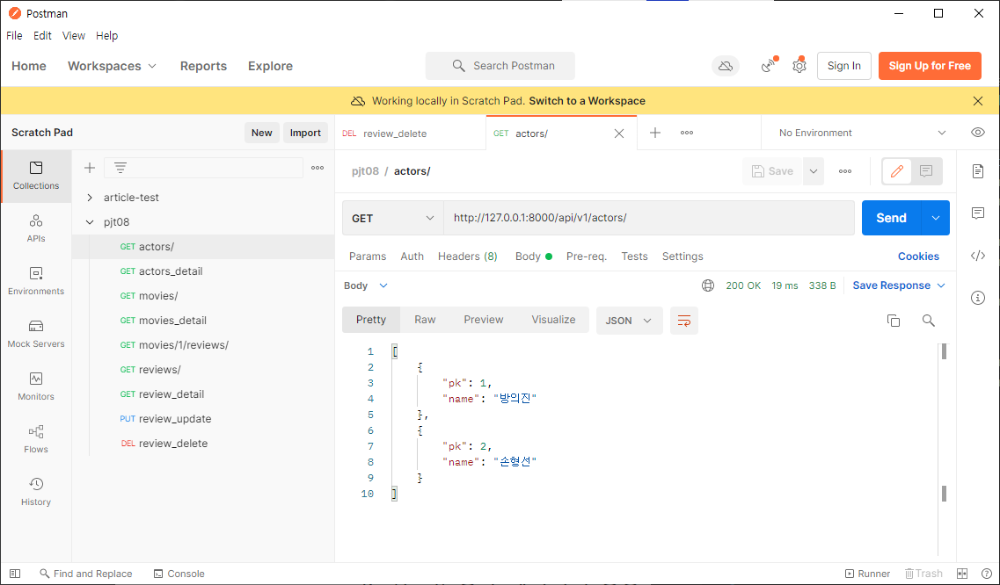

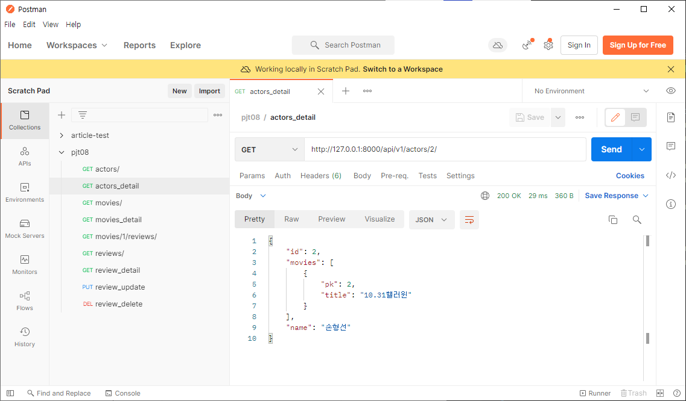

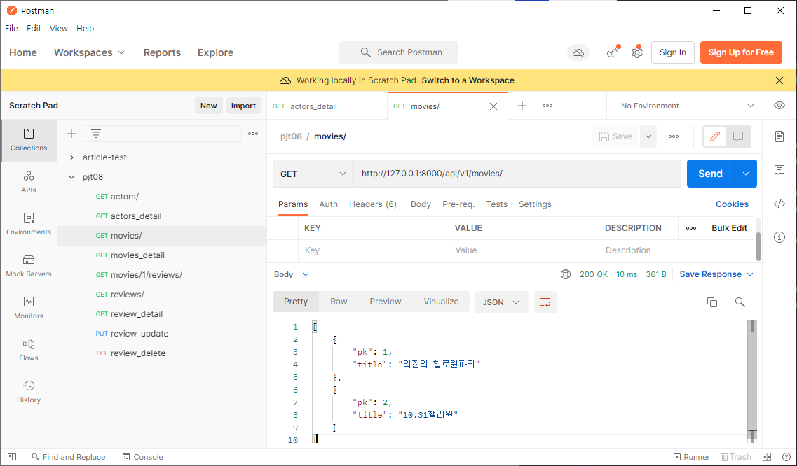

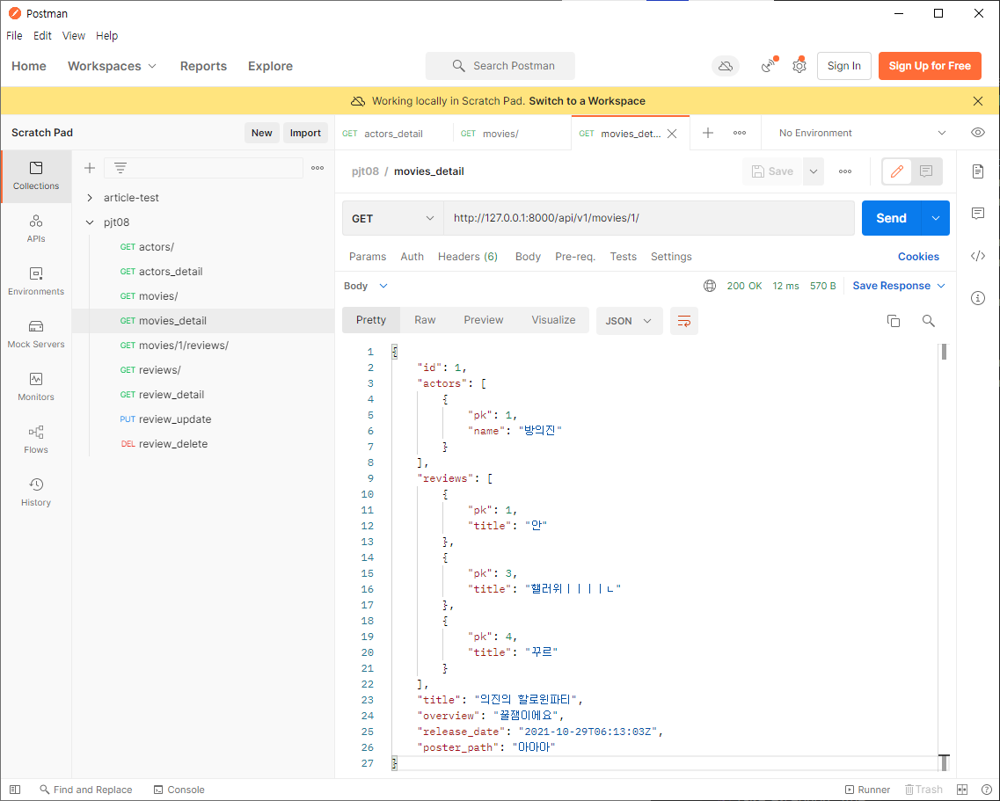

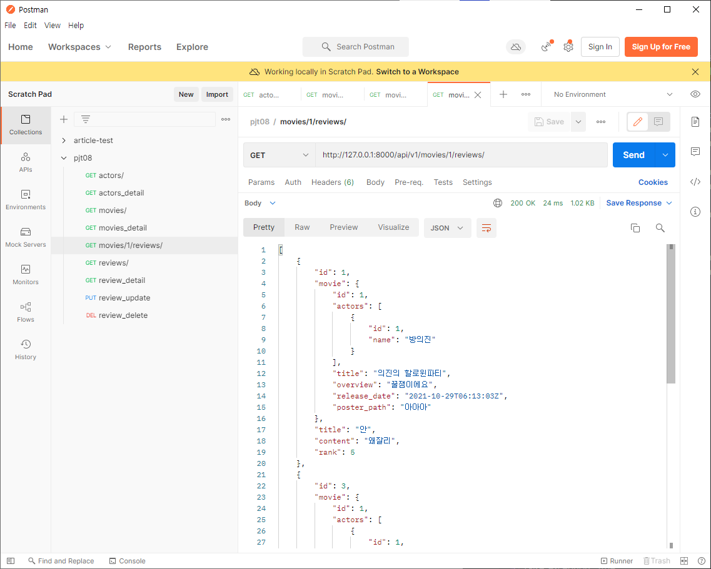

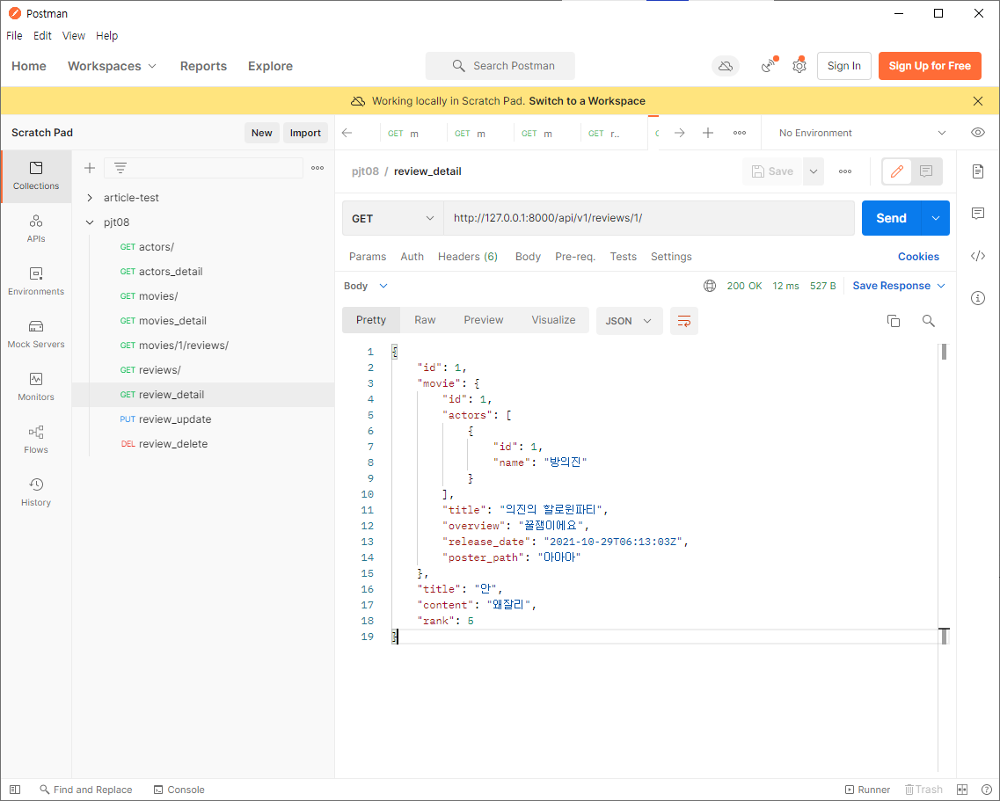

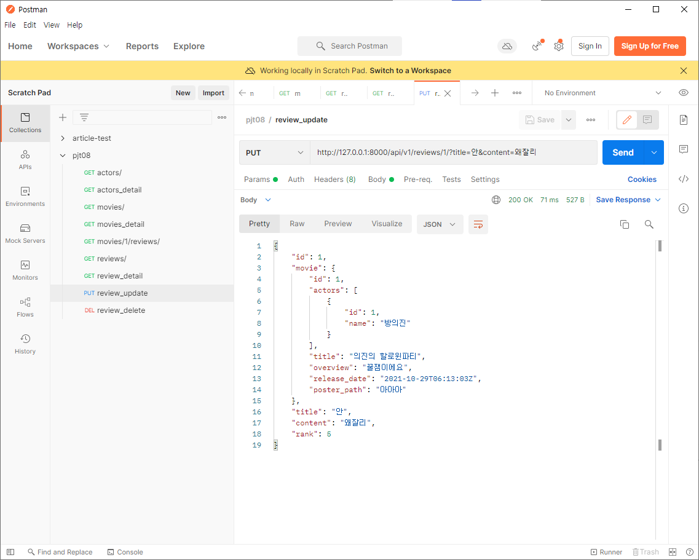

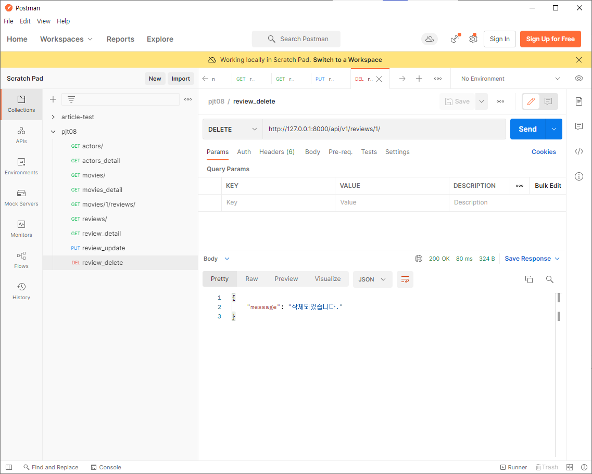

# 소감

M:N 관계와 1:N 관계를 바탕으로 drf 를 활용한 웹 어플리케이션을 제작하였다. 

REST API 에 대한 개념이 생소해서 API, Django REST FRAMEWORK 에 대해 새롭게 알게 되었고 serializer를 사용해 보았다.

처음에 모델을 파악하고 url을 만들었는데, 추후 약간의 변동이 있었다. (사진 참조)

쉽지 않은 과정이었고 에러가 계속해서 발생하여서 기록해 두었다. 

향후 다시 복습하고, 미완성한 기능도 추가하면 좋을 것 같다. 

# 프로젝트 목표

#### 데이터베이스 설계를 통한 REST API 설계

- 데이터를 생성, 조회, 수정, 삭제할 수 있는 Web Application 제작
- DRF(Django Rest Framework)를 활용한 API Server 제작
- Database 1:N, M:N 관계의 이해와 데이터 관계 설정

### 프로젝트 구조

 pjt08/은 startproject 명령어로 생성되는 project 디렉토리입니다. movies/는 startapp 명령어로 생성되는 application 디렉토리입니다. 아래의 폴더구조는 주요한 폴더와 파일만 명시되어 있습니다.

### URL

TMDB(https://developers.themoviedb.org/3/) API 문서를 참고하여 페어와 의논 후 RESTful한 URL을 구성합니다.

# 프로젝트 내용

### Admin

- Actor, Movie, Review의 데이터 모두 admin 페이지에서 CRUD가 가능합니다.

### Serializer & View 

1. Serializer
   1. Model과 URL경로 및 view 함수와 대응하는 적절한 Serializer를 생성합니 다.

2. Actor
   1. 전체 배우 목록을 제공합니다.
   2. 단일 배우 정보(출연 영화 포함)를 제공합니다.
   3. 관리자 페이지에서 배우 데이터를 생성, 수정, 삭제합니다.

3. Movie
   1. 전체 영화 목록을 제공합니다.
   2. 단일 영화 정보(출연 배우와 리뷰 데이터 목록 포함)를 제공합니다.
   3. 관리자 페이지에서 영화 데이터를 생성, 수정, 삭제합니다.
   4. (선택) 영화 데이터의 생성과 출연 배우 등록이 가능한 view 함수를 생성 합니다. => 미완성

4. Review
   1. 리뷰를 생성합니다.
   2. 전체 리뷰 목록을 제공합니다.
   3. 단일 리뷰 정보(영화 정보 포함)를 반환합니다.
   4. 리뷰를 수정합니다.
   5. 리뷰를 삭제합니다.

---

# 초기 url 구조 설정

# url 최종 구조

---

# URL

---

# 발생한 에러들

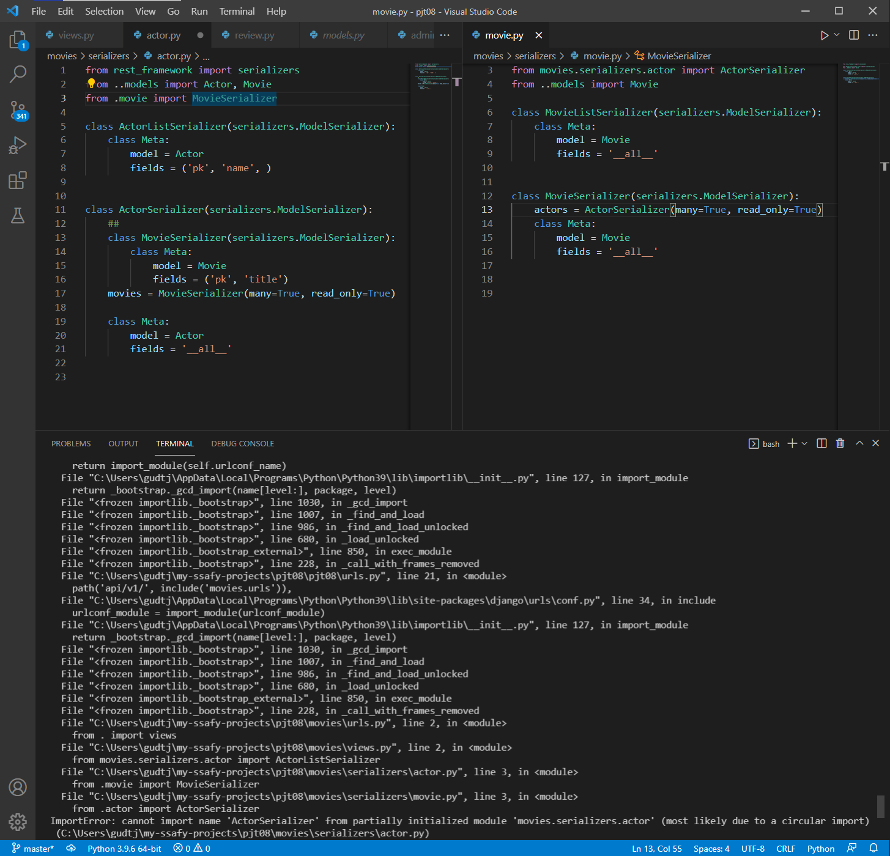

# API View

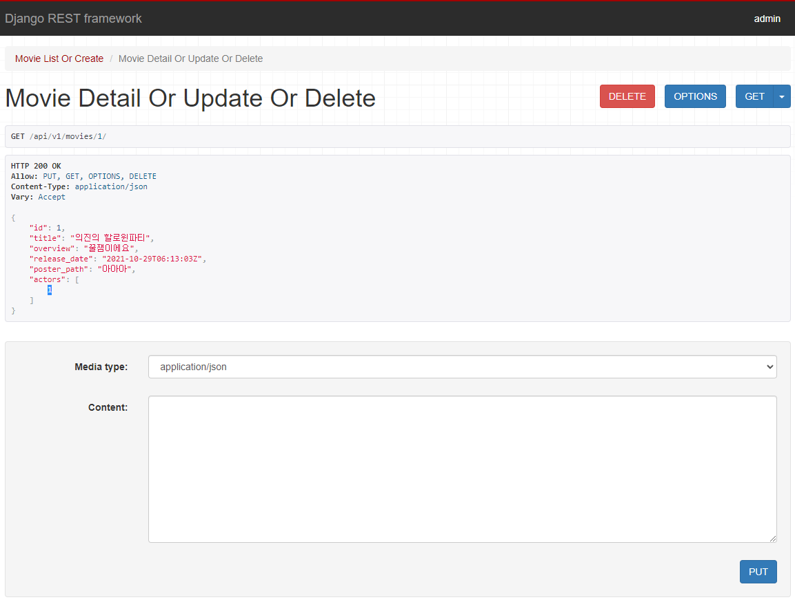

# ActorSerializer class를 생성하지 않고 넣어줘서 pk만 나왔음.

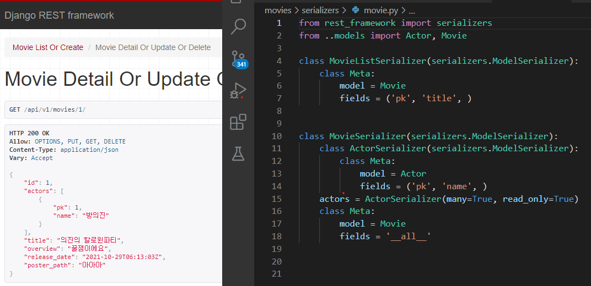

# Review 구조 : 전체리뷰 + 영화별 리뷰

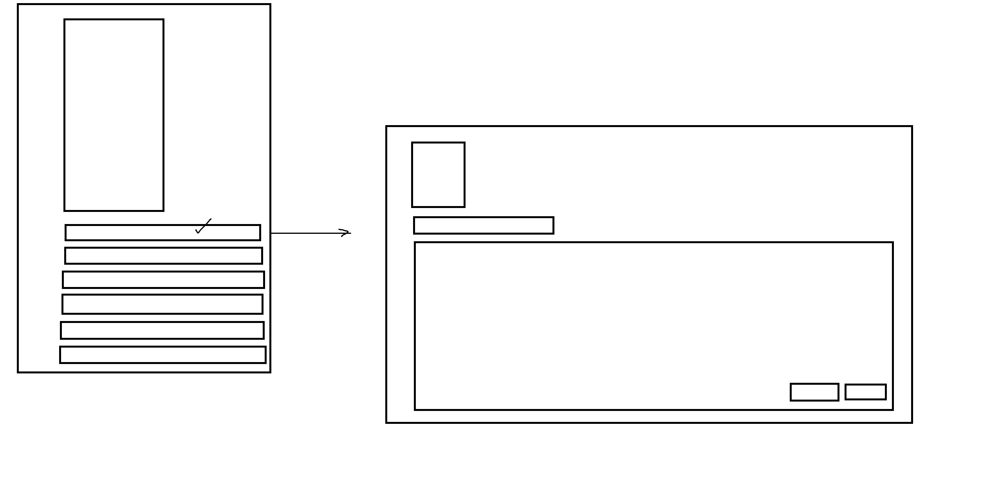

# related_name 빼먹음

# many=True빼먹음

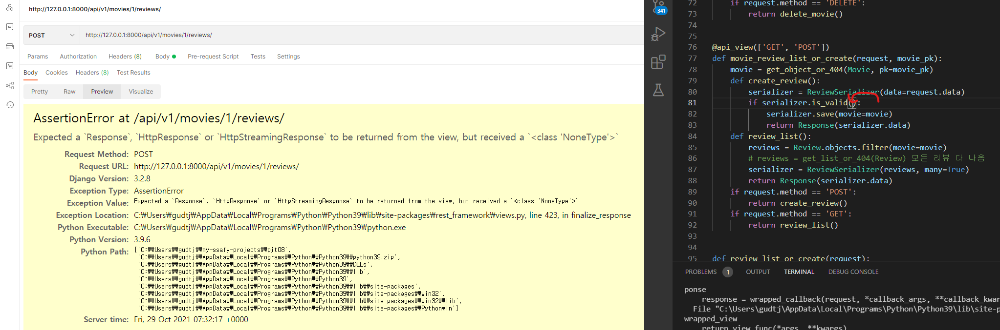

# serializers.py에서 read_only빼먹음!

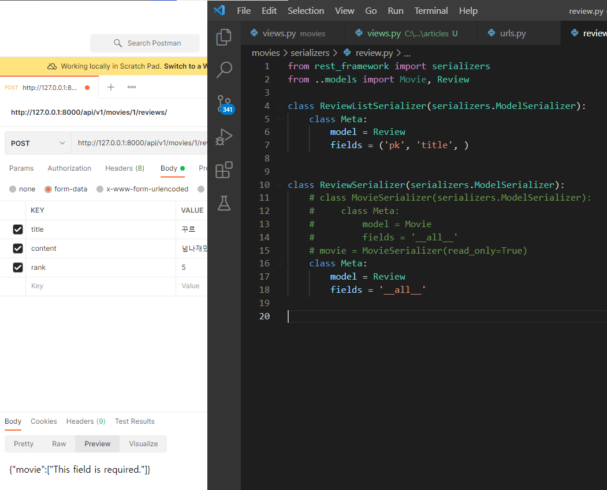

# 위 에러시 review.movie에 movie_pk만 나옴

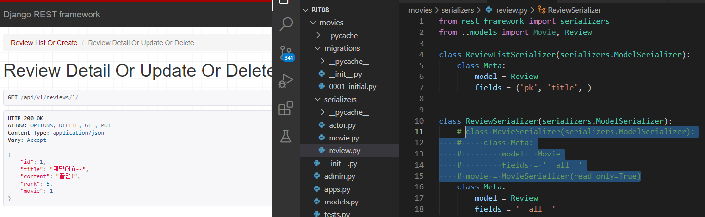

# 주석 해제시 영화 정보 출력

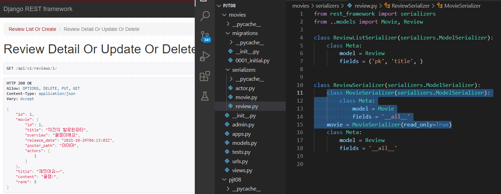

