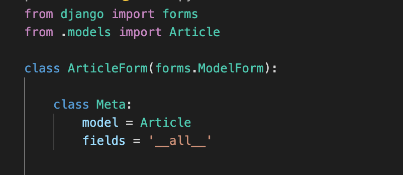

# ModelForm

- Model 이 있다면, 따로 form 이 적인 html을 생성할 필요 없이 ModelForm을 사용하여 Form Class를 만든다.


### 선언하기




## GET & POST 분기처리는 왜 하는 것이고, POST가 먼저인 이유는 무엇인가?

post 방식만이 디비를 건드릴 수 있다. get 이 먼저 온다면, 여러 분기처리가 필요하다.


### create view 함수 구조 변경 - 연습용

- create view 함수 변경

```python
# 2. create
# 빈 종이를 보여주던 new.html 과 new 함수는 사라진다. form이 대체한다.
def create(request):
    # 5. create 경로로 요청이 들어옴(POST) => 잘못된 데이터를 담아서 저장해달라고 요청
    # 10. create 경로로 요청이 들어옴(POST) => 올바른 데이터를 담아서 저장해달라고 요청

        # 6. ArticleForm을 인스턴스화한다. (사용자가 입력한 정보를 담아서) => 데이터가 입력된 종이를 생성한다.
        # 11. ArticleForm을 인스턴스화한다. (사용자가 입력한 정보를 담아서) => 데이터가 입력된 종이를 생성한다.

        # 7. 데이터가 유효한지 검증한다. (잘못된 데이터를 넣었기 때문에 실패)
        # 12. 데이터가 유효한지 검증한다. (올바른 데이터를 넣었기 때문에 성공)

            # 13. 데이터를 저장한다.
            # 14. index로 리다이렉트한다.

    # 1. create 경로로 요청이 들어옴(GET) => 빈종이를 달라고 하는 요청
        # 2. ArticleForm을 인스턴스화한다. => 빈 종이를 생성한다.

    # 3. 사용자에게 빈 종이를 주기 위해 context에 담는다.
    # 8. 유효한 데이터만 들어있는 종이를 다시 돌려주기 위해 context에 담는다.

    # 4. 사용자에게 빈 종이를 넘겨준다.
    # 9. 사용자에게 올바른 데이터가 있는 종이를 넘겨준다.
```

- html 변경


### update view 함수 구조 변경 - 연습용

- update view 함수 변경

```python
# 3. update
# 기존 정보를 보여주는 종이였던 edit.html과 edit 함수는 사라진다. form이 대체한다.
def update(request, pk):
    # 0. 기존 정보를 하나 가져온다.

    # 5. update 요청이 들어옴(POST) => 잘못된 데이터를 담아서 수정해달라고 요청
    # 10. update 요청이 들어옴(POST) => 올바른 데이터를 담아서 수정해달라고 요청

        # 6. ArticleForm을 인스턴스화한다. (사용자가 수정한 정보 + 기존정보)
        # 11. ArticleForm을 인스턴스화한다. (사용자가 수정한 정보 + 기존정보)

        # 7. 데이터가 유효한지 검증한다. (잘못된 정보가 들어옴)
        # 12. 데이터가 유효한지 검증한다. (올바른 정보가 들어옴)

            # 13. 데이터를 수정한다.
            # 14. index로 리다이렉트 시켜준다.


    # 1. update 요청이 들어옴(GET) => 기존의 정보를 담은 종이를 요청

        # 2. 기존의 정보를 담은 종이를 생성

    # 3. 사용자에게 보여주기 위해 context에 저장한다.
    # 8. 유효한 데이터만 들어있는 종이를 다시 돌려주기 위해 context에 저장

    # 4. 사용자에게 종이를 보낸다.
    # 9. 사용자에게 올바른 데이터가 있는 종이를 넘겨준다.
```

- html 변경


### delete view 함수 구조 변경


## 위젯 적용하기

- 위젯? django의 HTML input element를 표현한다.
- HTML 렌더링을 처리한다.


