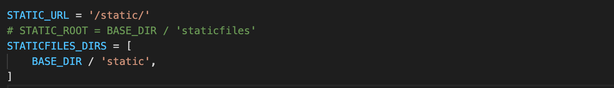
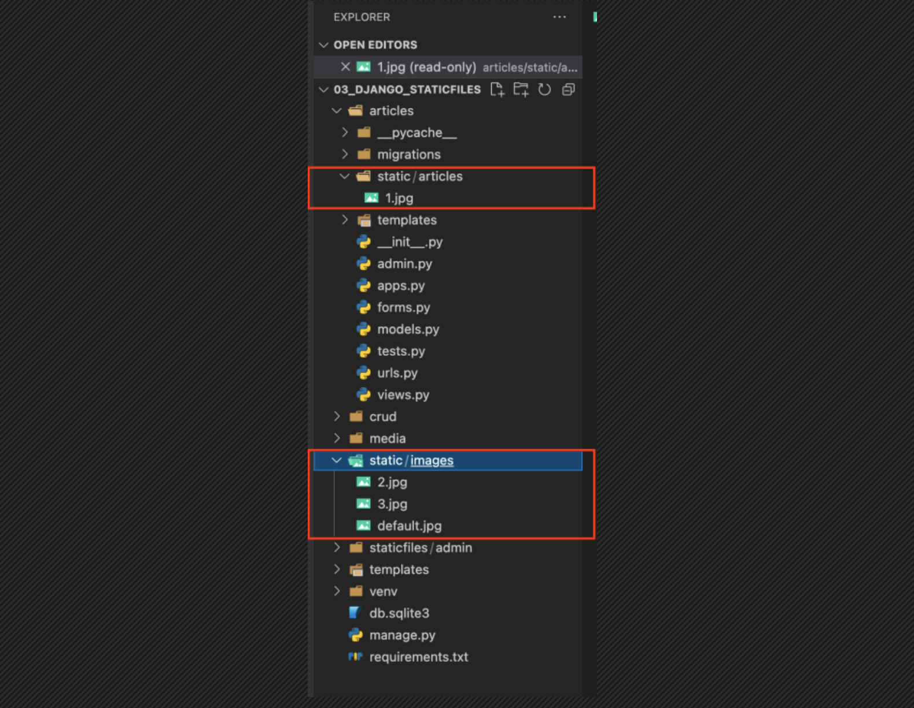
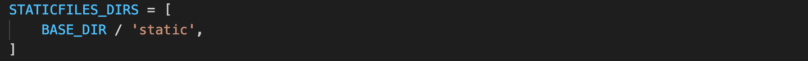
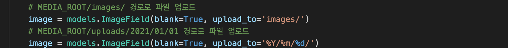
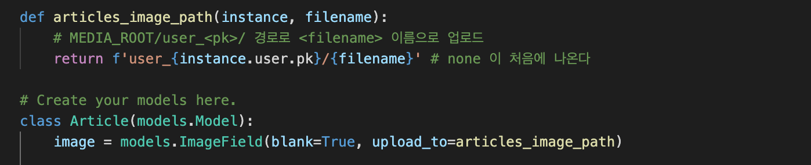
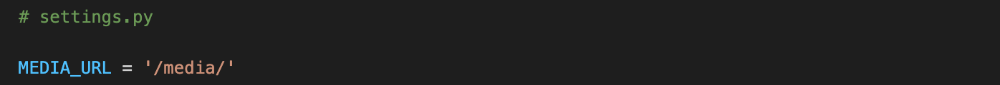

# Static files

> 개발자가 작성한 css파일이나 미리 업로드한 이미지 파일


### Static file 

- 응답시 서버단에서 별도의 처리 없이 그대로 보여주면 되는 정적 파일


### 구성 4단계

1. `django.contrib.staticfiles 가 INSTALLED_APPS` 에 포함되어있는지 확인한다. (기본 포함되어있다.)

2. `settings.py` 에서 `STATIC_URL`을 정의한다.

```python
STATIC_URL = '/static/' # 기본 경로
STATICFILES_DIRS = [BASE_DIR / 'static'] # 추가 경로: 최상위 폴더명 'static'
```

3. 템플릿에서 `static template tag`를 사용하여 지정된 상대경로에 대한 URL을 빌드한다.

- 기본 경로는  `my_app/static`  이후의 경로로 작성한다.
- 추가 경로는  `static` 이후의 경로로 작성한다.

```Html
<!-- html -->

<!-- 기본경로 -->
 
<!-- 추가경로 -->
 
```

4. 앱의 `static` 폴더에 정적 파일을 저장한다.

- my_app/static/my_app/example.jpg





위가 기본 경로, 아래가 추가 경로


### Django template tag

- load : 사용자 정의 템플릿 태그세트를 로드한다.

```python

```

- static : STATIC_ROOT 에 저장된 정적 파일에 연결한다.

```python

```


### STATICFILES_APP

##### STATIC_ROOT(참고)

- collectstatic이 배포를 위해 정적 파일을 수집하는 디렉토리의 절대 경로
- settings.py의 DEBUG 값이 True 로 설정시 작동하지 않음
  - 직접 작성하지 않으면 장고프로젝트에서는 셋팅에 작성되어 있지 않음
- 추후 배포시 사용

```python
STATIC_ROOT = BASE_DIR / 'staticfiles'

$ python manage.py collectstatic
```


##### STATIC_URL


- STATIC_ROOT에 있는 정적 파일을 참조할 때 사용할 URL
  - 기본 경로(app/static/경로) 및 STATICFILES_DIRS에 정의된 추가 경로를 선택
- 실제 파일이나 디렉토리가 아니며, URL로만 존재한다.


##### STATICFILES_DIRS



- 기본경로 외 추가적인 정적 파일 경로 목록을 정의하는 리스트
- 추가 파일 디렉토리에 대한 전체 경로를 포함하는 문자열 목록으로 작성


### 정적파일 사용하기 - 기본경로

- 정적 파일 경로 : app/static/app

```python
# settings.py

STATIC_URL = '/static/'
```


- 템플릿에서 경로 참조 : app/static 까지가 기본 경로이므로 그 이후를 써준다.

```html

...

```

- 이미지 주소는 `/static/app/example.jpg `이며, 이 요청주소를 static tag가 만들어주는 것이다.

> http:// ...8000/static/app/example.jpg


### 정적파일 사용하기 - 추가경로

- 정적 파일 위치: 프로젝트 폴더와 동일선상에서 static/images
- 추가 경로 작성

```python
# settings.py

STATICFILES_DIRS = [
  BASE_DIR / 'static'
]
```

- 템플릿에서 경로 참조 -

```html

...

```


---


# Media Files

> 사용자가 웹에 업로드하는 정적 파일


### Model field

##### ImageField

- 이미지 업로드에 사용하는 모델 필드
- FileField를 상속받는 서브클래스로 유효한 이미지인지까지 검사한다.
- ImageField 인스턴스는 최대 길이가 100자인 문자열로 DB에 생성되며 max_length 인자로 변경 가능하다.
- 주의) 사용시 Pillow 라이브러리 필수!


##### FileField

- 파일 업로드에 사용하는 모델 필드

- 2개의 선택 인자를 가진다

  - upload_to
  - ~~storage~~

  ###### upload_to argument

  > 업로드 디렉토리와 파일 이름을 설정하는 2가지 방법을 제공

  1. 문자열 값이나 경로 지정 방식 (models.py)

  2. 함수 호출 방식 (models.py)

  - 반드시 2개의 인자(instance, filename) 사용
    - instance
      - FileField 가 정의된 모델의 인스턴스
      - 대부분 이 객체는 아직 데이터베이스에 저장되지 않았으므로 PK 값이 없을 수 있음
    - filename
      - 기존 파일에 제공된 파일 이름

  


### ImageField, FileField 사용방법

1. `settings.py`에 MEDIA_ROOT, MEDIA_URL 설정
2. upload_to 속성을 정의하여 업로드 된 파일에 사용할 MEDIA_ROOT의 하위 경로 지정
3. 업로드된 파일 경로는 django가 제공하는 'url' 속성을 통해 얻을 수 있음


### MEDIA_ROOT

- 사용자가 업로드한 파일을 보관할 디렉토리의 절대 경로
- 장고는 파일이 아닌 '파일의 경로'를 데이터베이스에 저장한다.
- 주의) MEDIA_ROOT는 STATIC_ROOT 와 다른 경로로 지정해야 한다.


### MEDIA_URL

- MEDIA_ROOT 에서 제공되는 미디어를 처리하는 URL
- 업로드된 파일의 주소를 만들어주는 역할
- 비어있지 않은 값으로 설정시 / 로 끝나야 함




### 사용자가 업로드 한 파일을 제공하기

settings.py에 MEDIA_URL 값이 작성되어 프로젝트에 사용자가 업로드한 파일을 받았는데, 이걸 다시 웹페이지에서 조회할 수 있도록 하려면 업로드된 파일에 대한 URL 설정이 필요하다.

- 업로드된 파일의 URL => ` settings.MEDIA_URL`
- 위 URL을 통해 참조하는 파일의 실제 위치 => `settings.MEDIA_ROOT`


## 이미지 업로드하기(create)

1. `ImageField` 작성
2. Pillow 라이브러리 설치
3. 마이그레이션 실행
4. 게시글 작성 `form enctype` 속성 지정
5. View.py 수정


https://www.w3schools.com/tags/att_input_accept.asp

view.py 를 보면, 장고가 이미지를 받지 못함

request.POST 가 아닌 request.FILES에 있기 때문

저장하면

최상위에 image 폴더가 생성

장고가 주는 이미지가 다시 크롬으로 갈때 경로를 설정

```python
# settings.py

MEDIA_URL = '/media/' # url 경로의 이름
MEDIA_ROOT =  BASE_DIR / 'media' # 실제로 파일이 저장되는 공간
```

urls.py 에 경로 잡아주기

Index.html


#### Media file with HTML input

- <input type='file'> 태그를 사용할 경우 반드시 사용해야하는 속성은?
  - `enctype="multipart/form-data`

- accept 속성: 파일 업로드 제어에서 선택할 수 있는 파일 유형을 정의하며 Input 태그의 type이 파일일 경우에만 유효하다.
  - 표준이미지 형식뿐 아니라 PDF 형식도 받을 수 있어야 한다면? `accept="image/*,.pdf"`


4. 글자 외의 파일을 받겠다

```html
<form ... enctype="multipart/form-data">
```


## 이미지 업로드하기(read)

1. 이미지 경로 불러오기
2. MEDIA_URL 확인하기
3. STATIC_URL과 MEDIA_URL


## 이미지 업로드하기(update)

- 이미지는 바이너리 데이터이기 때문에 일부 수정이 불가, 새로운 이미지로 덮어씌운다.


## 이미지 리사이징

원본 데이터를 받아서 줄이는게 아니라, 처음부터 작게 받는 방법

1. django-imagekit 설치
2. INSTALLED_APPS 에 추가
