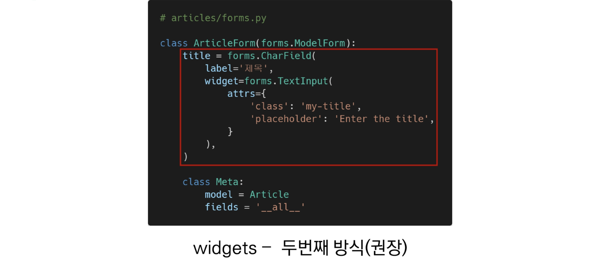
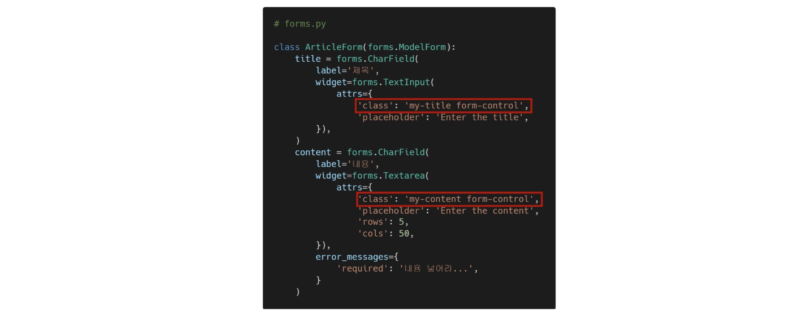
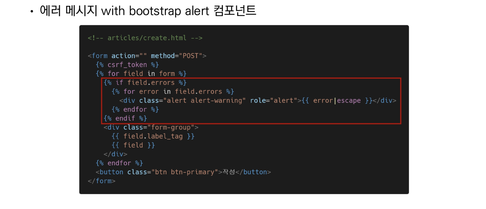

# Widget and Bootstrap

## 위젯 적용하기

- 위젯? django의 HTML input element를 표현한다.
- HTML 렌더링을 처리한다.





## Bootstrap과 함께 사용하기

#### Bootstrap class with widgets

- 부트스트랩 form 을 사용해 적용
  - http://getbootstrap.com/docs/5.1/forms/overview/
- 핵심 클래스
  - form-control
- Bootstrap Form의 핵심 클래스를 widget에 작성






#### Django Bootstrap 5 Library

- django-bootstrap v5

  - form class에 bootstrap을 적용시켜주는 라이브러리
  - https://django-bootstrap-v5.readthedocs.io/en/latest/quickstart.html
  
  

장고 어플리케이션 설치

```bash
pip install django-bootstrap-v5
```

외부 라이브러리 설치하고 업데이트

```bash
pip freeze > requirements.txt
```

앱 등록

```
'bootstrap5',
```


