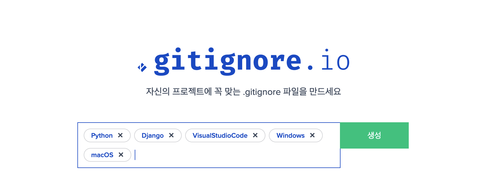
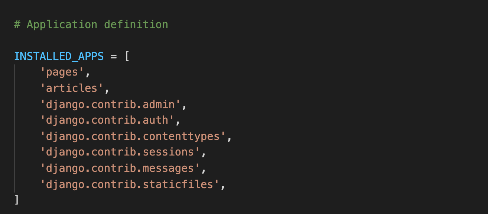
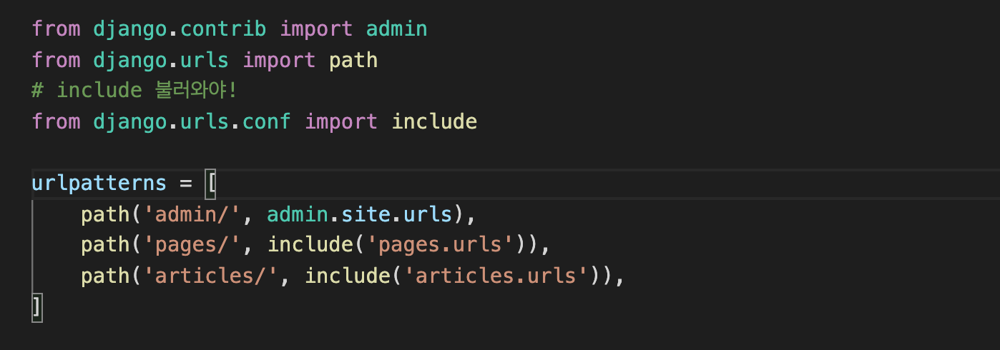
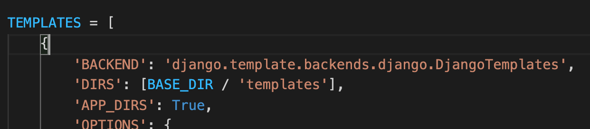

# django 실행순서


### 1. 루트폴더 생성 및 폴더 내 이동

```python
mkdir <folder name>
cd <folder name>
```


### 2. 가상환경 생성

```python
python -m venv <name>
```

일반적으로 <name>에는 venv를 사용


참고) 적용

```python
pip install -r requirements.txt
```

참고 ) 변경된 사항을 반영

```python
pip freeze > requirements.txt
```


### 3. 가상환경 실행

```python
# Window OS
source <name>/Scripts/activate
```

```python
# mac os
source <name>/bin/activate
```

참고 ) 가상환경 종료

```python
deactivate
```


### 4. 장고 설치

```python
pip install django
```


---


### 5. 장고 프로젝트 (폴더)생성

- '.' 을 찍어야, 프로젝트 폴더와 manage.py 가 동일경로에 위치

```python
django-admin startproject <name> .
```


### 6. .gitignore 파일만들기

- .gitignore 로 만든 후, 웹사이트 들어가 내용 복사 붙여넣기



### 7. 장고 앱 생성 및 등록

- **이때 앱 이름은 반드시 복수형으로 사용! (articles 등)**

```python
python manage.py startapp <name>
```

- **생성 후에는 무조건 등록! (project folder 내의 settings.py)**




---


### 8. 메인 urls.py 경로설정

- project folder 내의 urls.py
- 요청받은 url들을 각각 맞는 앱 내 주소로 보내주는 허브 역할




### 9. 각 앱에 urls.py 파일 만들고 패턴 등록


### 10. 공통 html 등록

BASE_DIR



+

루트안에 templates 폴더, 그 안에 base.html 만듦
