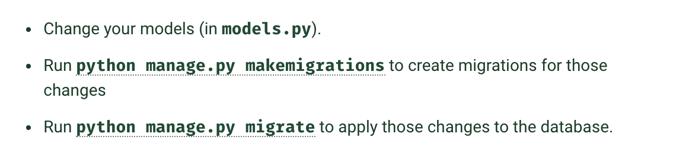

# view - request & response

### 1. app 의 view 작성

- 앱 내의 views.py 에 작성

```python
# <appname>/views.py
# polls/views.py

from django.http import HttpResponse


def index(request):
    return HttpResponse("Hello, world. You're at the polls index.")
```


### 2. view 와 urls 연결

- 앱 내에 urls.py 파일 생성 URL conf
- To call the view, we need to map it to a URL - and for this we need a URLconf.
- To create a URLconf in the polls directory, create a file called `urls.py`. 

```python
# <appname>/urls.py
# polls/urls.py

from django.urls import path

from . import views

urlpatterns = [
    path('', views.index, name='index'),
]
```


### 3. 프로젝트 URL과 연동

- 프로젝트 내 url.py
- add an import for `django.urls.include` and insert an [`include()`](https://docs.djangoproject.com/en/3.2/ref/urls/#django.urls.include) in the `urlpatterns` list
- **`include` function : 다른 URLconfig를 참조. 매칭되는 부분까지 자르고, 나머지 부분을 보낸다 (??)**
- The [`include()`](https://docs.djangoproject.com/en/3.2/ref/urls/#django.urls.include) function allows referencing other URLconfs. Whenever Django encounters [`include()`](https://docs.djangoproject.com/en/3.2/ref/urls/#django.urls.include), it chops off whatever part of the URL matched up to that point and sends the remaining string to the included URLconf for further processing.
- The idea behind [`include()`](https://docs.djangoproject.com/en/3.2/ref/urls/#django.urls.include) is to make it easy to plug-and-play URLs. Since polls are in their own URLconf (`polls/urls.py`), they can be placed under “/polls/”, or under “/fun_polls/”, or under “/content/polls/”, or any other path root, and the app will still work.

```python
# <projectname>/urls.py
# mysite/urls.py

from django.contrib import admin
from django.urls import include, path

urlpatterns = [
    path('polls/', include('polls.urls')),
    path('admin/', admin.site.urls),
]
```


### 참고: path() function

- 필수인자 : route & view
- 옵션인자 : kwargs & name

##### path() argument: route

- a string that contains a URL pattern
- 요청을 처리할 때, urlpatterns 를 쭉 따라가며 검색하는데, GET과 POST 파라미터는 제외
- 아래 주소의 경우 `myapp/` 을 찾는다.

`https://www.example.com/myapp/?page=3`

##### path() argument: view

- 장고가 matching pattern을 찾으면, `view` function을 요청하는데, 이때 `request` 오브젝트를 첫 번째 인자로 보낸다. 그 이외 route의 value들은 키워드 인자로 보낸다.
- When Django finds a matching pattern, it calls the specified view function with an [`HttpRequest`](https://docs.djangoproject.com/en/3.2/ref/request-response/#django.http.HttpRequest) object as the first argument and any “captured” values from the route as keyword arguments. We’ll give an example of this in a bit.


### 4. 서버 실행

```python
python manage.py runserver
```


---


# DB and MODELS

### 1. DB SETUP

##### default

- python 내장 `SQLite` 사용 (유저가입 없이도 사용가능)
- `<projectname>/settings.py`  내의 **"INSTALLED_APPS"** 에 필요한 데이터베이스를 생성

```python
python manage.py migrate
```


### 2. model class 제작

- model : a database layout, with additional metadata
- **Question** 및 **Choice** model class 제작 (python `classes` 형태)

```python
# polls/modes.py
from django.db import models

class Question(models.Model):
    question_text = models.CharField(max_length=200)
    pub_date = models.DateTimeField('date published')
    

class Choice(models.Model):
    question = models.ForeignKey(Question, on_delete=models.CASCADE)
    choice_text = models.CharField(max_length=200)
    votes = models.IntegerField(default=0)
```

```
여기에서 각 모델은 django.db.models.Model를 하위 클래스로 가지는 클래스입니다.

question_text, pub_date => database field
각 모델에는 여러 클래스 변수(class variables)가 있으며 각각은 모델의 database field를 나타냅니다.

각 필드는 Field class의 instances로 표시된다. (예: 문자 필드의 경우 CharField, 날짜/시간의 경우 DateTimeField). 이것은 Django에게 각 field가 어떤 유형의 data를 보유하는지 알려줍니다.

각 Field instance의 이름(question_text 또는 pub_date)은 machine-friendly format 이름입니다. Python 코드에서 이 값을 사용하고 데이터베이스는 이 값을 column name 으로 사용합니다.

일부 Field class에는 필수 인수(required arguments)가 있습니다. 예를 들어 CharField는 max_length를 지정해야 합니다. 이것은 데이터베이스 스키마뿐만 아니라 곧 보게 될 유효성 검사(validation)서도 사용됩니다.

Field는 또한 다양한 선택적 인수(optional arguments)를 가질 수 있습니다. 이 경우 투표의 기본값을 0으로 설정했습니다.

마지막으로 ForeignKey를 사용하여 관계를 정의합니다. 이는 Django에게 각 Choice가 단일 질문과 관련되어 있음을 알려줍니다. Django는 다대일, 다대다, 일대일과 같은 모든 공통 데이터베이스 관계를 지원합니다.
```


### 3. model 실행

#### 3-1. 앱 등록

- The `PollsConfig` class is in the `polls/apps.py` file, so its dotted path is `'polls.apps.PollsConfig'`. 
- Edit the `mysite/settings.py` file and add that dotted path to the [`INSTALLED_APPS`](https://docs.djangoproject.com/en/3.2/ref/settings/#std:setting-INSTALLED_APPS) setting.

```python
INSTALLED_APPS = [
    'polls.apps.PollsConfig',
    'django.contrib.admin',
    'django.contrib.auth',
    'django.contrib.contenttypes',
    'django.contrib.sessions',
    'django.contrib.messages',
    'django.contrib.staticfiles',
]
```


#### 3-2. cmd 입력

- By running `makemigrations`, you’re telling Django that you’ve made some changes to your models (in this case, you’ve made new ones) and that you’d like the changes to be stored as a *migration*.

```python
python manage.py makemigrations polls
```

```bash
Migrations for 'polls':
  polls/migrations/0001_initial.py
    - Create model Question
    - Create model Choice
```


#### 추가 : SQL 확인하기

```bash
python manage.py sqlmigrate polls 0001
```


#### 3-3. migrate 실행하기

- model 의 변화를 database에 반영

```bash
python manage.py migrate
```


### 결론 : 3steps!! 




### 5. API 활용하기

#### **5-1. model class 사용을 위해 익스텐션 설치, shell plus 사용**

장고 익스텐션 설치 및 실행

```bash
pip install django-extensions (이후 settings.py 에 app 'django_extensions' 등록)
```

```bash
python manage.py shell_plus
```

추가 (비주얼보정용)

```python
pip install ipython
```

