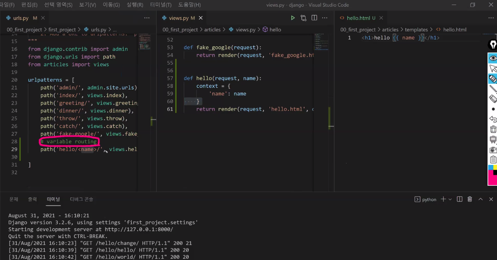
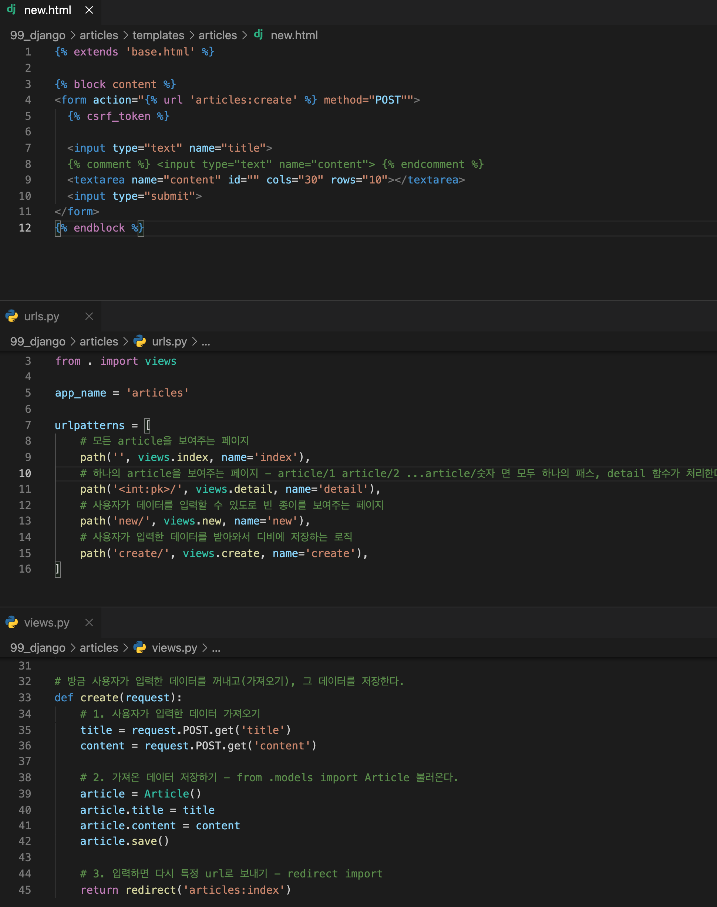
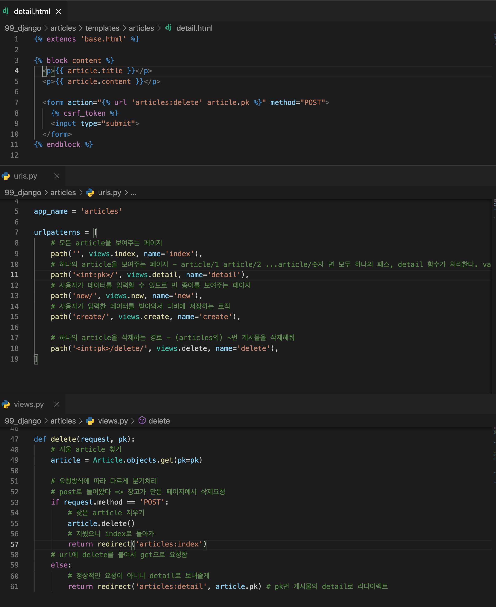

# django

### 동적 웹페이지

##### 정적 웹페이지 vs. 동적 웹페이지

| 정적 웹페이지         | 동적 웹페이지                                   |
| --------------------- | ----------------------------------------------- |
| 일반 신문             | 해리포터 마법사 신문                            |
| html, css, javascript | 서버사이드 프로그래밍 언어                      |
| 데이터 변화 없음      | 데이터가 시시각각 변함, 데이터베이스와 상호작용 |

 ### 사용기업

스포티파이, 인스타그램, 드롭박스, 요기요

###  Framework Architecture

##### MVC Design Pattern (model-view-controller)

사용자 인터페이스로부터 프로그램 로직을 분리하여 애플리케이션의 시각적 요소나 이면에 실행되는 부분을 서로 영향 없이 쉽게 고칠 수 있는 애플리케이션을 만들 수 있음

- Django는 MTV Pattern이라 부른다.

### MTV Pattern(Django)

- Model :  데이터베이스의 데이터를 다룬다. 네 가지 방법 : CRUD
- Template : 레이아웃을 정의 (html, css같은 개념)
- View : 컨트롤러. http요청을 수신하고 응답을 반환
  - 모델과 템플릿 사이에서 중간 역할!!

### 기타설정 - 언어, 타임존

LANGUAGE_CODE = 'ko-kr'

TIME_ZONE = 'Asia/Seoul'

### MTV 중 Template (Django Template Language, DTL)

render 함수 : request와 미완성 'index.html' 을 합쳐 하나의 html로 만든다.

재사용과 상속

템플릿을 모아서 관리한다

## DB & HTTP

create - post

read - get

update - put

delete - delete

4개 중 어떤 방식인지 미리 만들어 놓는다(request method)

- django에서는 get, post만 사용!!!

### variable routing

### 각각의 앱들을 분리

### GET & POST 방식

- GET : 도서관 가서, 00책(단순한 정보를) 주세요~ 그러면 사서가 바로 찾아서 줌

- POST: 도서관 가서, 00책을(구체적 정보를) 신청(처리)해주세요 ~ 하면 사서가 처리해서 완료됐다고 알려줌 => post 방식은 항상 정보가 필요하다.

### POST 방식과 csrf_token

 

### delete

### 수정(UPDATE)

1. 수정버튼을 누릅니다.
2. 수정페이지로 이동합니다. (기존의 정보를 보여줍니다.) => READ
3. 수정합니다. 사용자가 기존 데이터를 변경합니다.
4. 수정완료 버튼을 누릅니다.
5. 사용자가 변경한 데이터를 받아옵니다.
6. 기존 데이터를 받아온 데이터로 변경합니다. => CREATE
7. 변경이 완료된 후 원래 위치로 돌려보내줍니다.
