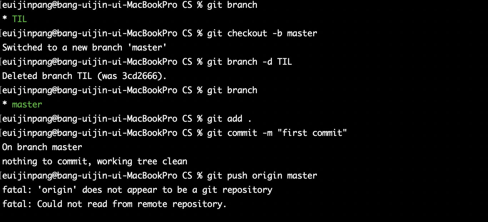

# git error

### git branch root change to 'master'

##### 문제점

`git status` 로 확인시, 폴더의 브랜치 경로가 `master` 이외 경로로 설정

##### 원인

???

##### 해결방안1

`git checkout master` 입력하여 브랜치를 master로 변경

##### 해결방안2

origin2 만들었다가 삭제, `git branch -m TIL master`  로 TIL 브랜치 삭제

##### 해결방안 3

- **`git checkout -b master`  ==> Switch to a new branch 'master'**
- **`git branch -d TIL` ==> Deleted branch TIL**
- **`git branch` ==> Check branch**

