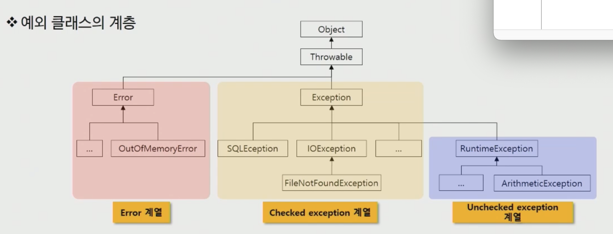

# exception handling (예외 처리)

예외 발생 시 프로그램의 비정상 종료를 막고 정상적인 실행 상태를 유지하는 것


# 예외 클래스의 계층



### Error 

- stackoverflow, 메모리 부족 등 일단 발생하면 복구할 수 없는 상황

### Checked exception

- 읽으려는 파일이 없거나 네트워크 연결이 안 되는 등 프로그램 코드에 의해 수습될 수 있는 상황

- 처리하지 않으면 컴파일 불가

### Unchecked exception

- 예외에 대한 대처 코드가 없어도 컴파일은 진행됨


# try-catch 

상속 관계는 작은 범위(자식)에서 큰 범위(조상) 순으로 정의

```java
try {
  // exception 이 발생할 만한 코드
} catch (XXException e) {
  // 
} catch (YYException e) {
  //
} catch (Exception e) {
  //
}
```


# throwable 주요 메서드

### public String getMessage()

### public void printStackTrace()


# try-catch-finally

finally 는 예외 발생 여부와 관계없이 언제나 실행된다.

중간에 return 을 만나도 finally 블록을 먼저 수행 후 리턴을 실행한다.

```java
try {
  // exception 이 발생할 만한 코드
} catch (XXException e) {
  // 
} catch (YYException e) {
  //
} finally {
  //
}
```

- 예를 들어 성공하거나 실패해도 자원을 정리하는 경우 (delete)에 사용