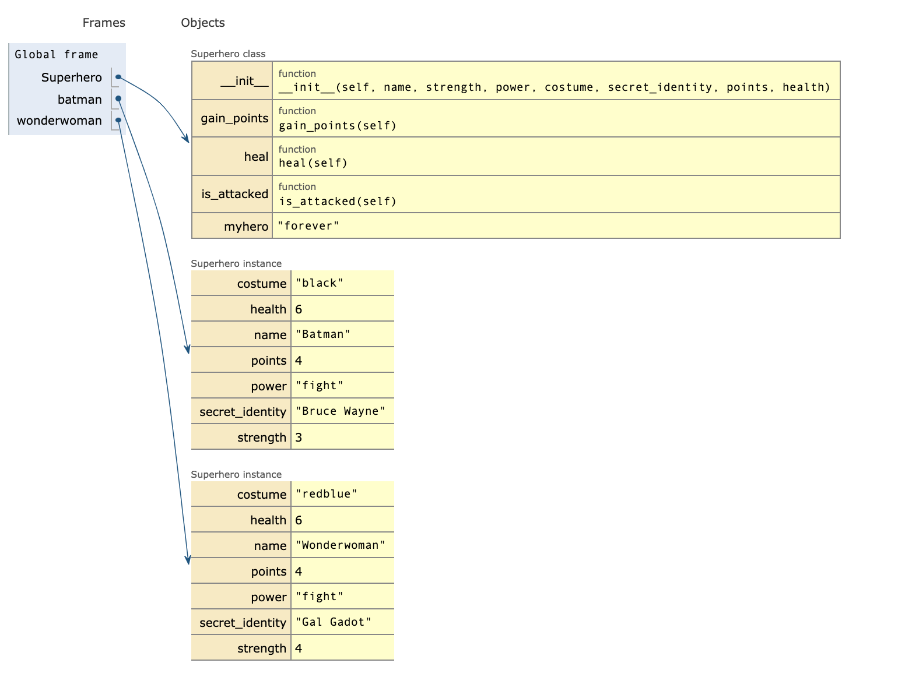

# OOP

ref: https://brilliant.org/wiki/methods-oop/?subtopic=programming-languages&chapter=objects

## Overview

```python
class Superhero:
    def __init__(self, name, strength, power, costume, secret_identity, points, health):
        self.name = name
        self.strength = strength
        self.power = power
        self.costume = costume
        self.secret_identity = secret_identity
        self.points = points 
        self.health = health

    def is_attacked(self):
        #print self.health #uncomment print statements to see how variables are updated
        self.health -= 1
        return self.health

    def heal(self):
        #print self.health
        self.health += 2
        return self.health

    def gain_points(self):
        self.points += 1
        return self.points

batman = Superhero("Batman", 3, "fight", "black", "Bruce Wayne", 3, 5)
wonderwoman = Superhero("Wonderwoman", 4, "fight", "redblue", "Gal Gadot", 4, 6)

print (batman.myhero)
print (wonderwoman.myhero)
print (batman.name)
print (batman.points)

print (batman.is_attacked())
print (batman.heal())
print (batman.gain_points())
```





## Methods

### Interface Methods

- the methods that have the purpose of providing an interface for an object with the external environment, for example, other objects' methods, data input from a user, data from another object, or anything that's not inside that very same object

- This code snippet defines a `Square` class which will have instances with a `sideLength` attribute accessible through the getter method `getSideLength` which will provide that attribute's value and through the setter method `setSideLength` which will provide a way to alter that attribute's value.

  Then, an instance of the `Square` class is created with an initial value for `sideLength` equaling 10.0 and this instance gets assigned to the `square` variable. The value of the sideLength variable is then printed on the screen, then the value of sideLength is updated and finally, the updated value of the `sideLength` variable is printed to the screen.

  The `__init__()` Python method can be confusing for beginners to object-oriented programming. These are really just another type of method called a **constructor**.

```python
class Square(object):

    def __init__(self, sideLength):
        self.sideLength = sideLength

    # Getter:
    def getSideLength(self):
        return self.sideLength

    # Setter:
    def setSideLength(self,sideLength):
        self.sideLength = sideLength

square = Square(10.0)

print square.getSideLength() # prints 10.0 to the screen

square.setSideLength(3.0)

print square.getSideLength() # prints 3.0 to the screen
```


### Constructor

- used to instantiate a class, which is what effectively creates an object

```python
class Square(object):

    # Constructor:
    def __init__(self):
        self.sideLength = 5.0

    def getSideLength(self):
        return self.sideLength

    def setSideLength(self,sideLength):
        self.sideLength = sideLength

square = Square() # invokes the constructor method

print square.getSideLength() # prints 5.0 to the screen

square.setSideLength(3.0)

print square.getSideLength() # prints 3.0 to the screen
```


### Implementation Methods

- actually implement functionality to the object
-  Any method that has a more general functionality not restricted to a single class  is usually defined inside a module (think of a module as a collection of methods designed to provide functionality that can be applied in a lot of different classes).

-  Let's implement the `outputArea` functionality in out `Square` object:

```python
class Square(object):

    # Constructor:
    def __init__(self):
        self.sideLength = 5.0

    def getSideLength(self):
        return self.sideLength

    def setSideLength(self,sideLength):
        self.sideLength = sideLength

    # Implemented functionality:
    def outputArea():
        return self.getSideLength() * self.getSideLength()

square = Square()

square.setSideLength(3.0)

print square.outputArea() # prints 9.0 to the screen
```

