# 컴파일 에러로 기존 자바 설치파일 수정

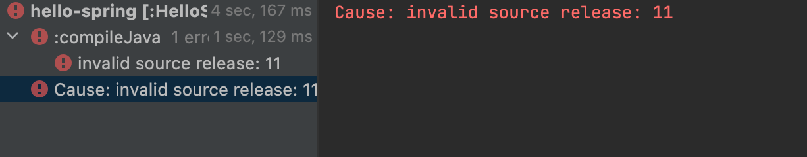

from

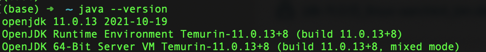

to

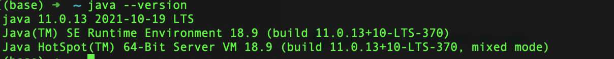

재시작

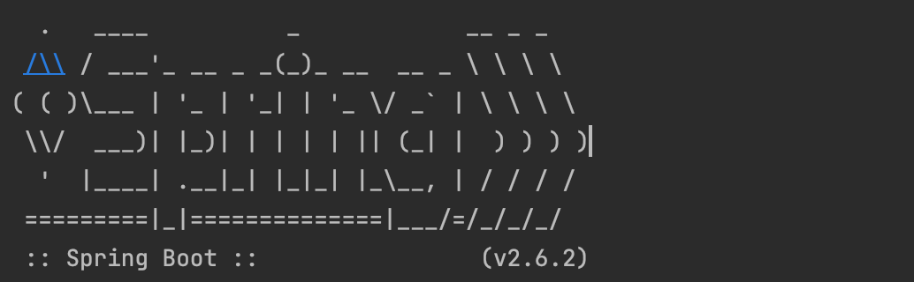


# 라이브러리와 의존성

Gradle은 의존관계가 있는 라이브러리를 함께 다운로드 한다.

- ex. 로깅

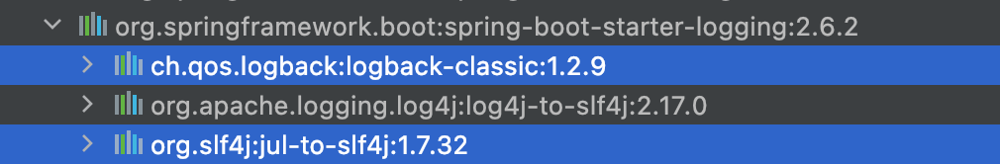

#### 스프링 부트 라이브러리 

- spring-boot-starter-web
  - spring-boot-starter-tomcat: 톰캣 (웹서버) 
  - spring-webmvc: 스프링 웹 MVC 
- spring-boot-starter-thymeleaf: 타임리프 템플릿 엔진(View) 
- spring-boot-starter(공통): 스프링 부트 + 스프링 코어 + 로깅 
  - spring-boot 
    - spring-core 
  - spring-boot-starter-logging 
    - logback, slf4j 

#### 테스트 라이브러리

- spring-boot-starter-test 
  - junit: 테스트 프레임워크 
  - mockito: 목 라이브러리 
  - assertj: 테스트 코드를 좀 더 편하게 작성하게 도와주는 라이브러리 
  - spring-test: 스프링 통합 테스트 지원


# dev-tools


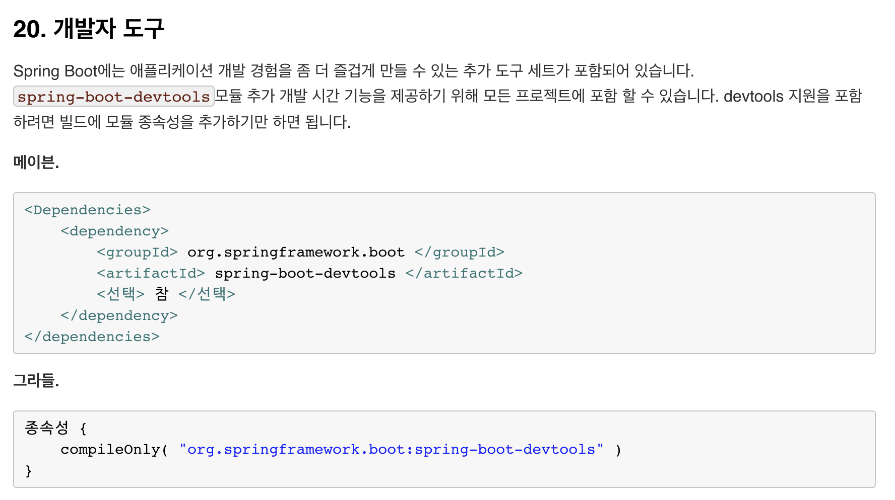

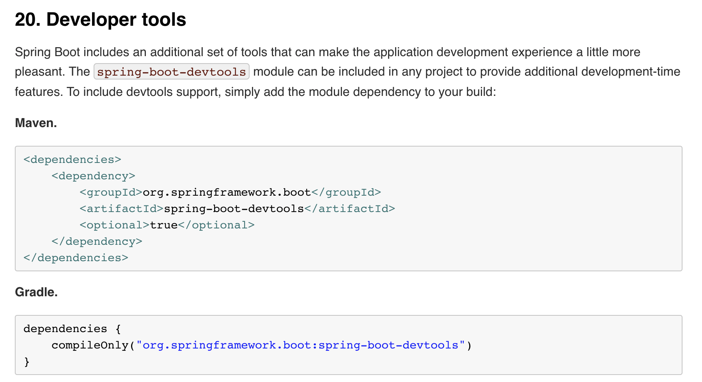

- 따라했으나 적용안됨


# 빌드

- 빌드

```
./gradlew build
```

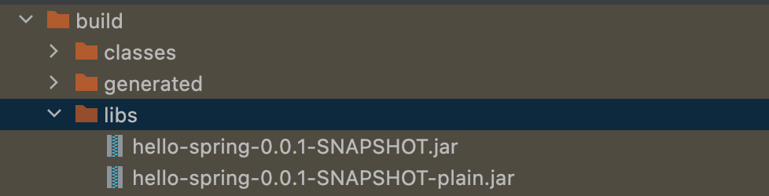

- 실행

```
java -jar hello-spring-0.0.1-SNAPSHOT.jar
```

- 빌드 삭제하기

```
./gradlew clean build
```


# API JSON 파일 변환

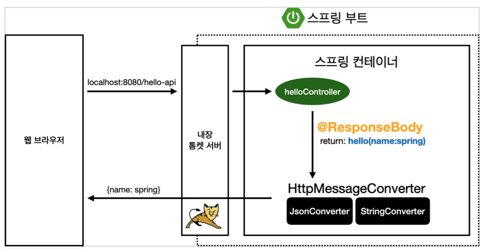

### 새롭게 알게된 사실

- @RequestParam("파라미터 키") + 돌려받는 밸류명 으로 메서드를 구성해서, 파라미터에 값을 넣어 전달하면 그 밸류값을 받은 후, 객체를 생성, 객체에 set으로 넣어주고 그 객체를 돌려주면 자동으로 Json 파일이 생성되어 보여진다.
- 클래스를 만들 때, `getter` 와 `setter` 를 설정하는데,  세터의 파라미터는 주소 입력시 받은 밸류값으로 들어가게 된다.
- 신기한 것은 돌려받는 json 의 key 가 `getter` 의 `get` 다음 요소라는 것이다. 즉, 내가 getter 메서드명을 어떻게 설정하느냐에 따라 변한다.
- **즉, 객체에 받은 정보로 set하여 객체정보를 설정하게 되고, `ResponseBody` 에 의해 `HttpMessageConverter` 가 동작하면서 자동으로 getter 의 값으로 돌려주는 것으로 보인다.**


```java
package hello.hellospring.controller;

import org.springframework.stereotype.Controller;
import org.springframework.web.bind.annotation.GetMapping;
import org.springframework.web.bind.annotation.RequestParam;
import org.springframework.web.bind.annotation.ResponseBody;

@Controller
public class HelloController {
    // JSON 형태로 반환 - 객체를 리턴
    @GetMapping("hello-api")
    @ResponseBody
    public Want wannaApi(@RequestParam("breed") String animalName) {
        Want wannaHave = new Want();
        wannaHave.setAnimalName(animalName);
        return wannaHave;
    }

    static class Want {
        private String animalNameee;

        public String getThisisKeyinJson() {
            return animalNameee + 'this is value';
        }

        public void setAnimalName(String name) {
            this.animalNameee = name;
        }
    }
}
```


# Optional

## Class Optional<T>

null이 아닌 값을 포함하거나 포함하지 않을 수 있는 컨테이너 개체입니다. 

값이 존재하는 경우, `isPresent()`반환 `true`하고 `get()`값을 반환합니다.

- `ofNullable` : NullPointerException 이 발생하지 않고 빈 Optional 객체를 반환한다.

```java
@Test
public void givenNonNull_whenCreatesNullable_thenCorrect() {
    String name = "baeldung";
    Optional<String> opt = Optional.ofNullable(name);
    assertTrue(opt.isPresent());
}
```

```java
@Test
public void givenNull_whenCreatesNullable_thenCorrect() {
    String name = null;
    Optional<String> opt = Optional.ofNullable(name);
    assertFalse(opt.isPresent());
}
```

```java
import java.util.*;
  
public class GFG {
  
    public static void main(String[] args)
    {
        // create a Optional
        Optional<String> op2
            = Optional.ofNullable(null);
  
        // print value
        System.out.println("Optional 2: "
                           + op2);
    }
}
```


## ifPresent 로 null 확인

- 변경전

```java
Member member = memberRepository.findById(id);
if (member != null) {
    if (member.isAdmin()) {
        member.addAdminPermissions();
    } else {
        member.addDefaultPermissions();
    }
}
```

- 변경후

```java
Optional<Member> memberOptional = memberRepository.findById(id);
memberOptional.ifPresent(member -> {
    if (member.isAdmin()) {
        member.addAdminPermissions();
    } else {
        member.addDefaultPermissions();
    }
});
```


# stream

```java
    @Override
    public Optional<Member> findByName(String name) {
        return store.values().stream()
                .filter(member -> member.getName().equals(name))
                .findAny();

    }
```

데이터 소스를 추상화한다. 

### 연산

- 중간연산
- 최종연산


# lambda

메서드를 하나의 식으로 표현한 것

1. 메서드의 이름을 제거한다.
2. 반환 타입을 제거한다.
3. 메서드의 선언부와 몸통 사이에 화살표를 추가한다.
4. 매개 변수 타입을 생략한다.
5. 선언된 매개변수가 하나이고, 매개변수의 타입이 없다면 괄호()를 생략한다.
6. {} 안의 문장이 하나이고, return 문이 아닐 경우 괄호{} 를 생략한다.

```java
int max(int a, int b) {
  return a > b ? a : b;
}
```

```java
(a, b) -> a > b ? a : b
```


# .clear()

해당 자료형의 모든 아이템을 삭제한다.

코드분석

```java
public void clear() {
  // clear to let GC do its work
  for (int i = 0; i < size; i++)
    elementData[i] = null;

  size = 0;
}
```

- ex

```java
String[] fruitsArray = {"apple", "banana", "kiwi", "mango"};
ArrayList<String>  fruits = new ArrayList<>(Arrays.asList(fruitsArray));
System.out.println("all: " + fruits);

fruits.clear();
System.out.println("clear: " + fruits);
```

```log
all: [apple, banana, kiwi, mango]
clear: []
```


# 테이트케이스 작성

JUnit 프레임워크를 통해 테스트를 실행한다.

- 기본적인 @BeforeEach > @Test > @AfterEach 순의 코드수행


 # JUnit 5

https://junit.org/junit5/docs/current/user-guide/


### AssertJ 메서드 임포트

다음과 같이 정적 임포트를 하면 AssertJ의 다양한 API를 클래스 이름없이 바로 사용할 수 있습니다.

```java
import static org.assertj.core.api.Assertions.*;
```


### API

https://junit.org/junit5/docs/5.0.1/api/org/junit/jupiter/api/package-summary.html

- `@AfterEach` : 현재 테스트 클래스의 각 메서드 다음에 주석이 달린 메서드가 실행되어야 함을 알리는 데 사용됩니다 .
  - 한번에 여러 테스트를 실행하면 메모리 디비에 직전 테스트 결과가 남을 수 있으므로, 각 테스트가 종료될 때마다 이 기능을 실행한다.(메모리 데이터베이스에 저장된 데이터를 삭제)
- `@Test` : @Test주석이 달린 방법이 테스트 방법 이라는 신호를 보내는 데 사용됩니다 .

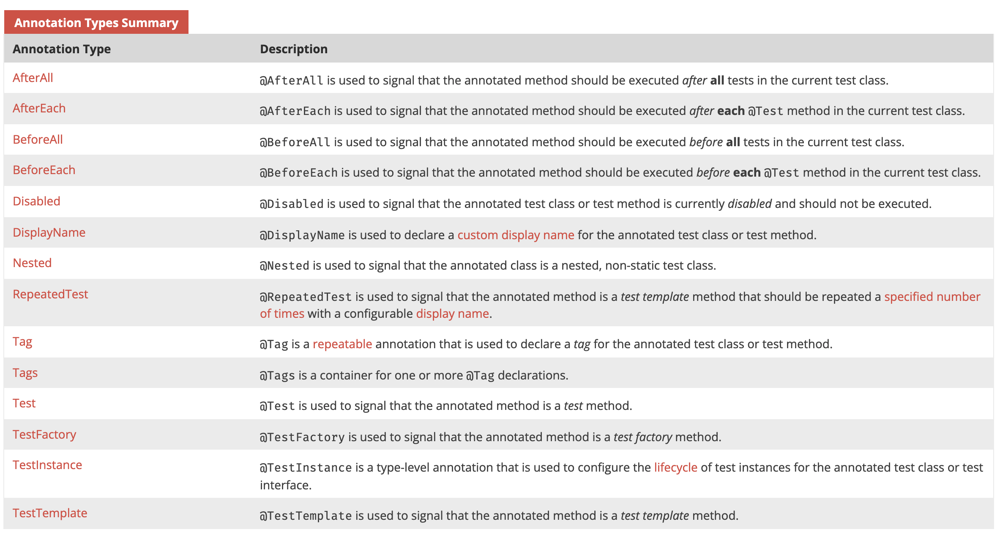


### assertThat()

최종적으로 테스트 값과 특정 값이 일치하면 true, 아니면 false를 반환한다.


### Core Matchers - 기본적으로 제공되는 matcher methods

##### Core

- [`any()`](http://hamcrest.org/JavaHamcrest/javadoc/1.3/) Matches any object passed to it.
- [`is()`](http://hamcrest.org/JavaHamcrest/javadoc/1.3/) A matcher that checks if the given objects are equal.
- [`describedAs()`](http://hamcrest.org/JavaHamcrest/javadoc/1.3/) adds a description to the matcher

##### Logical

- [`allOf()`](http://hamcrest.org/JavaHamcrest/javadoc/1.3/) Takes an array of matchers and must all match the expected object.
- [`anyOf()`](http://hamcrest.org/JavaHamcrest/javadoc/1.3/) Takes an array of matcher and must match at least one of the matchers must report that it matches the target object.
- [`not()`](http://hamcrest.org/JavaHamcrest/javadoc/1.3/) Check if the object negates what was passed.

##### Object

- [`equalTo()`](http://hamcrest.org/JavaHamcrest/javadoc/1.3/) Equality check.
- [`instanceOf()`](http://hamcrest.org/JavaHamcrest/javadoc/1.3/) Check if an object is an instance of a given/expected object.
- [`notNullValue()`](http://hamcrest.org/JavaHamcrest/javadoc/1.3/) Check if the passed value is not null
- [`nullValue()`](http://hamcrest.org/JavaHamcrest/javadoc/1.3/) Tests whether the given object is null or not null.
- [`sameInstance()`](http://hamcrest.org/JavaHamcrest/javadoc/1.3/) Tests if the given object is the exact same instance as another.


### isEqualTo vs. isSameTo

- isSameTo : 주소값을 비교
- isEqualTo : 대상의 값 자체를 비교


### @BeforeEach 

각 테스트 실행 전에 호출되며, 테스트가 서로 영향이 없도록 항상 새로운 객체를 생성하고, 의존관계도 새로 맺어준다.


### assertThrows(특정 유형의 에러, 메서드)

```java
assertThrows(IllegalStateException.class, () -> memberService.join(member2));
// IllegalStateException 유형의 예외가 발생해야 한다.
```


# MVC


# 서비스 개발

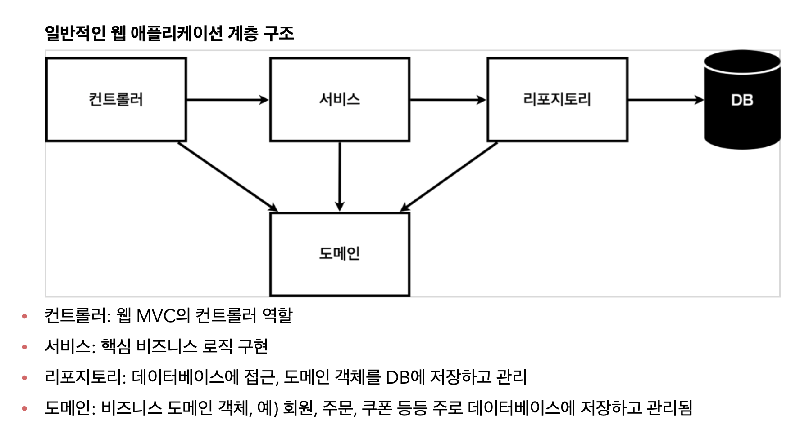

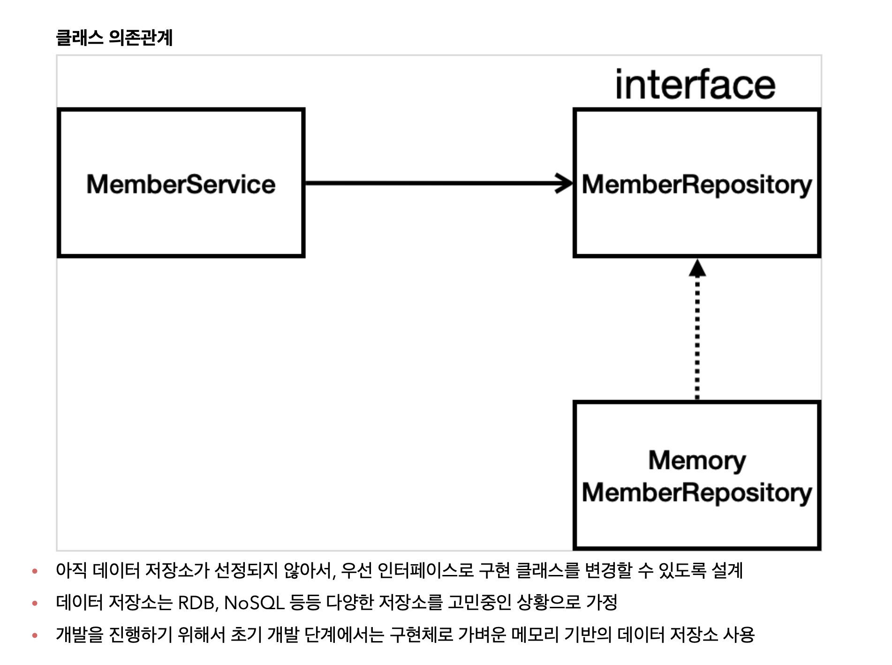


# DI 의존성 주입

- 멤버 컨트롤러가 멤버 서비스를 통해 회원가입하고 데이터를 조회할 수 있다.
- 멤버 컨트롤러가 멤버 서비스를 의존한다.

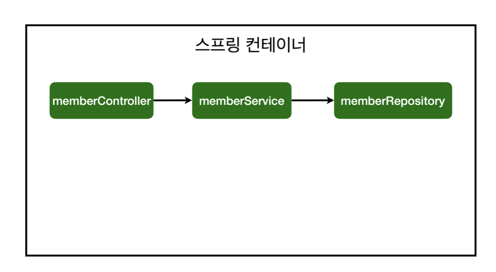

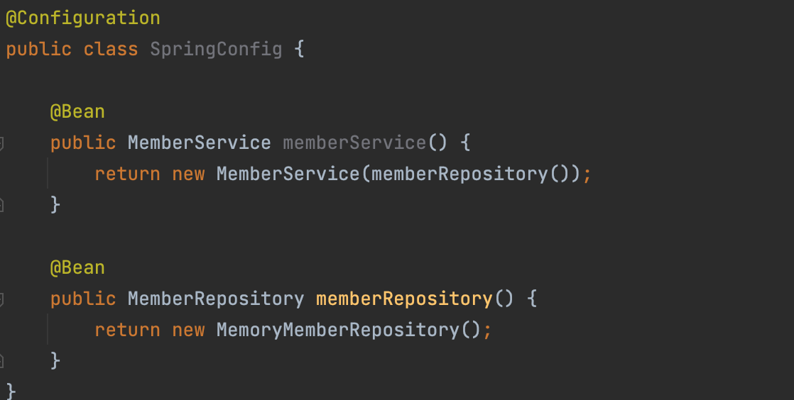

- 스프링 컨테이너 안에 helloController 가 있다. 

- 매번 생성할 때 마다 새로운 인스턴스를 생성할 필요 없이, 하나만 생성해서 공용으로 사용
- **스프링 컨테이너에 등록하면 한 개만 딱 등록된다.** **즉, 같은 스프링 빈이면 모두 같은 인스턴스이다.**

### 원리

- 스프링 컨테이너가 뜰 때, 멤버컨트롤러가 생성된다.
- 그 때, @Autowired 가 생성자에 붙어있으면, 멤버서비스를 컨테이너에서 가져다가 연결한다.

- 이를 위해 memberService 를 bean으로 등록해야 한다.
- @Service 를 달아서 등록한다. + 생성자에 또다시 @Autowired 달아준다.
- 레포지토리에는 @Repository 를 등록한다.


# **스프링 빈을 등록하는** 2가지 방법

## 1. 컴포넌트 스캔과 자동 의존관계 설정

- `@Component` 스프링 빈으로 자동 등록된다.
- `@Controller` 컨트롤러가 스프링 빈으로 자동 등록된 이유도 컴포넌트 스캔 때문이다.
- `@Component` 를 포함하는 다음 annotation 도 스프링 빈으로 자동 등록된다.
- 이 범위는 main 함수를 포함하는 패키지 + 그 하위 패키지까지이다.
  - `@Controller`
  - `@Service`
  - `@Repository` 

## 2. 자바 코드로 직접 스프링 빈 등록하기

- Config 파일 생성 후 
- `@Configuration` 
- `@Bean` 이 붙은 클래스를 빈으로 등록


# DI 방법

### 1. 생성자 주입 - 추천 (이후 변경 못하도록 막음)

### 2. 필드 주입 

### 3. setter 주입


# @SpringBootTest

스프링 컨테이너와 테스트를 함께 실행한다.

# @transactional

테스트케이스에 붙여주면 테스트 시작 전에 트랜잭션을 시작하고 테스트 완료 후에 항상 롤백한다. 

이렇게 하면 DB에 데이터가 남지 않으므로 다음 테스트에 영향을 주지 않는다.


### 통합 테스트보다 순수한 자바로 만든 단위테스트가 훨씬 빠르고, 중요하다.


# JdbcTemplate

**이것은 JDBC 코어 패키지의 중심 클래스입니다.** JDBC 사용을 단순화하고 일반적인 오류를 방지하는 데 도움이 됩니다. 핵심 JDBC 워크플로를 실행하여 SQL을 제공하고 결과를 추출하는 애플리케이션 코드를 남깁니다. 이 클래스는 SQL 쿼리 또는 업데이트를 실행하여 ResultSets에 대한 반복을 시작하고 JDBC 예외를 포착하고 `org.springframework.dao`패키지에 정의된 일반적이고 보다 유익한 예외 계층으로 변환합니다 .


이 클래스를 사용하는 코드는 명확하게 정의된 계약을 제공하는 콜백 인터페이스만 구현하면 됩니다. [`PreparedStatementCreator`](https://docs.spring.io/spring-framework/docs/current/javadoc-api/org/springframework/jdbc/core/PreparedStatementCreator.html)콜백 인터페이스는 대한 연결 주어진 준비된 문장, 제공하는 SQL하고 필요한 매개 변수를 만듭니다. [`ResultSetExtractor`](https://docs.spring.io/spring-framework/docs/current/javadoc-api/org/springframework/jdbc/core/ResultSetExtractor.html)인터페이스는 ResultSet에서 값을 추출합니다. [`PreparedStatementSetter`](https://docs.spring.io/spring-framework/docs/current/javadoc-api/org/springframework/jdbc/core/PreparedStatementSetter.html)그리고 [`RowMapper`](https://docs.spring.io/spring-framework/docs/current/javadoc-api/org/springframework/jdbc/core/RowMapper.html)두 가지 인기 있는 대체 콜백 인터페이스를 참조하십시오 .


DataSource 참조로 직접 인스턴스화하여 서비스 구현 내에서 사용하거나 애플리케이션 컨텍스트에서 준비하고 서비스에 빈 참조로 제공할 수 있습니다. 참고: DataSource는 항상 애플리케이션 컨텍스트에서 Bean으로 구성되어야 합니다. 첫 번째 경우에는 서비스에 직접 제공되고 두 번째 경우에는 준비된 템플릿에 제공됩니다.


이 클래스는 콜백 인터페이스와 인터페이스에서 매개변수화 [`SQLExceptionTranslator`](https://docs.spring.io/spring-framework/docs/current/javadoc-api/org/springframework/jdbc/support/SQLExceptionTranslator.html) 할 수 있으므로 하위 클래스로 만들 필요가 없습니다.


이 클래스가 수행하는 모든 SQL 작업은 "org.springframework.jdbc.core.JdbcTemplate"을 로그 범주로 사용하여 디버그 수준에서 기록됩니다.


# 콜백

## Java의 비동기 및 동기 콜백

콜백 함수는 다른 함수에 인수로 전달되고 일종의 이벤트 후에 실행될 것으로 예상되는 함수입니다. 콜백 함수의 목적은 다른 클래스에서 일부 작업이 완료되면 Sync/Async 클래스에 알리는 것입니다. 이것은 비동기 작업으로 작업할 때 매우 유용합니다. 버튼을 클릭한 후 작업을 수행하거나 콘텐츠를 표시하거나 인터넷에서 데이터를 가져오는 것과 같은 일상적인 작업을 수행한다고 가정합니다. 이것은 콜백 함수를 통해 버튼이 클릭될 때 알림을 받기 때문에 이벤트 처리에서도 사용됩니다.


Java에서 인터페이스를 사용하여 콜백을 구현할 수 있습니다. 구현을 위한 일반적인 절차는 다음과 같습니다.

```
  1. 콜백 후 호출하려는 인터페이스의 메서드를 정의합니다.
  2. 인터페이스의 콜백 메소드를 구현할 클래스를 정의하십시오.
  3. 다른 클래스에 참조를 정의하여 콜백 인터페이스를 등록합니다.
  4. 해당 참조를 사용하여 콜백 메서드를 호출합니다.
```

코드 실행은 계속하기 전에 이벤트를 차단하거나 대기합니다. 이벤트가 응답을 반환할 때까지 프로그램은 더 이상 실행되지 않습니다. 따라서 기본적으로 콜백은 call 문으로 돌아가기 전에 모든 작업을 수행합니다. 동기식 콜백의 문제는 지연되는 것처럼 보인다는 것입니다.


**동기 콜백**

코드 실행은 계속하기 전에 이벤트를 차단하거나 대기합니다. 이벤트가 응답을 반환할 때까지 프로그램은 더 이상 실행되지 않습니다. 따라서 기본적으로 콜백은 call 문으로 돌아가기 전에 모든 작업을 수행합니다. 동기식 콜백의 문제는 지연되는 것처럼 보인다는 것입니다.

```java

// Java program to illustrate synchronous callback
interface OnGeekEventListener {
  
    // this can be any type of method
    void onGeekEvent();
}
  
class B {
  
    private OnGeekEventListener mListener; // listener field
  
    // setting the listener
    public void registerOnGeekEventListener(OnGeekEventListener mListener)
    {
        this.mListener = mListener;
    }
  
    // my synchronous task
    public void doGeekStuff()
    {
  
        // perform any operation
        System.out.println("Performing callback before synchronous Task");
  
        // check if listener is registered.
        if (this.mListener != null) {
  
            // invoke the callback method of class A
            mListener.onGeekEvent();
        }
    }
  
    // Driver Function
    public static void main(String[] args)
    {
        B obj = new B();
        OnGeekEventListener mListener = new A();
        obj.registerOnGeekEventListener(mListener);
        obj.doGeekStuff();
    }
}
  
class A implements OnGeekEventListener {
  
    @Override
    public void onGeekEvent()
    {
        System.out.println("Performing callback after synchronous Task");
        // perform some routine operation
    }
    // some class A methods
}
```

Output:

```
Performing callback before synchronous Task
Performing callback after synchronous Task
```

**비동기 콜백**

비동기식 호출은 코드 실행에서 프로그램을 차단하지 않습니다. 호출이 이벤트에서 반환되면 호출은 다시 콜백 함수로 반환됩니다. 따라서 Java 컨텍스트에서 새 스레드를 만들고 해당 스레드 내에서 콜백 메서드를 호출해야 합니다. 콜백 함수는 스레드에서 호출할 수 있지만 요구 사항은 아닙니다. 콜백은 새 스레드를 시작하여 스스로를 비동기식으로 만들 수도 있습니다.

다음은 이 원칙의 간단한 구현입니다.

```java
// Java program to illustrate Asynchronous callback
  
interface OnGeekEventListener {
  
    // this can be any type of method
    void onGeekEvent();
}
  
class B {
  
    private OnGeekEventListener mListener; // listener field
  
    // setting the listener
    public void registerOnGeekEventListener(OnGeekEventListener mListener)
    {
        this.mListener = mListener;
    }
  
    // My Asynchronous task
    public void doGeekStuff()
    {
  
        // An Async task always executes in new thread
        new Thread(new Runnable() {
            public void run()
            {
  
                // perform any operation
                System.out.println("Performing operation in Asynchronous Task");
  
                // check if listener is registered.
                if (mListener != null) {
  
                    // invoke the callback method of class A
                    mListener.onGeekEvent();
                }
            }
        }).start();
    }
  
    // Driver Program
    public static void main(String[] args)
    {
  
        B obj = new B();
        OnGeekEventListener mListener = new A();
        obj.registerOnGeekEventListener(mListener);
        obj.doGeekStuff();
    }
}
  
class A implements OnGeekEventListener {
  
    @Override
    public void onGeekEvent()
    {
        System.out.println("Performing callback after Asynchronous Task");
        // perform some routine operation
    }
    // some class A methods
}
```

Output:

```
Performing operation in Asynchronous Task
Performing callback after Asynchronous Tas
```


**언제 무엇을 사용**

**동기식 콜백 :** 작업이 순서대로 실행되어야 하고 많은 시간을 차지하지 않는 여러 작업이 있는 모든 프로세스는 동기식 콜백을 사용해야 합니다.
예: 당신은 티켓을 받기 위해 영화 대기열에 있습니다. 당신 앞에 있는 모든 사람이 티켓을 받을 때까지 티켓을 얻을 수 없습니다.

**비동기식 콜백:** 작업이 서로 종속되지 않고 실행에 시간이 걸릴 수 있는 경우 비동기식 콜백을 사용해야 합니다.
예: 당신이 음식을 주문하면 다른 사람들도 레스토랑에서 음식을 주문할 수 있습니다. 그들은 주문이 끝날 때까지 기다릴 필요가 없습니다. 인터넷에서 노래를 다운로드하는 경우 API 응답 받기.


# JDBC Template - save

