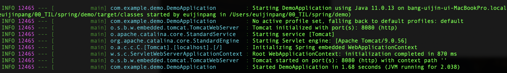
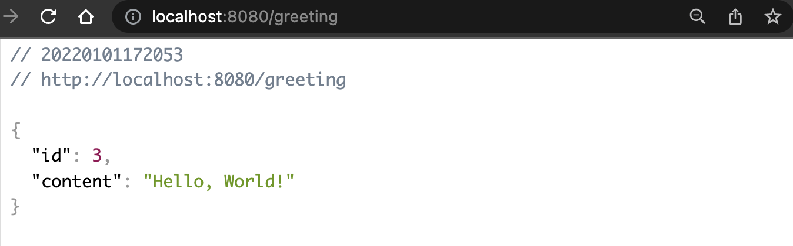

[TOC]

# Quickstart

## application.java

```java
package com.example.demo;

import org.springframework.boot.SpringApplication;
import org.springframework.boot.autoconfigure.SpringBootApplication;
import org.springframework.web.bind.annotation.GetMapping;
import org.springframework.web.bind.annotation.RequestParam;
import org.springframework.web.bind.annotation.RestController;

@SpringBootApplication
@RestController
public class DemoApplication {

public static void main(String[] args) {
SpringApplication.run(DemoApplication.class, args);
}

@GetMapping("/hello")
public String hello(@RequestParam(value = "name", defaultValue = "World") String name) {
return String.format("Hello %s!", name);
}
}
```

- The `@RestController` annotation tells Spring that this code describes an endpoint that should be made available over the web.
- 레스트 컨트롤러 어노테이션은 이 코드가 엔드포인트라서 웹상에서 동작 가능하다는 것을 알려줍니다.


- The `@GetMapping(“/hello”)` tells Spring to use our `hello()` method to answer requests that get sent to the `http://localhost:8080/hello` address. 
- 게팅맵 () 안의 포트로 접속시 해당 메서드를 실행한 결과를 반환합니다.


- Finally, the `@RequestParam` is telling Spring to expect a `name` value in the request, but if it’s not there, it will use the word “World” by default.
- 리퀘스트 파라미터로 특정 값을 요청을 통해 받고 그게 없다면 디폴트 값을 사용합니다.


## build and run

```bash
./mvnw spring-boot:run
```



- Spring Boot’s embedded Apache Tomcat server is acting as a webserver and is listening for requests on `localhost` port `8080`.

- 스프링부트에 내장된 아파치 톰캣 서버가 웹서버로 작동하며 로컬호스트 8080 포트의 요청을 듣고 있습니다.

```
http://localhost:8080/hello?name=EJ
```


# Building a RESTful Web Service

## 1. json 반환할 resource 제작

```json
{
    "id": 1,
    "content": "Hello, World!"
}
```

The `id` field is a unique identifier for the greeting, and `content` is the textual representation of the greeting.

Provide a plain old Java object with fields, constructors, and accessors for the `id` and `content` data.

### Greeting.java

```java
package com.example.restservice;

public class Greeting {
	// 클래스 내부에서만 사용가능한 변경 불가한 변수
	private final long id;
	private final String content;
	
  // 생성자
	public Greeting(long id, String content) {
		this.id = id;
		this.content = content;
	}
	
  // 메서드
	public long getId() {
		return id;
	}

	public String getContent() {
		return content;
	}
}
```


#### Jackon JSON 라이브러리

This application uses the Jackson JSON library to automatically marshal instances of type `Greeting` into JSON. Jackson is included by default by the web starter.

잭슨 라이브러리로 인스턴스를 자동으로 JSON으로 반환합니다.


## 2. Create a Resource Controller

HTTP request는 controller로 핸들합니다.

These components are identified by the [`@RestController`](https://docs.spring.io/spring/docs/current/javadoc-api/org/springframework/web/bind/annotation/RestController.html) annotation.

The `GreetingController` shown in the following listing handles `GET` requests for `/greeting` by returning a new instance of the `Greeting` class.

레스트 컨트롤러 어노테이션으로 컴포넌트를 identify하고 그리팅 컨트롤러가 GET 요청에 Greeting 클래스의 새로운 인스턴스를 반환함으로써 응답합니다.


### GreetingController.java

```java
package com.example.restservive;

import java.util.concurrent.atomic.AtomicLong;

import com.example.restservice.Greeting;
import org.springframework.web.bind.annotation.GetMapping;
import org.springframework.web.bind.annotation.RequestParam;
import org.springframework.web.bind.annotation.RestController;

// 클래스가 컨트롤러로써, 모든 메서드는 view가 아닌 domain object를 반환하게 된다.
// Greeting 오브젝트는 HTTP message converter가 지원하는 Jackson2가 있고
// classpath에 있기 때문에 스프링의 MappingJackson2HttpMessageConverter 가 자동으로 선택된다.
@RestController
public class GreetingController {
		
  	// static 인 이유?
    private static final String template = "Hello, %s!";
    private final AtomicLong counter = new AtomicLong();
  
		// greeting 요청과 greeting() 메서드를 매핑
    @GetMapping("/greeting") 
    // 쿼리스트링 파라미터 name을 greeting() 메서드의 파라미터로 바인딩
    public Greeting greeting(@RequestParam(value = "name", defaultValue = "World") String name) {
        // 새로운 `Greeting` 오브젝트 & greeting template을 사용하여 반환된 name을 문자열로 반환
        return new Greeting(counter.incrementAndGet(), String.format(template, name));
    }
}
```

#### Mapping Annotation - @RequestMapping

- `@PostMapping` : POST 요청
- `@RequestMappomg` : GET 요청  `@RequestMapping(method=GET)` 과 동일


#### AtomicLong(Class)

A `long` value that may be updated atomically.


#### @RestController = `@Controller` and `@ResponseBody`.

클래스가 컨트롤러로써, 모든 메서드는 view가 아닌 `domain object`를 반환하게 된다.

`Greeting` 오브젝트는 `HTTP message converter`가 지원하는` Jackson2`가 있고

classpath에 있기 때문에 스프링의  `MappingJackson2HttpMessageConverter `가 자동으로 선택된다.


#### MappingJackson2HttpMessageConverter(Class)

This converter can be used to bind to typed beans, or untyped `HashMap` instances.

By default, this converter supports `application/json` and `application/*+json` with `UTF-8` character set. This can be overridden by setting the [`supportedMediaTypes`](https://docs.spring.io/spring-framework/docs/current/javadoc-api/org/springframework/http/converter/AbstractHttpMessageConverter.html#setSupportedMediaTypes-java.util.List-) property.


#### @GetMapping

 HTTP GET requests to `/greeting` are mapped to the `greeting()` method.

greeting 요청과 greeting() 메서드를 매핑


#### @RequestParam

`@RequestParam` binds the value of the query string parameter `name` into the `name` parameter of the `greeting()` method. 

쿼리스트링 파라미터 name을 greeting() 메서드의 파라미터로 바인딩


### RestServiceApplication.java

```java
package com.example.restservice;

import org.springframework.boot.SpringApplication;
import org.springframework.boot.autoconfigure.SpringBootApplication;

@SpringBootApplication
public class RestServiceApplication {

	public static void main(String[] args) {
		SpringApplication.run(RestServiceApplication.class, args);
	}

}
```


#### @SpringbootApplication  => ???

a convenience annotation that adds all of the following:

- `@Configuration`: Tags the class as a source of bean definitions for the application context.
- `@EnableAutoConfiguration`: Tells Spring Boot to start adding beans based on classpath settings, other beans, and various property settings. For example, if `spring-webmvc` is on the classpath, this annotation flags the application as a web application and activates key behaviors, such as setting up a `DispatcherServlet`.
- `@ComponentScan`: Tells Spring to look for other components, configurations, and services in the `com/example` package, letting it find the controllers.


#### Spring Bean? => ??


## 3. Run

### Gradle 사용

```
./gradlew bootRun
```


### Maven 사용

```
./mvnw spring-boot:run
```


### JAR 

실행 가능한 JAR 빌드 Gradle 또는 Maven을 사용하여 명령줄에서 애플리케이션을 실행할 수 있습니다. 

필요한 모든 종속성, 클래스 및 리소스가 포함된 단일 실행 가능한 JAR 파일을 빌드하고 실행할 수도 있습니다. 

실행 가능한 jar를 빌드하면 개발 수명 주기 전반에 걸쳐 다양한 환경 등에서 서비스를 애플리케이션으로 쉽게 제공, 버전 지정 및 배포할 수 있습니다.


##### Gradle 사용시

1. 빌드

```
./gradlew build
```

2. 실행

```
java -jar build/libs/gs-rest-service-0.1.0.jar
```


##### Maven 사용시

1. 빌드

```
./mvnw clean package
```

2. 실행

```
java -jar target/gs-rest-service-0.1.0.jar
```


## 4. 결과




에러원인 : 파일명 변경하였기 때문에 내부에서 문제가 생긴것같다. 파일명 변경하면 안된다.


## 5. gitignore

- 디폴트 활용
- STS
- IntelliJ IDEA
- NetBeans
- VS Code
- ..etc

```
*.DS_Store
*.sw?
.#*
*#
*~
.classpath
.project
.settings
bin
build
target
dependency-reduced-pom.xml
*.sublime-*
/scratch
.gradle
README.html
*.iml
.idea

HELP.md
target/
!.mvn/wrapper/maven-wrapper.jar
!**/src/main/**/target/
!**/src/test/**/target/

### STS ###
.apt_generated
.classpath
.factorypath
.project
.settings
.springBeans
.sts4-cache

### IntelliJ IDEA ###
.idea
*.iws
*.iml
*.ipr

### NetBeans ###
/nbproject/private/
/nbbuild/
/dist/
/nbdist/
/.nb-gradle/
build/
!**/src/main/**/build/
!**/src/test/**/build/

### VS Code ###
.vscode/
```

