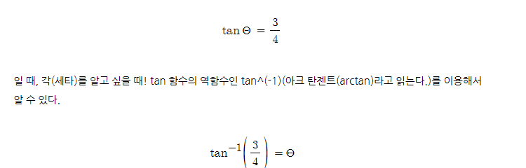

## KEY

- PT00003083
- OVUO-HMVR-UCSV-JJCJ


## TEST

- 9:30 - 12:30
- STAGE 1,2  - 3 STARS
- STAGE 3,4 - 2 STARS
- STAGE 5,6 - (etc)


## HOWTO

- 1 => 3 => 8


## CODE

- distance : pitagoras
- angle : radian

```python
[[a1, b1], [a2, b2]]

def (strength, angle):
    
```


2π radiaus = 360 degree (호의 길이가 2π)

1π radiaus =180 degree

1 radiaus = 180 / π degree

degree = π /180 radiaus





