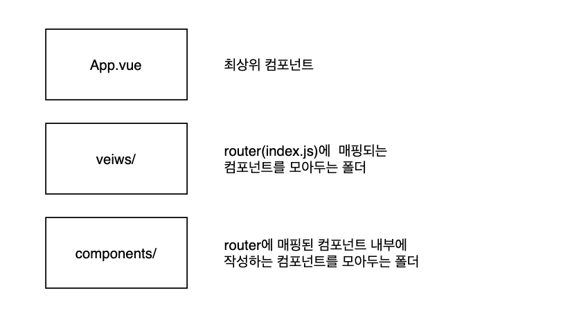

# SFC(Single File Component)

```bash
Vue 컴포넌트 = Vue 인스턴스 =  .vue 파일
```

- 하나의 컴포넌트는 .vue 확장자를 가진 하나의 파일 안에서 작성되는 코드의 결과물이다.
- 화면의 특정 영역에 대한 HTML, CSS, Javascript 코드를 하나의 vue 파일에서 관리한다.

# Vue CLI

- Vue.js 개발을 위한 표준 도구

- 설치

```bash
$ npm install -g @vue/cli
```

- 버젼 확인

```bash
$ vue --version
```

- 프로젝트 생성 ( git-bash 가 아닌 vscode terminal 로 진행 ), vue2 선택

```bash
$ vue create my-first-app
```

- 해당 앱으로 이동

```bash
cd my-first-app
```

- 서버 켜기

```bash
npm run serve
```

- Node modules 설치하기 

```bash
npm i
```


# Pass Props & Emit Events

- 자식 컴포넌트는 props 옵션을 사용하여 수신하는 props를 명시적으로 선언해야 한다.

# 단방향 바인딩

- 부모 속성이 변경되면 자식 속성에게 전달되지만, 반대 방향으로는 안된다.

# Vue Router

- route에 컴포넌트를 매핑한 후, 어떤 주소에서 렌더링할 지 알려준다.
- routing 결정권을 서버가 아닌 Vue.js가 가진다.
- SPA 등장 이후, 서버는 index.html 하나만 제공하고, 이후 모든 처리는 HTML위에서 JS 코드를 활용해 진행한다.

- 플러그인 설치

```bash
$ vue add router
```

- index.js : 특정 컴포넌트가 렌더링 된다.

```javascript
import Vue from 'vue'
import VueRouter from 'vue-router'
import Home from '../views/Home.vue'
import About from '../views/About.vue'
import TheLotto from '../views/TheLotto.vue'

Vue.use(VueRouter)

const routes = [
  {
    path: '/',
    name: 'Home',
    component: Home
  },
  {
    path: '/about',
    name: 'About',
    component: About,
  },
  {
    path: '/lotto/:lottoNum',
    name: 'TheLotto',
    component: TheLotto,
  }
]
```

- App.vue 
  - router-link: 사용자 네비게이션
  - router-view: 주어진 라우터에 일치하는 컴포넌트를 렌더링하며 실제 component가 DOM에 부착되어 보이는 자리
  - 즉, router-link를 클릭하면 해당 경로와 연결된 index.js에 정의한 컴포넌트가 위치한다.

```vue
<template>
  <div id="app">
    <div id="nav">
      <router-link to="/">Home</router-link>  |
      <router-link to="/about">About</router-link>  |
       // named-routes
      <router-link :to="{ name: 'Home' }">Home</router-link>  |
      <router-link :to="{ name: 'About' }">About</router-link> |
      <router-link :to="{ name: 'TheLotto', params: { lottoNum: 6}}">TheLotto</router-link>
    </div>
    <router-view/>
  </div>
</template>
```

- 프로그래밍 방식으로 네비게이션 만들기 `$router.push`


```vue
// About.vue
<template>
  <div class="about">
    <h1>This is an about page</h1>
    <button @click="moveToHome">Home으로 이동</button>
  </div>
</template>

<script>
export default {
  name: 'About',
  methods: {
    moveToHome: function () {
      // this.$router.push('/')
      this.$router.push({ name: 'Home' })
    }
  }
}
</script>
```

- Dynamic Route Matching => `component` 에서 `this.$route.params` 로 사용가능

```javascript
// main.js
const routes = [
  {
    path: '/lotto/:lottoNum',
    name: 'TheLotto',
    component: TheLotto,
  }
]
```

```vue
// App.vue
<router-link :to="{ name: 'TheLotto', params: { lottoNum: 6 } }">TheLotto</router-link>
```

```vue
// TheLotto.vue
<template>
  <div>
    <h1>로또번호 추첨</h1>
    <h2>{{ $route.params.lottoNum }}개의 번호를 추첨합니다.</h2>
  </div>
</template>
```

# History mode

- HTML History API 를 이용하여 router를 구현.
- 브라우저 히스토리는 남기지만, 페이지를 다시 로드하지 않고 URL을 탐색한다. (URL만 변경)

# History API

- DOM의 Window 객체는 history 객체를 통해 브라우저의 세션 기록에 접근할 수 있는 방법을 제공한다.
- history 객체는 사용자를 자신의 앞 뒤로 보내거나, 기록의 특정 지점으로 이동하게 할 수 있다.

# Components & Views



