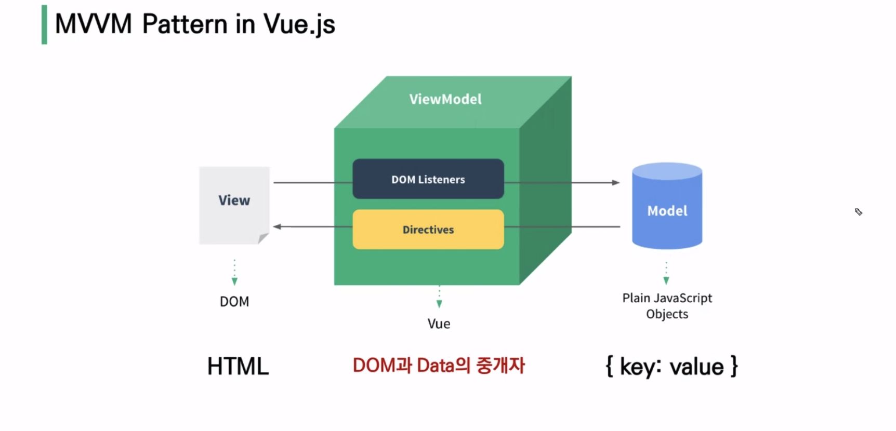
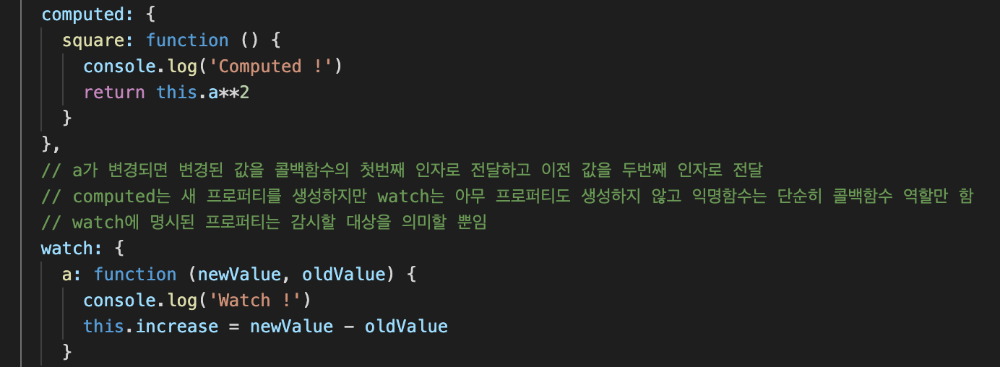

# Vue.js

- 사용자 인터페이스를 만들기 위한 진보적인 자바스크립트 프레임워크
- 현대적 tool과 다양한 라이브러리로 **SPA(Single Page Application)** 을 완벽하게 지원한다.

# SPA

싱글페이지라 url이 아닌 클릭을 통해 화면을 바꾼다.

이를 보완하기 위한 라이브러리가 존재한다.

# SSR vs CSR

서버사이드에서 렌더링, 클라이언트에서 렌더링하느냐가 차이이다.

Vue.js의 경우 SSR을 지원하는 **SEO 대응 기술**이 존재한다.

- Nuxt.js : Vue.js 응용 프로그램을 위한 프레임워크로 SSR 지원
- Next.js : React.js 응용 프로그램을 위한 프레임워크로 SSR 지원

# Vue.js 역할

- Server 사이드에서 Django 서버는 MTV 중 데이터베이스만 조작한다.
- Client 사이드에서 Vue 서버는 템플릿 역할을 하며 Django에서 데이터를 받아오고, 사용자 데이터를 Django로 넘긴다.

# Why Vue.js?

왜 사용할까?

### 데이터 바인딩 개념

기존 자바스크립트에서는 여러 요소의 경우 for문을 돌면서 각각 li 태그를 만들고 데이터를 만들고, 다시 부모태그에 넣었다.

뷰에서는 li 태그를 미리 만들고 데이터를 넣으면 자동으로 넣어서 태그를 자동으로 생성한다. 이것이 데이터 바인딩!!

# MVVM Pattern



View의 model은 하나의 obeject이며 그 안에 데이터가 들어간다.

View는 DOM과 연결되며 ViewModel이 중재한다.

즉, Model 데이터가 수정되면 자동으로 View 가 변경되는 것이다!

Model <===> View

# Eslint

https://eslint.org/

javascript 디버깅 도구 (ex. v-for 사용시 key 속성 필수 작성)


# Template Syntax

렌더링 된 DOM을 기본 Vue 인스턴스의 데이터에 선언적으로 바인딩할 수 있는 HTML 기반 템플릿 구문 사용

1. Interpolation(보간법)
   - Text : <span> 메시지: {{ message}}</span>
   - Attributes: <div v-bind:id="dynamicId"></div>
2. Directive
   - v- 로 시작하는 속성들이며 표현식 값(속성 값) 변경시 DOM에 적용

# v-text

# v-html

# v-show

# v-if, v-else-if, v-else

dirctive 표현식이 true일 때만 렌더링


# v-show vs. v-if

### show는 렌더링을 하고 false에선 display-none으로 가림, v-if는 애초에 렌더링을 하지 않는다.

show 는 처음엔 비싼데 나중엔 토글비용 적다.

v-if는 처음엔 렌더링 비용 싼데 토글에서는 다시 렌더링 해야하므로 비용 증가 ex. 로그인-로그아웃시 서로 다른 네비게이션 바 보여주기 (If-else 분기처리)

# v-for

- 반드시 key 속성을 각 요소에 작성
- item in items 구문 사용

# v-bind 통한 데이터 변수화

- HTML 요소의 속성에 Vue 상태 데이터를 값으로 할당한다.
- Object 형태로 사용시 value가 true인 key가 class 바인딩 값으로 할당된다.
  - 약어 : `v-bind:href` => `:href`
- ex. ``
- ex. `<div :class="{ active: isRed }">클래스 바인딩</div>`

- v-bind:key  -> :key 로 생략

# 단방향

데이터 변경하면 출력값(html 코드)도 변한다. 반대로 html 바꿨다고 data가 바뀌지는 않는다.

# v-model 통한 양방향 바인딩


- HTML 요소와 input 값을 양방향 바인딩
- model은 사용자가 입력하는 input에만 사용하며, 사용자가 입력하는 데이터를 저장한다.
- 단, 언어가 영어가 아닌 한중일 경우 따로 이벤트-메서드 제작
- https://kr.vuejs.org/v2/guide/forms.html

```html
<h3>{{ myMessage }}</h3>
<input v-model="myMessage" type="text">

<script>
    const app = new Vue({
      el: '#app',
      data: {
        myMessage: '',
      },
    })
</script>
```

```html
<input v-model="isChecked" type="checkbox" id="checkbox">
<label for="checkbox">{{ isChecked }}</label>

<script>
  const app = new Vue({
    el: '#app',
    data: {
      isChecked: true,
    },
  })
</script>
```


# v-on 통한 이벤트 등록

- 엘리먼트에 이벤트 리스너 연결
- 이벤트 유형은 전달인자로 표시
- 약어 : @ `v-on:click` => `@click`

# computed vs. watch

- 둘 다 종속된 데이터가 변해야만 실행된다.
- computed 는 특정 데이터를 직접 다른 값으로 만들 때 사용 (선언형 프로그래밍)
  - "특정 값이 변동하면 해당 값을 다시 계산해서 보여준다."
  - ""계산해야 하는 목표 데이터를 정의""
  - a자체를 변화.
  - 반드시 return 필요.
- watch 는 변화 상황에 맞추어 특정 데이터(감시데이터)를 지정하고 변화가 발생하면 다른 data를 바꿀 때 사용
  - watch는 명칭을 지정 (명령형 프로그래밍 방식)
  - "특정 값이 변동하면 다른 작업을 한다." 특정 대상 변경시 콜백 함수 실행
  - "데이터가 바뀌면 특정 함수를 실행"
  - a를 건드리지 않음.
  - 반드시 return이 필요한 것은 아님.



# computed vs. methods

- computed는 `이미 계산된 값`을 사용하므로 {{ computed }} 로 사용
  - 종속된 데이터값이 변화되어야만 실행된다.
- methods는 함수 호출이므로 {{ method() }} 로 사용
- 각각 필요한 경우가 있다.


# filter

- 텍스트 형식화를 적용
- interpolation 또는 v-bind 이용시 사용 가능
- 필터는 자바스크립트 표현식의 마지막에 파이프와 함께 추가하며 체이닝이 가능하다.

```html
<div id="app">
  <p>{{ numbers | getOddNums | getUnderTenNums }}</p>
</div>

<script>
  const app = new Vue({
    el: '#app',
    data: {
      numbers: [1, 2, 3, 4, 5, 6, 7, 8, 9, 10, 11, 12, 13, 14, 15],
    },
    filters: {
      getOddNums: function (nums) {
        const oddNums = nums.filter(num => {
          return num % 2
        })
        return oddNums
      },
      getUnderTenNums: function (nums) {
        const underTen = nums.filter(num => {
          return num < 10
        })
        return underTen
      }
    }
  })
</script>
```


# Lifecycle Hooks

https://v3.vuejs.org/api/options-lifecycle-hooks.html#deactivated

- Vue의 각 인스턴스는 생성될 때 일련의 초기화 단계를 거치는데
- 그 과정에서 사용자 정의 로직을 호출할 수 있는 Lifecycle Hooks도 호출된다.

- ## beforeCreate

- ## created

- ## beforeMount

- ## beforeUpdate


# lodash library

- array, object 등 자료구조를 다룰 때 사용하는 유용하고 간편한 유틸리티 함수 제공


# jsonplaceholder

API 넣기

https://jsonplaceholder.typicode.com/guide/
