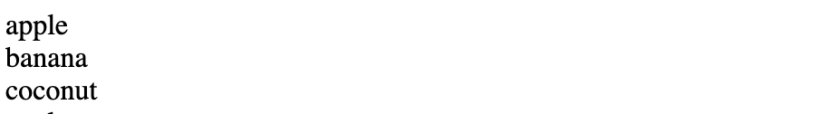
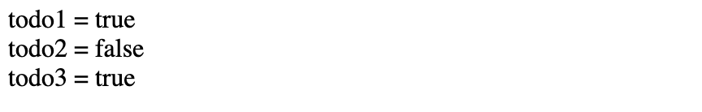
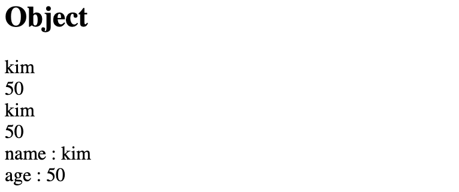

# v-for

## 배열순회

- 배열 내의 요소를 순회한다. 이때 인덱스 값을 `key` 로 넣어준다.
- 인덱스는 출력 여부에 관계 없이 필수 요소이다.



```vue
<!-- 배열 순회 -->
<div v-for="(fruit, index) in fruits" :key="`fruit-${index}`">
  {{ fruit }}
</div>

<script>
  const app = new Vue({
    el: '#app',
    data: {
      fruits: ['apple', 'banana', 'coconut'],
    },
  })
</script>

```


## 배열 내 객체 순회

- 배열 내의 요소가 객체일 때 순회한다.
- `key` 는 todo.id 로 설정한다.
- 인터폴레이션 할때에도 콤마 `.` 로 원하는 `value` 값에 접근한다.



```vue
<!-- 배열 안의 요소가 객체일 때 -->
<div v-for="todo in todos" :key="todo.id">
  {{ todo.title }} = {{ todo.completed }}
</div>

<script>
  const app = new Vue({
    el: '#app',
    data: {
      todos: [
        { id: 1, title: 'todo1', completed: true},
        { id: 2, title: 'todo2', completed: false},
        { id: 3, title: 'todo3', completed: true},
      ],
    },
  })
</script>
```


## 객체 순회

- data 안에 객체가 있고, 객체를 순회하면 한 객체 안의 요소들이 출력된다.



```vue
<!-- 객체 순회 -->
<div v-for="value in myObj" :key="key">
  {{ value }}
</div>
<div v-for="(value, key) in myObj" :key="key">
  {{ value }}
</div>
<div v-for="(value, key) in myObj" :key="key">
  {{ key }} : {{ value }}
  
<script>
  const app = new Vue({
    el: '#app',
    data: {
      myObj: {
        name: 'kim',
        age: 50,
      }
    },
  })
</script>
```

