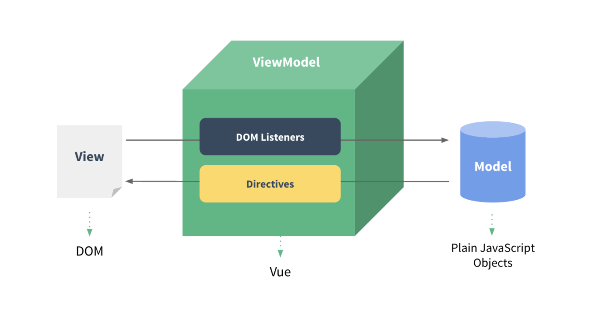
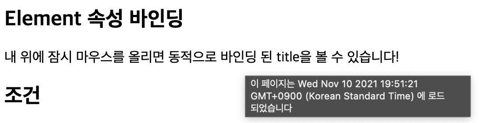
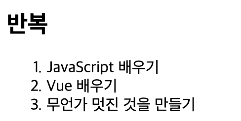
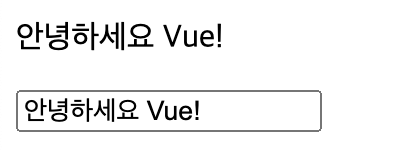
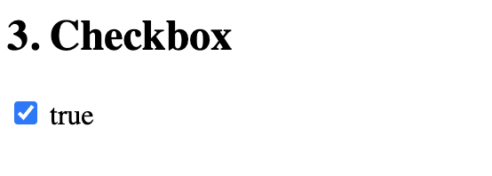
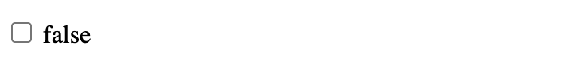
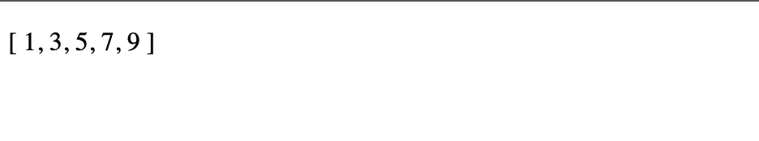

# Vue.js 란

- 사용자 인터페이스를 만들기 위한 자바스크립트 프레임워크
- SPA(Single Page Application) 을 지원

# SPA

- 단일 페이지 어플리케이션
- 즉, 현재 페이지를 동적으로 렌더링하여 사용자와 소통한다.
- 서버로부터 최초 한 번만 페이지를 다운로드 하고, 이후에는 동적으로 DOM을 구성한다!
- 동작 원리의 일부가 CSR(Client Side Rendering) 구조를 따른다.
- 요청에 따라 매번 새로운 페이지를 응답하는 MPA(Multi Page Application) 와는 반대의 방식이다.

# CSR

- Client Side Rendering
- 서버에서 화면을 구성하는 것이 아니라(SSR), 클라이언트 단에서 화면을 구성하는 것이다.
- **최초 요청시에는 데이터를 제외한 리소스(HTML, CSS, JS)를 응답받고, 이후 필요한 데이터가 있다면 그 데이터만 요청해서 자바스크립트로 DOM을 렌더링 하는 방식이다.**
- 정적 리소스 다운로드 후 필요 데이터만 갱신하므로 서버와 클라이언트 간 트래픽이 감소한다.

# SSR

- Server Side Rendering
- 서버에서 클라이언트에게 보여줄 모든 페이지를 구성하는 전통적인 방식
- 초기 구동 속도가 빠르지만, 모든 요청마다 새로운 페이지를 구성하여 전달하여 계속 새로고침된다. 서버쪽 트래픽이 많아 부담이 클 수 있다.

# SSR, CSR 뭐 쓸까?

결국 화면을 어디에서 그리느냐의 문제이기 때문에, 서비스에 따라 결정해야 한다.

예를 들어, 장고 프로젝트에서 좋아요/팔로우 로직을 이야기할 때, Server에서 완성된 HTML을 제공하는 구조(SSR) 를 사용한다.

이때 특정 요소(좋아요/팔로우)만 자바스크립트(AJAX & DOM 조작) 을 활용하여 비동기 요청으로 필요데이터를 서버로 직접 요청보내 받아오고 DOM 을 조작했었다.(CSR)

# DOM과 Data

- DOM과 Data가 연결되어 있다면, Data가 변경시 DOM은 알아서 변한다.
- 따라서, 오직 Data에 대한 관리만 하면 된다!
  - DATA LOGIC 작성 => DOM 작성

# Vue 설치

https://vuejs.org/v2/guide/

```bash
<script src="https://cdn.jsdelivr.net/npm/vue@2/dist/vue.js"></script>
```

# MVVM 모델(Design Pattern)



- Model => 데이터 부분, { key: value } 자바스크립트 오브젝트 자료구조
- View => DOM (HTML)
- ViewModel => Vue, DOM과 데이터를 중개하는 부분, Vue 인스턴스
  - DOM Listener를 통해 DOM에서 데이터(모델)로 전달
  - Directives를 통해 데이터(모델)에서 DOM으로 전달
- Vue 함수 객체 내에서 `this` 는 vue 인스턴스를 가리킨다.
- **이벤트 리스너의 콜백 함수는 화살표함수가 아닌 function 키워드 사용할 것~**
- **data, method 정의시 화살표 함수 쓰면 안된다. (window를 this로 잡아버림)**

```vue
<body>
  <!-- MVVM - View -->
  <div id="app">
    <label for="inputArea">userName: </label>
    <input v-on:input="onInputChange" type="text" id="inputArea">
    <hr>
    <!-- 3. DOM이 update(re-render) -->
    <h1>안녕하세요 {{ userName }}</h1>

    <div>
      {{ userName }} 님의 친구 목록
    </div>

    <div>
      {{ userName }} 님의 알림 목록
    </div>

    <div>
      {{ userName }} 님의 친구 요청 목록
    </div>
  </div>

  <script src="https://cdn.jsdelivr.net/npm/vue/dist/vue.js"></script>
  <script>
    // MVVM - ViewModel
    const app = new Vue({
      //1. DOM과 data 연결
      el: '#app',
      // MVVM - Model
      data: {
        userName: 'Unknown',
        message: 'Hello Vue.js',
      },
      //2. Data가 바뀌면 
      methods: {
        onInputChange: function (event) {
          this.userName = event.target.value
        }
      }
    })
  </script>
</body>
</html>
```

# Vue instance

- 모든 Vue 앱은 Vue 함수로 새 인스턴스를 만들면서 시작한다.
- Vue 인스턴스 === Vue Component

```vue
<div id="app">
  {{ message }}
</div>

<script> // new instance
var app = new Vue({
	el: '#app',
	data: {
		message: 'hi!'
	}
})
</script>
```

# v-bind

- directive
- 약어 `:`
- <span> 태그의 `title` 속성을 Vue 인스턴스의 `message` 속성으로 최신 상태를 유지



```vue
<h2>Element 속성 바인딩</h2>
<div id="app-2">
  <span v-bind:title="message">
    내 위에 잠시 마우스를 올리면 동적으로 바인딩 된 title을 볼 수 있습니다!
  </span>
</div>

<script>
  var app2 = new Vue({
    el: '#app-2',
    data: {
      message: '이 페이지는 ' + new Date() + ' 에 로드 되었습니다'
    }
  })
</script>
```

# v-show

- CSS display 속성을 hidden으로 만들어 토글한다. 전달인자가 true, false 관계없이 렌더링 시키고 DOM에 남아있지만 보이지만 않는 것!
- 자주 변경되는 요소라면 v-show가 유리하고, 한 번만 렌더링 되는 경우라면 v-if가 토글 비용이 적을 것이다.

# v-if

- 전달인자가 false인 경우 렌더링되지 않고, true인 경우 렌더링 됨

```vue
<h2>조건</h2>
<div id="app-3">
  <p v-if="seen">이제 나를 볼 수 있어요</p>
</div>

<script>
  var app3 = new Vue({
    el: '#app-3',
    data: {
      seen: true
    }
  })
</script>
```

# v-for

- 배열의 각각의 요소가 객체이므로 key값으로 전달하고 있다.
- key 속성 필수



```vue
<h2>반복</h2>
<div id="app-4">
  <ol>
    <li v-for="todo in todos">
      {{ todo.text }}
    </li>
  </ol>
</div>

<script>
  var app4 = new Vue({
    el: '#app-4',
    data: {
      todos: [
        { text: 'JavaScript 배우기' },
        { text: 'Vue 배우기' },
        { text: '무언가 멋진 것을 만들기' }
      ]
    }
  })
</script>
```

# v-on : 사용자와 상호작용

- 디렉티브를 사용하여 Vue 인스턴스에서 메서드를 호출하는 이벤트 리스너를 추가.
- 이벤트 유형은 전달인자로 표시
- @ 로 축약 가능


```vue
<h2>사용자 입력 핸들링</h2>
<div id="app-5">
  <p>{{ message }}</p>
  <button v-on:click="reverseMessage">메시지 뒤집기</button>
</div>

<script>
  var app5 = new Vue({
    el: '#app-5',
    data: {
      message: '안녕하세요! Vue.js!'
    },
    methods: {
      reverseMessage: function () {
        this.message = this.message.split('').reverse().join('')
      }
    }
  })
</script>
```

# v-model : form - 사용자와 상호작용

- 직접 DOM을 건드리지 않고 상태를 업데이트
- HTML form 요소의 값과 data를 양방향 바인딩



```vue
<div id="app-6">
  <p>{{ message }}</p> <!-- 3. 데이터 변경으로 인한 DOM 변경 -->
  <input v-model="message"> <!-- 1. 데이터 변경  -->
</div>

<script>
  var app6 = new Vue({
    el: '#app-6',
    data: {
      message: '안녕하세요 Vue!' // 2. 데이터가 변경
    }
  })
</script>
```






```vue
<h2>3. Checkbox</h2>
<!-- 1. 데이터 변경  -->
<input type="checkbox" id="checkbox" v-model="isChecked">
<!-- 3. 데이터 변경으로 인한 DOM 변경 -->
<label for="checkbox">{{ isChecked }}</label>

<script>
  const app = new Vue({
    el: '#app',
    data: {
      isChecked: true, // 2. 데이터가 변경
    },
  })
</script>
```


# filter

- interpolation 또는 v-bind 이용시 사용 가능
- 체이닝 가능
- filter 의 메서드의 인자(nums)는 필터 파이프 앞의 변수명(numbers) 이다.



```vue
<body>
  <div id="app">
    <p>{{ numbers | getOddNums | getUnderTenNums }}</p>
  </div>
  <script src="https://cdn.jsdelivr.net/npm/vue/dist/vue.js"></script>
  <script>
    const app = new Vue({
      el: '#app',
      data: {
        numbers: [1, 2, 3, 4, 5, 6, 7, 8, 9, 10, 11, 12, 13, 14, 15],
      },
      filters: {
        getOddNums: function (nums) {
          const oddNums = nums.filter(num => {
            return num % 2
          })
          return oddNums
        },
        getUnderTenNums: function (nums) {
          const underTen = nums.filter(num => {
            return num < 10
          })
          return underTen
        }
      }
    })
  </script>
</body>
```
