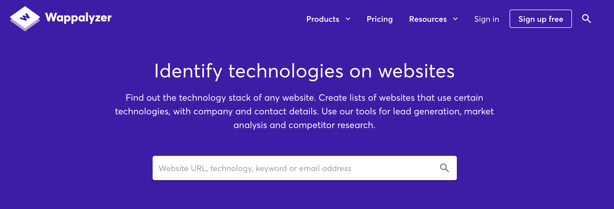
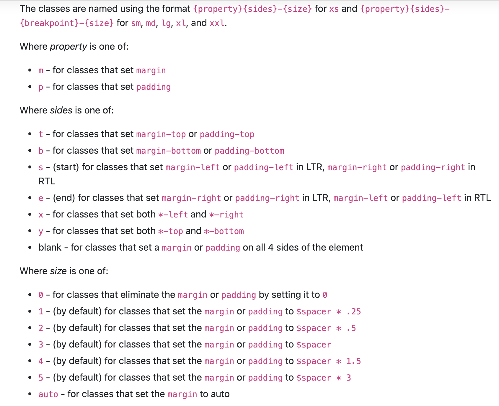
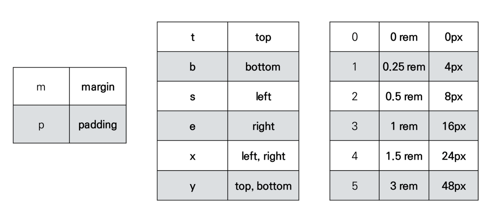
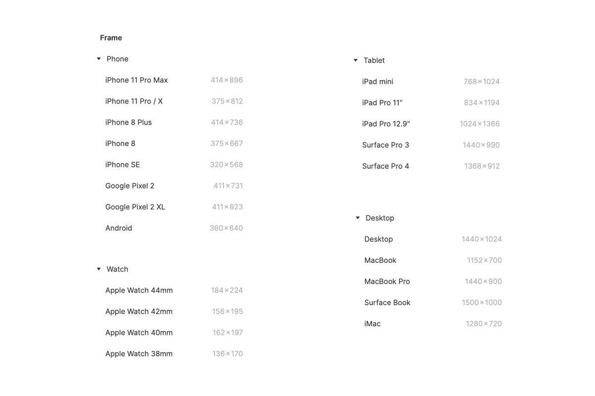
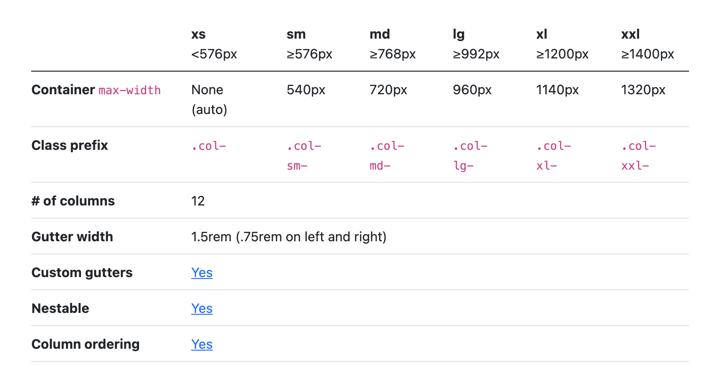

# Bootstrap

https://chrome.google.com/webstore/detail/wappalyzer/gppongmhjkpfnbhagpmjfkannfbllamg?hl=en-US




## SETTING

#### 1. 파일방식 : 다운로드 받아 직접 넣는다

```html
<!DOCTYPE html>
<html lang="en">
<head>
  <meta charset="UTF-8">
  <meta http-equiv="X-UA-Compatible" content="IE=edge">
  <meta name="viewport" content="width=device-width, initial-scale=1.0">
  <link rel="stylesheet" href="bootstrap.css">
  <title>Document</title>
</head>
<body>
  <h1>첫번째 부트스트랩!</h1>
  <a href="https://naver.com/">네이버로 고고!</a>
  <script src="bootstrap.bundle.js"></script>
</body>
</html>
```

#### 2. CDN 방식 : Content Delivery Network

- 전 세계에 분산된 서버로 이루어진 플랫폼
- 미국 서버에 접속하지 않아도 된다.

- 홈페이지에서 주소를 복사-붙여넣기하여 링크 삽입


```html
<!DOCTYPE html>
<html lang="en">
<head>
  <meta charset="UTF-8">
  <meta http-equiv="X-UA-Compatible" content="IE=edge">
  <meta name="viewport" content="width=device-width, initial-scale=1.0">
  <!-- <link rel="stylesheet" href="bootstrap.css"> -->
  <link href="https://cdn.jsdelivr.net/npm/bootstrap@5.0.2/dist/css/bootstrap.min.css" rel="stylesheet" integrity="sha384-EVSTQN3/azprG1Anm3QDgpJLIm9Nao0Yz1ztcQTwFspd3yD65VohhpuuCOmLASjC" crossorigin="anonymous">
  <title>Document</title>
</head>
<body>
  <h1>첫번째 부트스트랩!</h1>
  <a href="https://naver.com/">네이버로 고고!</a>
  <script src="https://cdn.jsdelivr.net/npm/bootstrap@5.0.2/dist/js/bootstrap.bundle.min.js" integrity="sha384-MrcW6ZMFYlzcLA8Nl+NtUVF0sA7MsXsP1UyJoMp4YLEuNSfAP+JcXn/tWtIaxVXM" crossorigin="anonymous"></script>
  <!-- <script src="bootstrap.bundle.js"></script> -->
</body>
</html>
```


## RESET CSS

여러가지 브라우저가 지니고 있는 기본 `user agent stylesheet` 를 초기화한다.

#### 1. Normalize CSS : gentle solution

- W3C 기준에 맞지 않으면 차이가 있는 브라우저를 수정한다.
- 부트스트랩 기본설정

#### 2. Reset CSS: agressive solution

- 모든 기본설정 리셋, 부작용 있어 쓰지 않는다


## spacing








# Flexbox in Bootstrap

- d-flex를 클래스로 선언하고 시작한다.

```html
<style>
  .d-flex {
  display: flex !important;
  }
  .justify-content-start{
    justify-content: flex-start !important;
  }
  .justify-content-center{
    justify-content: center !important;
  }
  .justify-content-between{
    justify-content: space-between !important;
  }
  .justify-content-around{
    justify-content: space-around !important;
  }
  .justify-content-evenly{
    justify-content: space-evenly !important;
  }
  .align-items-start{
    align-items: flex-start !important;
  }
  .align-items-center{
    align-items: center !important;
  }
</style>

<div class="d-flex justify-content-start"></div>
```

https://getbootstrap.com/docs/5.0/utilities/flex/#enable-flex-behaviors

# Bootstrap Grid System

> flexbox grid / 12 column system / 6 default responsive tiers

- **12 컬럼 그리드, 6개의 기준점 (12 columns & 6 grid breakpoints)**
- container, rows, column 으로 컨텐츠를 배치하고 정렬

- Bootstap Grid system은 flexbox로 제작된다.
  
  

## row (class)

- columns의 wrapper

- 12개의 컬럼으로 구성, container 안의 row 안에 12개의 columns

## gutters (class)

- column 사이의 padding

## col, col-* (class)

- **row 당 가능한 12개 중 사용하려는 columns의 수**
- columns의 너비는 **백분율**로 설정되므로 항상 부모 요소를 기준으로 유동적으로 크기 조정
-  grid  layout에서 내용은 반드시 columns 안에 있어야 하고, **오직 columns 만이 row 바로 아래의 자식일 수 있다.**


```html
<div class="container">
  <div class="row">
    <div class="box col-3">1</div>
    <div class="box col-6">2</div>
    <div class="box col-3">3</div>
  </div>
</div>
```


- 4등분 후 2줄로 만들기


```html
<div class="container">  
	<div class="row">
    <div class="box col">1</div>
    <div class="box col">2</div>
    <div class="w-100"></div>
    <div class="box col">3</div>
    <div class="box col">4</div>
  </div>
</div>
```


- 넘치면 아래로 떨어진다


```html
<div class="container">  
	<div class="row">
    <div class="box col-2">1</div>
    <div class="box col-8">2</div>
    <div class="box col-3">3</div>
  </div>
</div>  
```


```html
<div class="container">     
	<div class="row">	
      <div class="box col-1">1</div>
      <div class="box col-1">2</div>
      <div class="box col-1">3</div>
      <div class="box col-1">4</div>
      <div class="box col-1">5</div>
      <div class="box col-1">6</div>
      <div class="box col-1">7</div>
      <div class="box col-1">8</div>
      <div class="box col-1">9</div>
      <div class="box col-1">10</div>
      <div class="box col-1">11</div>
      <div class="box col-1">12</div>
      <div class="box col-1">13</div>
    </div>
</div>
```

- `ctrl` + `alt` 누른 후 화살표로 내리면 `multi-select`


```html
<div class="container">  
	<div class="row">
      <div class="box col-9">col-9</div>
      <div class="box col-4">col-4</div>
      <div class="box col-3">col-3</div>
    </div>
</div>
```


### Gutters (class)

- gird 시스템에서 반응적으로 공간 확보하고 정렬시 사용되는 column 사이의 padding


```html
<div class="container">     
	<div class="row gx-5">
      <div class="col">
        <div class="box">col</div>
      </div>
      <div class="col">
        <div class="box">col</div>
      </div>
      <div class="col">
        <div class="box">col</div>
      </div>
    </div>

    <div class="row g-0">
      <div class="col">
        <div class="box">col</div>
      </div>
      <div class="col">
        <div class="box">col</div>
      </div>
      <div class="col">
        <div class="box">col</div>
      </div>
    </div>
</div>
```


## Grid 6 breakpoints

- 특정 픽셀 조건에 대한 지점
- viewport 너비가 필셀 단위이고 글꼴 크기에 따라 변하지 않으므로 em, rem이 아닌 px를 사용
- 주로 md, lg 사용



```html
<div class="container">      
		<div class="row">
      <div class="box col-2 col-sm-8 col-md-4">1</div>
      <div class="box col-8 col-sm-2 col-md-4">2</div>
      <div class="box col-2 col-sm-2 col-md-4">3</div>
    </div>
</div>
```


## nesting (class) 중첩

- row > col > row > col


```html
<div class="container">   
	<div class="row">
      <div class="box col-6">
        <div class="row">
          <div class="box col-3">1</div>
          <div class="box col-3">2</div>
          <div class="box col-3">3</div>
          <div class="box col-3">4</div>
        </div>
      </div>
      <div class="box col-6">1</div>
      <div class="box col-6">2</div>
      <div class="box col-6">3</div>
 </div>
</div>
```


## offset (class)

-  해당 칸 이후 시작


```html
<div class="container">   
		<div class="row">
      <div class="box col-md-4 offset-4">.col-md-4 .offset-4</div>
      <div class="box col-md-4 offset-md-4 offset-lg-2">.col-md-4 .offset-md-4 .offset-lg-2</div>
    </div>
</div>
```

