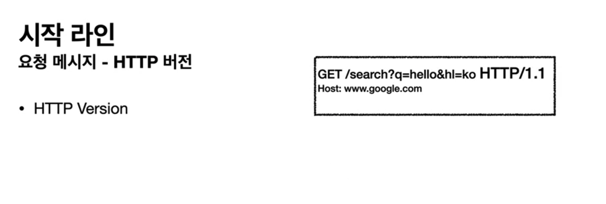
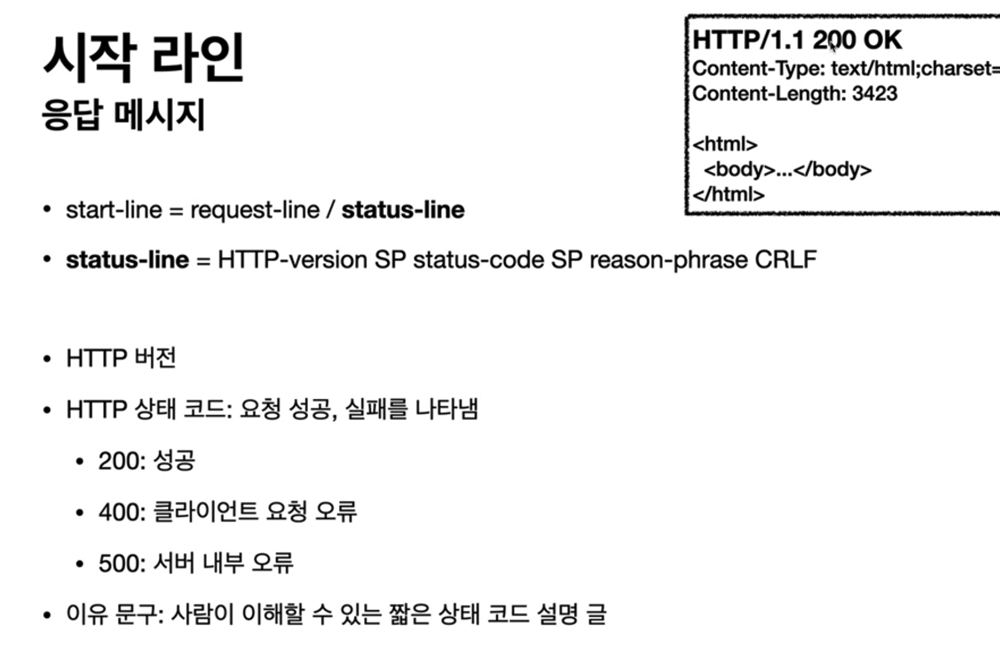
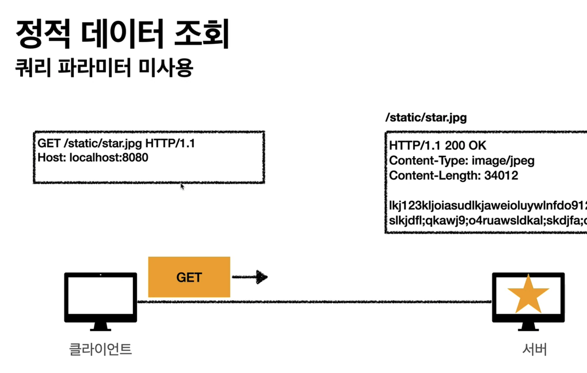
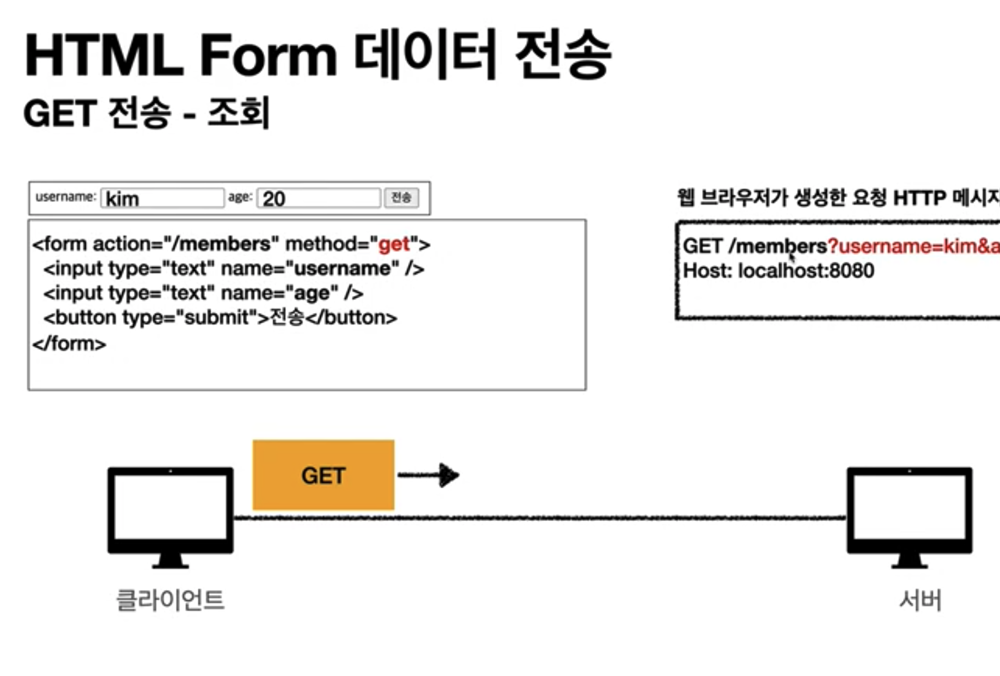
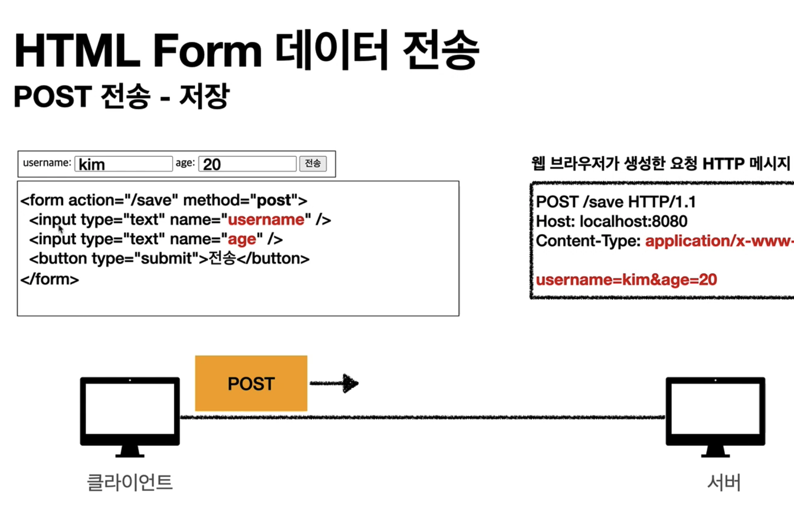
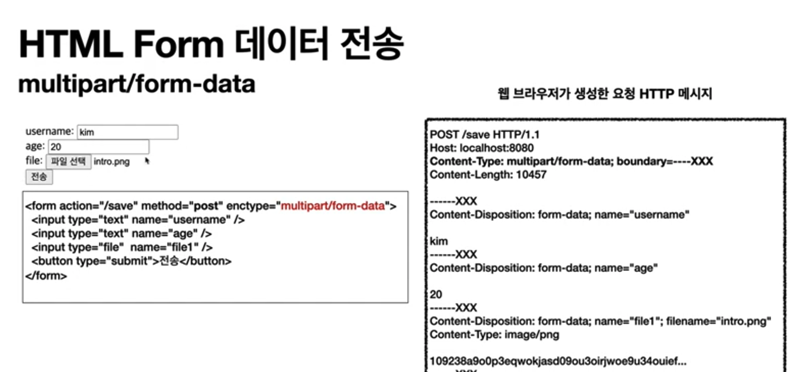

# HTTP 메세지

# HTTP 메서드의 종류

### GET

- 리소스 조회
- 서버에 전달하고 싶은 데이터는 쿼리 파라미터를 통해 전달

### POST

- 새 리소스 생성 / 요청 데이터 처리 / 다른 메서드로 처리하기 애매한 경우

- 클라이언트에서 메시지 바디를 통해 서버로 `요청 데이터` 를 전달한다.

### PUT

- 리소스가 있으면 `완전히 ` 대체한다.
- 리소스가 없으면 새로 생성한다.
- 클라이언트가 리소스 위치를 알고 URI를 지정한다!
- **주의 !!! 필드정보를 다 제공하지 않으면 기존 리소스가 다 날아가버린다.**

### PATCH  

- 리소스 부분 변경
- PUT은 리소스를 완전히 대체하기 때문에 일부 필드를 생략하면 그 필드는 반환되지 않는다. 
- PATCH는 달라진 부분만 고친다.
- 만약 PATCH 지원이 되지 않는 경우 POST를 사용한다. 
- 게시글처럼 전체를 고치는 경우 PUT 을 사용한다.

### DELETE

- 리소스 제거

# HTTP 메서드의 속성

### 안전(Safe Methods)

- 계속 호출해도 리소스가 변경되지 않고 안전하다.
- GET, HEAD

### 멱등성(Idempotent Mothods)

- 여러번 호출해도 결과가 똑같다.
- 자동 복구 매커니즘(에러시 재요청)에 사용할 수 있다.
- GET, PUT, DELETE
- `POST`는 멱등이 아니다. 두 번 결제하면 같은 결제가 중복해서 발생한다!

### 캐시가능성(Cacheable Methods)

- 응답 결과의 리소스를 캐시(웹브라우저에 저장)해서 사용해도 되는지?
- GET, HEAD 를 캐시로 사용한다.

# HTTP 메서드 활용

### 방법1. 쿼리 파라마터를 통한 데이터 전송 - GET

### 방법2. 메시지 바디를 통한 데이터 전송 - POST, PUT, PATCH

### 4가지 상황

- 1. `GET`정적 데이터 조회

- 2. `GET`동적 데이터 조회 (검색, 정렬 필터) 

  - 조회 조건을 줄여주는 필터에 사용
  - 조회 결과를 정렬하는 정렬 조건에 사용

- 3. `GET`  또는 `POST`  HTML FORM 통한 데이터 전송
     1. `GET`
     2. `POST`
     3. Content-Type: multipart/formdata 로 binary 데이터 전송

- 4. HTML API 통한 데이터 전송 (서버-서버, Ajax)

# POST 등록 vs PUT 등록

### POST (컬렉션) - 회원 관리 시스템

- `POST` 는 url를 서버가 만든다.
- 서버가 관리하는 리스트 디렉토리
- 서버가 리소스의 URI를 생성하고 관리
- 리소스는 /users

### PUT (스토어) - 파일 관리 시스템

- `PUT` 은 url을 클라이언트가 알고 있다.
- 파일을 새로 업로드할 때, 클라이언트가 직접 리소스의 URI를 지정한다.
- 클라이언트가 관리하는 리소스 저장소
- 스토어는 /files