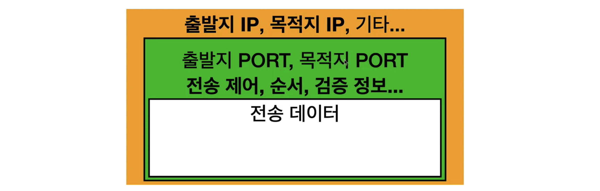
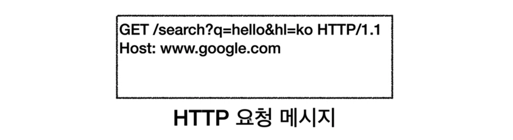
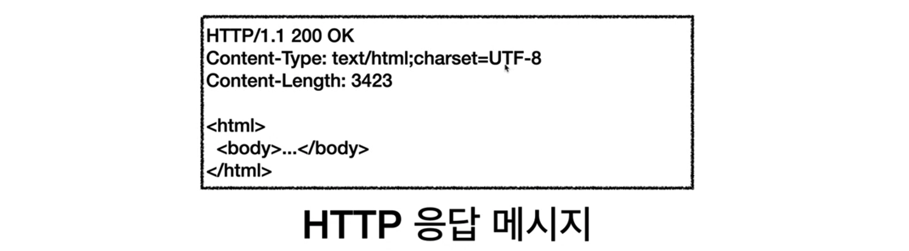
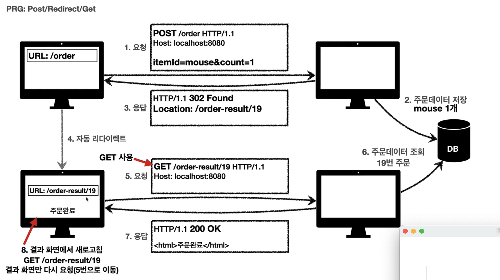

# 인터넷 네트워크

### IP (Internet Protocol)

- 클라이언트와 서버는 각각 주소(IP Address)를 부여받게 되는데...
- IP 가 그 주소에 메세지를 전달할 수 있도록 규칙(출발지랑 도착지 등) 정해 패킷이란 단위로 전달
- 클라이언트 패킷을 전달하면 (일종의 네비게이션)
- 서버까지 잘~ 도착하고
- 서버에서 다시 패킷을 통해 클라이언트로 정보를 전송

##### 문제점

- 서버가 꺼져있다면? 패킷이 소실된다면? 패킷이 다른 순서로 전달된다면?

### TCP, UDP

IP의 문제를 해결하기 위해....

##### 프로토콜 계층

1. 프로그램이 메세지를 생성하면 SOCKET 라이브러리를 통해 운영체제로 전달한다.
2. 운영체제에서 TCP 를 싸악 입히고
3. 운영체제에서 IP 를 싸악 입혀서 패킷을 생성
4. 이하 네트워크 인터페이스 LAN 으로 넘어간다. 

##### TCP Transmission Control Protocol 전송 제어 프로토콜

- 연결지향 - 연결하고나서 보낸다

  - TCP 3 way handshake ?

    - 클라이언트에서 서버로 싱크로나이즈~ 연결할래, 
    - 오케, 서버에서 에크~
    - 클라에서 다시 에크~ 오키오키
    - 그러고나서 데이터 전송!

    

- 데이터 전달을 보증해

- 순서도 보증해!!! 완전 믿음직해~ 대부분 사용해

##### UDP (User Datagram Protocol)

- 다양한 패킷을 구분하는 정도로 사용한다.

- 뭐 딱히 장점은 없는데~ 빠르고 단순하고 PORT 는 추가되어 있다!

- 데이터 전달 보증도, 순서보증도 안되긴 하는데...빨라서 은근 많이씀

### PORT

- TCP/IP 패킷 안에 출발지 IP, 포트랑 목적지 IP, 포트가 있다.
- 포트는 같은 IP 내에서 프로세스를 구분한다. 무슨말이냐면..
  - 게임은 8090 포트에서 출발해서 11220 포트로
  - 11220 포트에서 다시 8090 포트로...
  - 화상통화는 21000 포트에서 출발해서 32202 포트로
  - 32202 포트에서 다시 1120 포트로...
- 0 ~ 65535 할당 가능
- 0 ~ 1023 은 사용하지 말자, 잘 알려져있다
  - HTTP 80
  - HTTPS 443

### DNS

- IP 는 100.100.100.1 로 길고.. 바뀔 수도 있으니까
- Domain Name System!! 
- 전화번호부를 제공해서 아이피를 알려준다.

# URI 와 웹 브라우저 요청 흐름

리소스를 식별하는 통일된 방식

- URL 로케이션 즉 리소스 위치
- URN 리소스 이름.. 보편적이지 않아 URI > URL 같은 의미로 쓰자

### SCHEMA 구성

- 프로토콜 (어떤 방식으로 자원에 접근할래?) http, https
- 호스트명 (도메인명이나 IP주소)
- 포트 (생략가능)
- 리소스 경로 (패스)
- 쿼리파라미터, 쿼리스트링(다 문자열로 넘어감!) ? 로 시작하고 &로 추가한다.
- 프래그먼트 (#북마크, 서버전송안됨)

### HTTP 메세지 전송

- 웹브라우저가 위와 같은 메세지를 생성하면 
- SOCKET 라이브러리 통해 OS 로 전다되고
- TCP/IP 씌워서 
- 랜 드라이버 통해
- 서버로 HTTP 메세지 전송~~~~

- 다시 클라이언트로 전송~~~

# HTTP 기본

하이퍼텍스트 트랜스퍼 프로코콜쓰~

- 버젼 **HTTP/1.1** 1997년 버젼인데 이걸 가장 많이 씀!
- 1.1 , 2 는 TCP
- 3 은 UDP

### 특징

##### Stateful, Stateless 상태의 유지 또는 무상태 => 서버의 입장에서....

서버가 상태유지 프로토콜이면.... 서버가 클라 정보를 받는데

클라1이랑 서버1이랑 중계서버로 거래하다가 

서버1이 죽으면 클라1은 처음부터 해야.... 내 정보는 서버1 한테 있자나.ㅇ..

근데 무상태면... 클라가 정보를 담아 보내는데.. 서버가 상태를 보관을 안해...

서버1이 죽어도.. 서버2가 또 응대하면돼

그니까 서버 3 4 5 .. 계속 늘어나도 상관이 없다.

대신 로그인 상태는 유지해줘야 겠지..?

##### 비연결성(connectionless)

TCP/IP 로 클라랑 서버랑 연결이 되어있다면....

클라 1 2 3 에 서버 1이라면.... 서버가 1하고 할때 2, 3하고도 연결

연결 유지하지 않으면 

클라1이랑 하고 끊고 클라 2랑 하고 끊고,,,, 서버 리소스 자원을 최소한으로 유지할 수 있다. 

한 서버에 수천명이 서비스를 써도 동시처리 요청은 몇십개겠지?? 그걸 유지 안하니까 효율적이지.

근데 또 매번 자원받아야하니까 비효율적인데... HTTP **지속연결**이란게 있어서 보완.

> stateless ............ 한 방식으로 설계해야 대용량 트래픽 대응이 가능하다.
>
> 무상태와 상태를 잘 조절해야 마스터

##### HTTP 메세지

# HTTP 메서드의 종류

### GET

- 리소스 조회
- 서버에 전달하고 싶은 데이터는 쿼리 파라미터를 통해 전달

### POST

- 새 리소스 생성 / 요청 데이터 처리 / 다른 메서드로 처리하기 애매한 경우

- 클라이언트에서 메시지 바디를 통해 서버로 `요청 데이터` 를 전달한다.

### PUT

- 리소스가 있으면 `완전히 ` 대체한다.
- 리소스가 없으면 새로 생성한다.
- 클라이언트가 리소스 위치를 알고 URI를 지정한다!
- **주의 !!! 필드정보를 다 제공하지 않으면 기존 리소스가 다 날아가버린다.**

### PATCH  

- 리소스 부분 변경
- PUT은 리소스를 완전히 대체하기 때문에 일부 필드를 생략하면 그 필드는 반환되지 않는다. 
- PATCH는 달라진 부분만 고친다.
- 만약 PATCH 지원이 되지 않는 경우 POST를 사용한다. 
- 게시글처럼 전체를 고치는 경우 PUT 을 사용한다.

### DELETE

- 리소스 제거

# HTTP 메서드의 속성

### 안전(Safe Methods)

- 계속 호출해도 리소스가 변경되지 않고 안전하다.
- GET, HEAD

### 멱등성(Idempotent Mothods)

- 여러번 호출해도 결과가 똑같다.
- 자동 복구 매커니즘(에러시 재요청)에 사용할 수 있다.
- GET, PUT, DELETE
- `POST`는 멱등이 아니다. 두 번 결제하면 같은 결제가 중복해서 발생한다!

### 캐시가능성(Cacheable Methods)

- 응답 결과의 리소스를 캐시(웹브라우저에 저장)해서 사용해도 되는지?
- GET, HEAD 를 캐시로 사용한다.

# HTTP 메서드 활용

### 방법1. 쿼리 파라마터를 통한 데이터 전송 - GET

### 방법2. 메시지 바디를 통한 데이터 전송 - POST, PUT, PATCH

### [ 4가지 상황 ]

- 1. `GET`정적 데이터 조회

- 2. `GET`동적 데이터 조회 (검색, 정렬 필터) 

  - 조회 조건을 줄여주는 필터에 사용
  - 조회 결과를 정렬하는 정렬 조건에 사용

- 3. `GET`  또는 `POST`  HTML FORM 통한 데이터 전송
     1. `GET`
     2. `POST`
     3. Content-Type: multipart/formdata 로 binary 데이터 전송

- 4. HTML API 통한 데이터 전송 (서버-서버, Ajax) : 리액트, 뷰와 같은 웹클라이언트와 통신할 때는 폼전송대신 `자바스크립트` 를 사용한다.
     1. `GET` : 조회, 쿼리 파라미터로 데이터 전달
     2. `POST` : 

---

---

---

 

# HTTP API POST 등록 vs PUT 등록

### POST (컬렉션) - 회원 관리 시스템

- `POST` 는 url를 서버가 만든다.
- 서버가 관리하는 리스트 디렉토리
- 서버가 리소스의 URI를 생성하고 관리
- 리소스는 /users

### PUT (스토어) - 파일 관리 시스템

- `PUT` 은 url을 클라이언트가 알고 있다.
- 파일을 새로 업로드할 때, 클라이언트가 직접 리소스의 URI를 지정한다.
- 클라이언트가 관리하는 리소스 저장소
- 스토어는 /files

# HTTP 상태코드

### 2xx Success

클라이언트의 요청을 성공적으로 처리

- **200 OK** 요청 성공 (GET)
- **201 Created** 요청 성공하여 새로운 리소스 생성(POST)
- 202 Accepted 요청이 접수되었으나 처리가 완료되지 않음, 배치 처리 등에 사용
- 204 No Content 요청 성공했지만 응답 페이로드 본문에 보낼 데이터가 없다.

### 3xx Redirection

요청을 완료하기 위해 유저 에이전트의 추가 조치가 필요

이제 그 경로 없으니 다른 경로로 리다이렉트

Location 헤더 필드의 값을 바꿈

- 301 Moved Permanently POST 사용, 리다이렉트시 GET으로 요청 메서드가 변하고 본문이 제거될 수 있다.
- **302 Found**  : 리다이렉트시 요청 메서드가 GET으로 변하고 본문이 제거될 수 있다. (실무에서 대부분 사용)
- **303 See Other** : 302와 같지만 리다이렉트시 GET으로 변경
- 304 Not Modified
- **307 Temporary Redirect** : 리다이렉트시 요청 메서드와 본문을 유지하고 요청 메서드를 변경하면 안된다!
- 308 Permanent Redirect POST 사용, POST 유지 본문 유지 (사용 빈도 적음)

### 영구 리다이렉션

301, 308

### 기타 리다이렉션

304 Not Modified

- 캐시로 리다이렉트한다. (클라이언트야, 리소스 수정 안됐으니 로컬 캐시를 써!)

### 일시 리다이렉션 (많이씀!!)

302, 307, 303

## 일시 리다이렉션의 사용 PRG: POST REDIRECT GET

- `POST` 로 주문 후에 웹브라우저를 새로고침하면 ... 중복 주문??
- 중복주문을 방지하기 위해 
- 주문 결과 화면을 `GET` 메서드로 리다이렉트한다!
- 새로고침해도 결과 화면만 `GET` 으로 보여주게 된다!

- 302  => 19번 주문정보 조회 => GET /order-result/19 로 리다이렉트

### 4xx Client Error 클라이언트 오류

클라이언트가 잘못 요청해서 여러 번 요청해도 계속 재실패함

- 400 Bad Request 요청 구문, 메세지 오류 => 철저하게 validate !!!
- 401 Unauthorized 클라이언트가 해당 리소스에 대한 인증이 필요
  - Authentication 본인 확인 인증, 로그인
  - Authorization 권한 부여(관리자 등)
- 403 Forbidden 서버가 요청을 이해했지만 승인 거부(어드민)
- 404 Not Found 요청 리소스가 서버에 없다

### 5xx Server Error 서버 오류

서버 문제로 오류 발생했고 디비 복구되면 복구 가능

- 500 Internal Server Error 애매하면 500 서버 내부
- 503 Service Unavailable 서비스 이용 불가 서비스 과부하

### 500대 서버에러는 거의 내서는 안된다. 서비스상의 문제(20세 이상에게만 열려있는데 15세가 들어온 등 비즈니스 예외케이스는 서버상의 문제가 아니다. ) 로직 쿼리 nullpointexception 등만 500대 서버 에러이다.

# 헤더 - 일반헤더 - 쿠키

### 보안

- Secure : https만 전송, http 막는다

- HttpOnly : XSS 공격 방지 위해 자바스크립트에서 접근이 불가

- SameSite : XSRF 공격 방지. 요청 토베인과 쿠키에 설정된 도메인이 같은 경우에만 쿠키 전송

  

# 헤더 - 캐시와 조건부 요청

