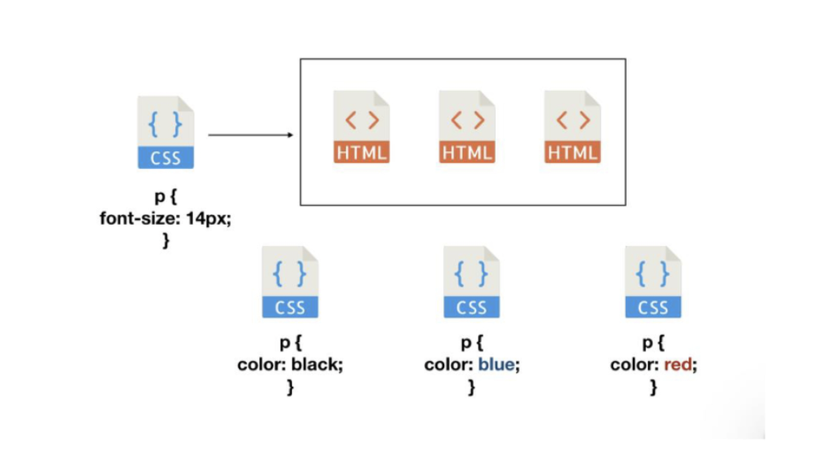
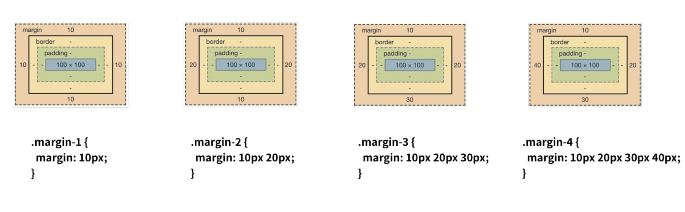
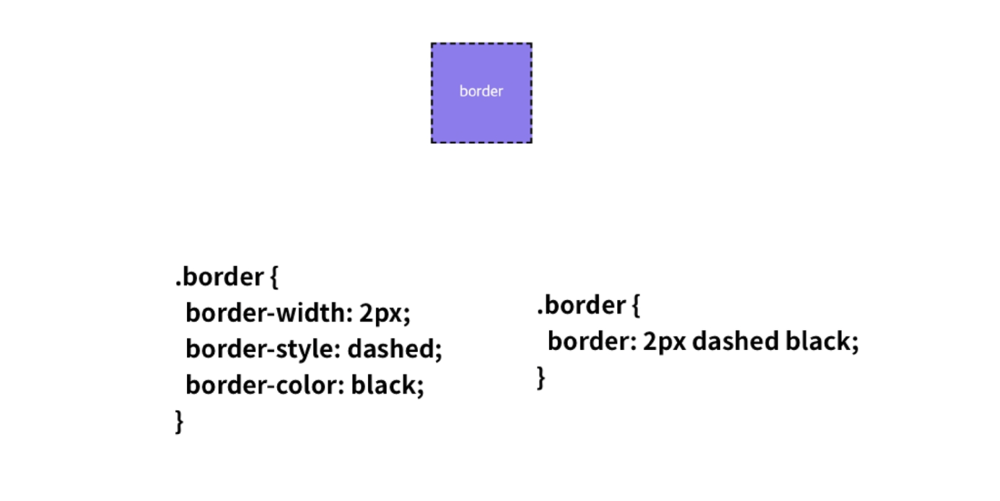
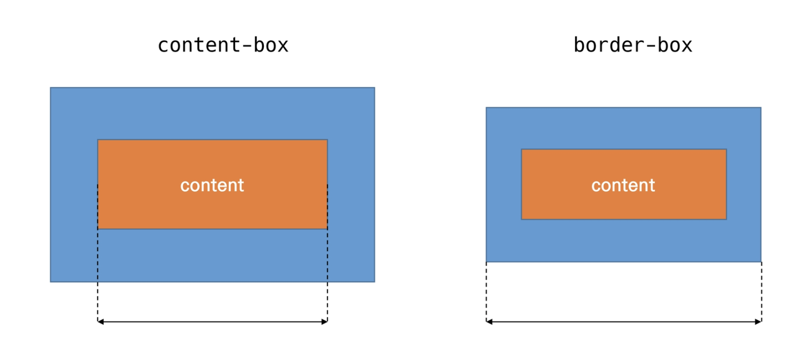
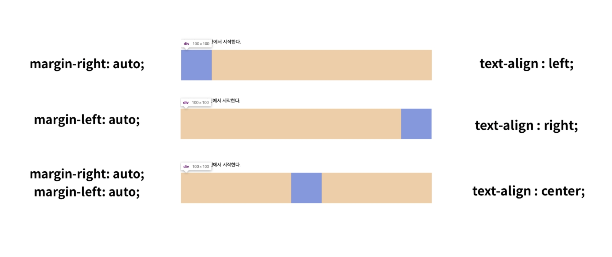
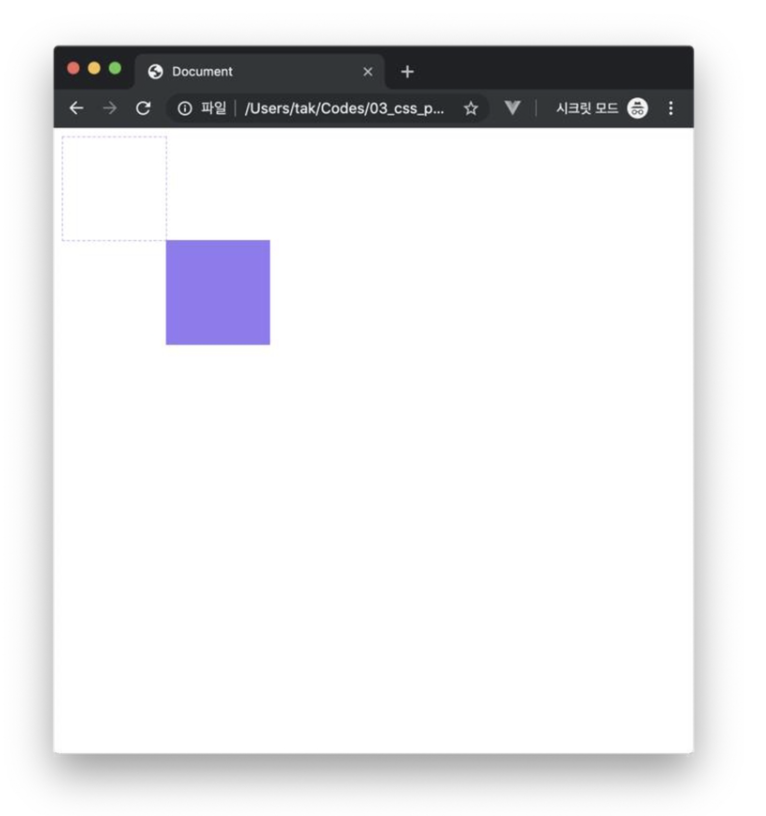
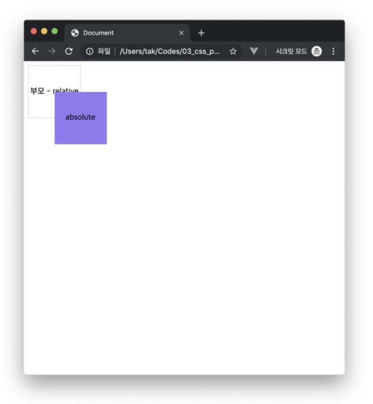

# CSS : Cascading Style Sheet

사용자에게 문서(HTML)를 표시하는 방법을 지정하는 언어

> - display
> - selectors
> - position
> - box model
> - layout - 따로 기재

# CSS Seletor


## 정의 방법

1. 인라인(inline) : 해당 태그에 직접 스타일 속성 활용

```html
<h1 style="color: blue; font-size: 100px;">Hello</h1>
```

2. 내부참조(embedding) :  <head> 내 <style> 지정 

```html
<head>
  <style>
    h1 {
      color: blue;
      font-size: 100px;
    }
  </style>
</head>
```

3. 외부 참조(link file) : 외부 css파일을 <head>내 <link>를 통해 불러온다. 
   - **모듈화 가능** 하므로 필요한 것만 불러서 쓸 수 있어, 중복 방지한다.

```html
<head>
  <link rel="stylesheet" href="mystyle.css">
</head>
```




### 기본 선택자

- 전체 선택자, 요소 선택자, 클래스 선택자, 아이디 선택자

```css
/* 전체 선택자 */
* {
	color : red;
}
/* 요소 선택자 */
h2 {
	color : orange;
}
/* 클래스 선택자 */
.green{
	color : green;
}
/* id 선택자 - id는 문서에서 단 한번만 !!! 사용!! */ 
#purple{
	color : purple;
}
```


### 결합자 (combinators)

- 자식, 자손 결합자, 일반 형제 결합자, 인접 형제 결합자

```css
/* 자손 결합자 : 하위의 모든 요소 - 예시에서 span 1개 */
div span {
	color : green;
}
/* 자식 결합자 : 바로 아래 요소 - 예시에서 span 2개 */
div>span {
	color : green;
}

<div>
	<span></span>
	<p> </p>
	<p>
		<span></span>
	</p>
</div>

/* 일반 형제 결합자 : 형제 요소 중 뒤(코드상 뒤)에 위치하는 요소를 모두 선택 - 예시에서 span 2개*/
p ~ span {
	color : green;
}
/* 인접 형제 결합자 : 형제 요소 중 '바로' 뒤에 위치하는 요소 한개를 선택  - 예시에서 span 1개*/
p + span {
	color : green;
}

<span></span>
<p></p>
<b></b>
<span></span>
<b></b>
<span></span>
```


### 의사 클래스/요소 (pseudo class)

- 링크, 동적 의사 클래스
- 구조적 의사 클래스


## 적용 우선순위(cascading order)

1. `!important`
2. 우선순위(Specificity) : **인라인 > id선택자 > class선택자 > 요소선택자**
3. 코드 순서


## 크기 단위

- px , %
- **em : 부모 사이즈의 배수. (부모가 10px이고 자식이 2em 이면 자식은 20px) ** 중복적용 주의!
- **rem : 최상위 요소(html) 사이즈(16px)를 기준으로 배수 단위를 가짐.** 상속받지 않아 편리!
- viewport 
  - 주로 스마트폰이나 테블릿 디바이스의 화면
  - 글자 그대로 디바이스의 뷰포트를 기준으로 상대적인 사이즈 결정.
  
  

## 색상단위

```css
p {color: #000}
p {color: rgba(0, 0, 0, 0.5);} /* 투명도 alpha 추가 */
```

# Box model

## shorthand

- 상하좌우, 상하/좌우, 상/좌우/하, 상/우/하/좌






## BOX-SIZING

- 디폴트는 `content-box` 이다. (padding, border pixel포함)
- css 전체 디폴트 설정으로 border-box 주고 들어감!

```css
* {
  box-sizing: border-box;
}
```




## 마진 상쇄

- block A의 top과 block B의 bottom에 적용된 각각의 margin이 둘 중 **큰 마진값으로 결합**(겹쳐지게) 되는 현상
- **따라서, margin-top , margin-bottom 중 하나 사용하자!**

# CSS Display : block & inline

### display : block

- 화면 가로 전체 차지 (100%)
- 블록 요소 안에 인라인 요소 들어갈 수 있음
- div / ul, ol, li / p / hr / form

### display : inline

- 컨텐츠 영역만큼 차지

- 상하여백은 `line-height` 로 지정한다. 가로세로폭 못정하니까!
- width, height, margin-top, margin-bottom 지정 불가
- span / a / image / input,label / b, em, i, strong

##### 

### display : inline-block

- inline처럼 한 줄에 표시 가능하며
- block처럼 width, height, margin 속성 적용 가능하다

### display : none vs. visibility : hidden

- <u>display : none - 해당 요소를 화면에 표시하지 않는다. (공간조차 사라진다)</u>
- visibility : hidden - 공간은 남아있고 화면에만 표시하지 않는다.

# CSS Position

### static : 모든 태그의 기본위치 (default, 좌측 상단)

- 부모 요소 내에 배치시 부모 요소의 위치를 기준으로 배치

### relative : 자기 자신의 static 위치를 기준으로 이동하며 공간은 <u>static일때 공간을 그대로 차지함</u>

```css
.relative{
  position:relative;
  top:100px;
  left:100px;
}
```




### absolute 절대 위치 : 요소를 일반적 문서 흐름에서 제거하며 <u>레이아웃에 공간을 차지하지 않음</u>

- **<u>static이 아닌</u> 가장 가까이 있는 부모/ 요소**를 기준으로 이동(**없는경우 body에 붙는 형태)
- <u>**따라서 static이 아닌 부모를 미리 만들고 이동시켜야한다!!**</u>
- 격리된 UI 에 사용

```css
/* position: relative 인 부모 요소를 설정 */
.parent{
  position: relative;
}

/* position: absolute */
.absolute_child{
  position: absolute;
  top:50px;
  left:50px;
}
```




### fixed 고정 위치: 일반적 문서 흐름에서 제거 후 레이아웃에 공간을 차지하지 않음

- 부모요소와 관계없이 viewport를 기준으로 이동
- 스크롤 시에도 항상 같은 곳에 위치함

```css
.fixed{
  position:fixed;
  bottom:0;
  right:0;
}
```


