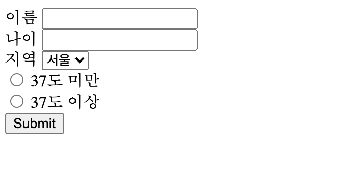
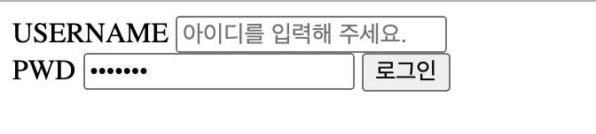

# form

> 사용자로부터 정보를 입력받는 form tag


## 구조

### **form > label + input**






## Input type

```html
<input type="text">

<input type="number">

<select>
  <option value="02"></option>
  <option value="052"></option>
</select>

<input type="radio" id="temp1" name="temp" value="under">
<label for="temp1">37도 미만</label>
<input type="radio" id="temp2" name="temp" value="over">
<label for="temp2">37도 이상</label>

<input type="submit" value="로그인">

<input type="text" placeholder="아이디를 입력해 주세요.">

<input type="password" value="FakePSW">
```


## for 그리고 id / name / value

`?n=방의진&a=27&name_location=02&temp=over`

- <label> 에 `for`를 지정하고, <input>에는 `id`를 동일하게 지정하면, 라벨만 눌러도 커서가 깜박인다.
- `name` : name 의 밸류값이 곧 변수명
- `radio` 의 경우, `name` 을 동일하게 설정하여 중복선택을 방지한다.
- `value` : 실제로 사용자에게 보여지는 값 또는 실제 전송되는 값

```html
  <!-- html의 목적이 데이터 보여주기라면, form의 목적은 데이터 입력하기(url로 만들어 보낸다.) -->
  <form action="">
    <!-- id 값이 name 이라는 속성, for 자리에는 id가 들어와야! -->
    <!-- 정보를 보낼 때 ! n이라는 변수에 사용자가 넣은 데이터가 들어간다! -->
    <div>  
      <label for="username">이름</label>
      <input id="username" name="n" type="text">
    </div>

    <div>
      <label for="age">나이</label>
      <input id="age" name="a" type="number">
    </div>
    <!-- 보여주는 데이터는 서울, 대전인데, 실제로 보내지는 데이터는 value값, name을 통해 변수설정 -->

    <div>
      <label for="location">지역</label>
      <select name="name_location" id="location">
        <option value="02">서울</option>
        <option value="052">대전</option>
      </select>
    </div>

    <!-- name을 통일하여 두 라디오 버튼을 묶는다. 그래야 중복선택 안됨 
    value 는 실제 클릭했을 때 전송되는 값, default 는 on -->
    <div>
      <div class="temp">
        <input type="radio" id="temp1" name="temp" value="under">
        <label for="temp1">37도 미만</label>
      </div>

      <div class="temp">
        <input type="radio" id="temp2" name="temp" value="over">
        <label for="temp2">37도 이상</label>
      </div>
    </div>

    <!-- 제출 버튼 -->
    <input type="submit">
    
  </form>
```

```html
  <form action="">
    <label for="usertext">USERNAME</label>
    <input type="text" id="usertext" placeholder="아이디를 입력해 주세요.">
    <br>
    <label for="userpassword">PWD</label>
    <input type="password" id="userpassword" value="FakePSW">
    <input type="submit" value="로그인">
  </form>
```

